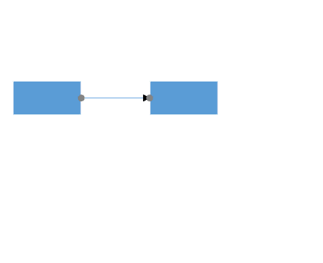
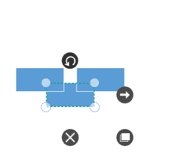
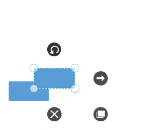

# Commands

Diagram provides set of Commands to perform the functionalities in application.

* Alignment commands
* Spacing commands
* Sizing commands
* Clipboard commands
* Duplicate Command
* Grouping commands
* Flip Commands
* Z-order commands
* Zoom commands
* Reset Command
* Draw Commands
* Nudge commands
* FitToPage command
* Undo/Redo command

## Alignment Commands

Alignment commands enable you to align the selected objects such as Nodes and Connectors on a page with respect to a reference object.

The Alignment commands as follows

| Commands | Description |
|---|---|---|
| AlignLeft | The AlignLeft command enables you to align all selected objects along the left corner of the reference object. |
| AlignRight | The AlignRight command enables you to align all selected objects along the right corner of the reference object. |
| AlignCenter | The AlignCenter command enables you to center all selected objects vertically. It aligns selected objects to the center with respect to the horizontal axis by changing the x-coordinate of the object. |
| AlignTop | The AlignTop command enables you to align all selected objects along the top surface of the reference object. |
| AlignBottom | The AlignBottom command enables you to align all selected objects along the bottom surface of the reference object. |
| AlignMiddle | The AlignMiddle command enables you to center all selected objects horizontally. It aligns selected objects to the center with respect to the vertical axis by changing the y-coordinate of the object. |




IGraphInfo graphinfo = diagramcontrol.Info as IGraphInfo;
// sets direction as Top
graphinfo.Commands.AlignTop.Execute(null);




## Spacing Commands

Spacing commands enable you to place selected objects on the page at equal intervals from each other. The objects are spaced within the bounds of the first and last objects in the selection.




IGraphInfo graphinfo = diagramcontrol.Info as IGraphInfo;

// Equally spaces the selected nodes horizontally
graphinfo.Commands.SpaceAcross.Execute(null);

// Equally spaces the selected nodes vertically
graphinfo.Commands.SpaceDown.Execute(null);




## Sizing Commands

Object size commands will be resized all selected object based on width, height and size of the first object in the selection list.




IGraphInfo graphinfo = diagramcontrol.Info as IGraphInfo;

//Scales the selected items to the size of first selected object
graphinfo.Commands.SameSize.Execute(null);

//Vertically scales the selected items to the height of first selected object
graphinfo.Commands.SameHeight.Execute(null);

//Horizontally scales the selected items to the width of first selected object
graphinfo.Commands.SameWidth.Execute(null);




## Clipboard Commands

Clipboard commands are used to perform Cut, Copy, and Paste operations. 

Clipboard commands allow you to cut or copy selected Diagram objects to the Clipboard and paste the valid Clipboard content into the Diagram.




IGraphInfo graphinfo = diagramcontrol.Info as IGraphInfo;
//Cuts the selected elements from the Diagram to the Diagram’s clipboard
graphinfo.Commands.Cut.Execute(null);

//Copies the selected elements from the Diagram to the Diagram’s clipboard.
graphinfo.Commands.Copy.Execute(null);

//Pastes the Diagram’s clipboard data (nodes/connectors) into the Diagram.
graphinfo.Commands.Paste.Execute(null);




## Duplicate Command

This command copies the selected objects from the diagram and pastes the copied content into the diagram.                           

## Grouping Command
Grouping commands are used to group/ungroup the selected elements on the diagram.




IGraphInfo graphinfo = diagramcontrol.Info as IGraphInfo;

//Groups the selected elements.
graphinfo.Commands.Group.Execute(null);

//UnGroups the selected elements.
graphinfo.Commands.UnGroup.Execute(null);




## Flip Commands

Flip commands are used to mirror a diagram object’s content.

### Parameter
To customize flipping, a parameter of type IFlipParameter has to be passed.

**IFlipParameter Properties**

| Property | Description | Value |
|---|---|---|
| Flip | Gets or sets whether the object is to be mirrored horizontally, vertically, or both | Enum Flip   Flip.HorizontalFlip   Flip.VerticalFlip   Flip.Flip |

**Execute Flip Command**




// Flip Command
(diagramcontrol.Info as IGraphInfo).Commands.Flip.Execute(null);




If the parameter is null, the object will be flipped both horizontally and vertically.




IGraphInfo graphinfo = diagramcontrol.Info as IGraphInfo;

FlipParameter flipParam = new FlipParameter();

// Horizontal Flip
flipParam.Flip = Flip.HorizontalFlip;
graphinfo.Commands.Flip.Execute(flipParam);

// Vertical Flip
flipParam.Flip = Flip.VerticalFlip;
graphinfo.Commands.Flip.Execute(flipParam);




## Z – Order Command

Z – Order commands enable you to visually arrange the selected objects such as Nodes and Connectors on the page.

### BringToFront command

The BringToFront command visually brings the selected element to the front over all other overlapped elements. 




IGraphInfo graphinfo = diagramcontrol.Info as IGraphInfo;

//Brings to front
graphinfo.Commands.BringToFront.Execute(null);




### SendToBack command

The SendToBack command visually moves the selected elements behind all the other overlapped elements. 




IGraphInfo graphinfo = diagramcontrol.Info as IGraphInfo;

// Send To Back
graphinfo.Commands.SendToBack.Execute(null);




### SendBackward command

The SendBackward command visually moves the selected elements behind the underlying element.




IGraphInfo graphinfo = diagramcontrol.Info as IGraphInfo;

// Send To Backward
graphinfo.Commands.SendBackward.Execute(null);




### BringForward command

The BringForward command visually moves the selected element over the nearest overlapping element.




IGraphInfo graphinfo = diagramcontrol.Info as IGraphInfo;

// Brings To Forward
graphinfo.Commands.BringForward.Execute(null);




## Zoom Commands
Zoom commands are used to  zoom-in and zoom-out the Diagram view.

To execute zoom commands, parameters of type IZoomParameter (IZoomManipulationParameter, IZoomPositionParameter, or IZoomPointerParameter) have to be passed.

**IZoomManipulationParameter Properties**

| Property | Description | Value |
|---|---|---|
| ManipulationArgs | Gets or sets the ManipulationDeltaRoutedEventArgs associated with the desired zoom function. | ManipulationDeltaRoutedEventArgs |

**IZoomPositionParameter Property**

| Property | Description | Value |
|---|---|---|
| ZoomTo | Gets or sets the zoom level to which the diagram is to be zoomed. | double |
| ZoomFactor | Gets or sets the percentage of scale value for each ZoomIn or ZoomOut function. | double |
| FocusPoint | Gets or sets the point of focus while zooming. | Point | 
| ZoomCommand | Gets or sets whether zoom in or zoom out has to be performed. | Enum ZoomCommand   ZoomCommand.ZoomIn   ZoomCommand.ZoomOut |

**IZoomPointerParameter Property**

| Property | Description | Value |
|---|---|---|
| PointerArgs | Gets or sets the PointerRoutedEventArgs associated with the desired zoom function. | PointerRoutedEventArgs |
| ZoomCommand | Gets or sets whether zoom in or zoom out has to be performed. | Enum ZoomCommand   ZoomCommand.ZoomIn   ZoomCommand.ZoomOut |




IGraphInfo graphinfo = diagramcontrol.Info as IGraphInfo;

//Zoom to a particular scale.
graphinfo.Commands.Zoom.Execute(new ZoomPositionParameter() 
{ 
	ZoomTo = 2, ZoomCommand = ZoomCommand.ZoomOut 
});

//Zoom out based on zoom factor.
graphinfo.Commands.Zoom.Execute(new ZoomPositionParameter() 
{ 
	ZoomFactor = 2, ZoomCommand = ZoomCommand.ZoomOut 
});




### Reset Commands
Reset commands are used to reset horizontal Offset, vertical Offset, and zoom level of the Diagram.
To execute a reset command, a parameter of type IReset has to be passed.

| Property | Description | Value |
|---|---|---|
| Reset | Gets or sets the ZoomPanReset | Enum Reset   Reset.Zoom – To reset zoom level to 1   Reset.Pan – To reset Offsets to 0,Reset.ZoomPan | 

Execute ResetCommand




IGraphInfo graphinfo = diagramcontrol.Info as IGraphInfo;

// Reset
graphinfo.Commands.Reset.Execute(new ResetParameter() { Reset = Reset.Zoom });




## Draw Commands
Draw commands are used to draw connections. They take parameters of type IDrawParameter.

| Property | Description | Value |
|---|---|---|
| DrawingTool | Gets or sets a tool to draw. | Enum DrawingToolDrawingTool.Connector |
| Point | Gets or sets the start point for drawing. | Point |
| Node | Gets or sets the source Node of the new connection. | Object |
| Port | Gets or sets the source port of the new connection. | Object |
| PressedEventArgs | Gets or sets the PressedEventArgs. | PointerRoutedEventArgs|

Execute DrawCommand




void Button_PointerPressed(object sender, PointerRoutedEventArgs e)
{
	IGraphInfo graphinfo = diagramcontrol.Info as IGraphInfo;
	Point SourcePoint = new Point(200,200);
            
	graphinfo.Commands.Draw.Execute(
         new DrawParameter(
                 DrawingTool.Connector,
                 e,
                 SourcePoint,
                 SourceNode,
                 SourcePort));
}




## Undoing and Redoing Actions

The Undo command reverses the last editing action performed. For example, some of the basic operations performed on diagram objects such as translation, rotation, resizing, grouping, ungrouping, changing z-order, addition, deletion, and so on, can be reversed. The Redo command restores the last editing action if no other actions have occurred since the last undo. 

## Nudge Command

Nudge commands move the selected elements towards up, down, left or right by 1 pixel.The Nudge Commands as follows.

| Commands | Description |
|---|---|
| NudgeUp | The NudgeUp command moves the selected object towards the top by 1 pixel. |
| NudgeDown | The NudgeDown command moves the selected object towards the bottom by 1 pixel. |
| NudgeLeft | The NudgeLeft command moves the selected object towards the left by 1 pixel. |
| NudgeRight | The NudgeRight command moves the selected object towards the right by 1 pixel. | 




IGraphInfo graphinfo = diagramcontrol.Info as IGraphInfo;

//Nudges up
graphinfo.Commands.MoveUp.Execute(null);




## FitToPage Command

FitToPage commands are used to bring the entire Diagram into the view.

| Command |	Description | Value |
|---|---|---|
| FitToPage | Gets or sets whether the Diagram is to fit into the view in terms of its width, height, or entirety. | Enum FitToPage   FitToPage.FitToPage   FitToPage.FitToHeight   FitToPage.FitToWidth |
| Margin | Gets or sets the margin value from the view to Diagram. | Thickness |




IGraphInfo graphinfo = diagramcontrol.Info as IGraphInfo;

graphinfo.Commands.FitToPage.Execute(

 new FitToPageParameter()
 {
	Margin = new Thickness(25),

       //To fit the diagram with respect to width/height use FitToWidth or FitToHeight.

       FitToPage = FitToPage.FitToPage

 });

 (or)

graphinfo.Commands.FitToPage.Execute(null);




## Command Manager
Command manager is used to map between user gestures (keyboard, mouse) with commands. Refer to the following table for built-in commands with Key Gesture and Mouse Gesture.
List of Commands and Key Gesture:

| Command | Key | Key Modifiers |
|---|---|---|
| Copy | C | Control |
| Cut | X| Control |
| Paste | V | Control |
| Duplicate | D | Control |
| Undo | Z | Control |
| Redo | Y | Control |
| MoveLeft | | Left |	
| MoveRight | |	Right |	
| MoveUp | | Up |	
| MoveDown | | Down |	
| Delete | | Delete |	
| SelectAll | A	| Control |
| Group| G|	Control |
| UnGroup | G | Control |
| SendToBack | [ | Control+Shift |
| SendBackward | [ | Control |
| BringToFront | ] | Control+Shift |
| BringForward | ] | Control |

#### List of Commands and Key Gestures with Parameter

| Command | Key | KeyModifier | Parameter |
|---|---|---|---|
| Zoom | - | Control | new ZoomPositionParameter { ZoomCommand=ZoomCommand.ZoomOut} |
| Zoom | + | Control | new ZoomPositionParameter { ZoomCommand = ZoomCommand.ZoomIn } |
| Reset | 0 | Control | new ResetParameter { Reset = Diagram.Reset.ZoomPan } |
| FitToPage | 0 | Control+ Menu | new FitToPageParameter { FitToPage = Diagram.FitToPage.FitToPage, Margin = new Thickness(20) } |

#### List of Commands and Mouse Gesture with Parameter

| Command | Scroll State | Parameter |
|---|---|---|
| Vertical Scroll using ‘Zoom’ command | Scroll | new ZoomPointerParameter { ZoomCommand = ZoomCommand.VerticalScroll} |

#### List of Commands and Key and Mouse Gesture with Parameter

| Command | KeyModifier | Scroll State | Parameter |
|---|---|---|---|
| Horizontal Scroll using ‘Zoom’ command | Shift | Scroll | new ZoomPointerParameter { ZoomCommand = ZoomCommand.HorizontalScroll} |
| Zoom | Control | Scroll | new ZoomPointerParameter { ZoomCommand = ZoomCommand.ZoomIn | ZoomCommand.ZoomOut} |

N> When different commands are registered for the same key / mouse gestures, you need to handle the command while execution.

### Custom command

User defined commands can also be created and mapped with existing gesture by using command manager. The following code example explains how to register mouse key gesture with Parameter to Save Command (Control + S)

#### Create a user defined command: Save command




//Create ICommand

private ICommand _save;

public ICommand Save
{
	get { return _save;}
	set { _save = value; }
}
        

//Initialize Command

Save = new DelegateCommand(OnSaveCommand);
         
// Execute Command

private async void OnSaveCommand(Object obj)
{
	var picker = new FileSavePicker();
  
       // set appropriate file types
              
       picker.FileTypeChoices.Add(".xaml", new List<String> {".xaml"});
       picker.DefaultFileExtension = ".xaml";
       Object parameter = (obj as IGestureParameter).Parameter;
       picker.SuggestedFileName = parameter.ToString();
       StorageFile file = await picker.PickSaveFileAsync();
       using (var filestream = await file.OpenStreamForWriteAsync())
       {
		sfdiagram.Save(fileStream);
       }
  }
  


  
#### Map and user defined command with key gesture:

Add new Commands to CommandManager - Ctrl + S -> Save
          
		    
	
		
sfdiagram.CommandManager.Commands.Add
(
	new GestureCommand()
	{
		Command = Save,
		Gesture = new Gesture
		{
			KeyModifiers = ModifierKeys.Control,
			KeyState = KeyStates.Down,
			Key = Key.S
		},

		// Parameter is the name of the file (.xmal)
		Parameter = "diagram"
	}
);


