#Connector

Connectors are objects used to create link between two Points, Nodes or ports to represent the relationships between them.

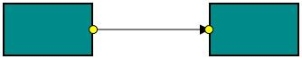

##Create Connector

Connector can be created by defining the start and end points. The Path to be drawn can be defined with a collection of segments.

###Add Connectors through Connectors collection

The `SourcePoint` and `TargetPoint` properties of Connector allow you to define the end points of a Connector. The following code example illustrates how to add a Connector through Connector collection.



<diagram:SfDiagram.Connectors>
  <diagram:DiagramCollection>
    <diagram:Connector SourcePoint="100,100" TargetPoint="200,200">
      <diagram:Connector.ConnectorGeometryStyle>
        
      </diagram:Connector.ConnectorGeometryStyle>
      <diagram:Connector.TargetDecoratorStyle>
        
      </diagram:Connector.TargetDecoratorStyle>
    </diagram:Connector>
  </diagram:DiagramCollection>
</diagram:SfDiagram.Connectors>





diagram.DefaultConnectorType = ConnectorType.Line;

ObservableCollection<Connector> lines = new ObservableCollection<Connector>();
Connector connector = new Connector()
{
	SourcePoint = new Point(100, 100),
	TargetPoint = new Point(200, 200),
};

lines.Add(connector);
diagram.Connectors = lines;



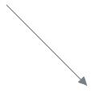

###Connectors from stencil

Connectors can be predefined and added to the stencil. You can drop those Connectors into the Diagram, when required. 

For more information about adding Connectors from stencil, refer to [Stencil](/wpf/sfdiagram/Stencil "Stencil").

###Connectors through data source

Connectors are automatically generated based on the relationships defined through the data source. For more information about data source, refer to [Data Source](/wpf/sfdiagram/DataSource "DataSource").

###Draw Connectors

Connectors can be interactively drawn by clicking and dragging on the Diagram surface by using Drawing Tool. For more information about drawing Connectors, refer to [Draw Connectors](/wpf/sfdiagram/Tools#drawing-tools:connectors "Draw Connectors").

##Connect Nodes

The `SourceNode` and `TargetNode` properties allow to define the Nodes to be connected. The following code example illustrates how to connect two Nodes.



ObservableCollection<Node> nodes = new ObservableCollection<Node>();

Node node = new Node()
{
	UnitWidth = 100,
	UnitHeight = 60,
	OffsetX = 200,
	OffsetY = 200,
	Annotations = new ObservableCollection<IAnnotation>()
	{
		new AnnotationEditorViewModel()
		{
			Content = "Task 1",
			ViewTemplate  =this.diagram.Resources["viewtemplate"] as DataTemplate
		}
	},
	Shape = new RectangleGeometry() { Rect = new Rect(0, 0, 10, 10) },
	ShapeStyle = this.diagram.Resources["shapestyle"] as Style
};

Node node1 = new Node()
{
	UnitWidth = 100,
	UnitHeight = 60,
	OffsetX = 400,
	OffsetY = 200,
	Annotations = new ObservableCollection<IAnnotation>()
	{
		new AnnotationEditorViewModel()
		{
			Content = "Task 2",
			ViewTemplate = this.diagram.Resources["viewtemplate"] as DataTemplate
		}
	},
	Shape = new RectangleGeometry() { Rect = new Rect(0, 0, 10, 10) },
	ShapeStyle = this.diagram.Resources["shapestyle"] as Style
};

nodes.Add(node);
nodes.Add(node1);
diagram.Nodes = nodes;

ObservableCollection<ConnectorViewModel> lines = new ObservableCollection<ConnectorViewModel>();

ConnectorViewModel connector = new ConnectorViewModel()
{
	SourceNode = node,
	TargetNode = node1,
	ConnectorGeometryStyle = this.diagram.Resources["connectorstyle"] as Style,
	TargetDecoratorStyle = this.diagram.Resources["decoratorstyle1"] as Style,
};

lines.Add(connector);
diagram.Connectors = lines;



N> By default, connections are created at the intersecting point of Segments and Node bounds. The connection between any specific point of Source and Target Nodes can be achieved with Ports.

##Connections with Ports

The `SourcePort` and `TargetPort` properties allow to create connections between some specific points of Source/Target Nodes. The following code examples illustrates how to use NodePort and ConnectorPort.

###Using NodePort

The following code example illustrates how to create ConnectorPort.



ObservableCollection<Node> nodes = new ObservableCollection<Node>();

NodePort port1 = new NodePort()
{
	Width = 10,
	Height = 10,
	NodeOffsetX = 1,
	NodeOffsetY = 0.65,
	UnitMode = UnitMode.Fraction,
	PortVisibility = PortVisibility.Visible,
	Constraints = PortConstraints.Default & ~PortConstraints.InheritPortVisibility,
	Shape = new EllipseGeometry() { RadiusX = 10, RadiusY = 10 },
	ShapeStyle = this.diagram.Resources["portshapestyle"] as Style
};

NodePort port2 = new NodePort()
{
	Width = 10,
	Height = 10,
	NodeOffsetX = 1,
	NodeOffsetY = 0.35,
	UnitMode = UnitMode.Fraction,
	PortVisibility = PortVisibility.Visible,
	Constraints = PortConstraints.Default & ~PortConstraints.InheritPortVisibility,
	Shape = new EllipseGeometry() { RadiusX = 10, RadiusY = 10 },
	ShapeStyle = this.diagram.Resources["portshapestyle"] as Style
};

Node task1 = new Node()
{
	UnitWidth = 100,
	UnitHeight = 60,
	OffsetX = 350,
	OffsetY = 300,
	Annotations = new ObservableCollection<IAnnotation>()
	{
		new AnnotationEditorViewModel()
		{
			Content="Task 1",
			ViewTemplate=this.diagram.Resources["viewtemplate"] as DataTemplate
		}
	},
	Shape = new RectangleGeometry() { Rect = new Rect(0, 0, 10, 10) },
	ShapeStyle = this.diagram.Resources["shapestyle"] as Style
};

Node task2 = new Node()
{
	UnitWidth = 100,
	UnitHeight = 60,
	OffsetX = 200,
	OffsetY = 250,
	Ports = new ObservableCollection<INodePort>()
	{
		port1,
		port2
	},
	Annotations = new ObservableCollection<IAnnotation>()
	{
		new AnnotationEditorViewModel()
		{
			Content="Task 2",
			ViewTemplate=this.diagram.Resources["viewtemplate"] as DataTemplate
		}
	},
	Shape = new RectangleGeometry() { Rect = new Rect(0, 0, 10, 10) },
	ShapeStyle = this.diagram.Resources["shapestyle"] as Style
};

Node task3 = new Node()
{
	UnitWidth = 100,
	UnitHeight = 60,
	OffsetX = 350,
	OffsetY = 200, 
	Annotations = new ObservableCollection<IAnnotation>()
	{
		new AnnotationEditorViewModel()
		{
			Content="Task 3",
			ViewTemplate=this.diagram.Resources["viewtemplate"] as DataTemplate
		}
	},
	Shape = new RectangleGeometry() { Rect = new Rect(0, 0, 10, 10) },
	ShapeStyle = this.diagram.Resources["shapestyle"] as Style
};

nodes.Add(task1);
nodes.Add(task2);
nodes.Add(task3);
diagram.Nodes = nodes;

ObservableCollection<ConnectorViewModel> lines = new ObservableCollection<ConnectorViewModel>();
ConnectorViewModel connector = new ConnectorViewModel()
{
	SourcePort = port2,
	SourceNode = task2,
	TargetNode = task3,
	ConnectorGeometryStyle = this.diagram.Resources["connectorstyle"] as Style,
	TargetDecoratorStyle = this.diagram.Resources["decoratorstyle1"] as Style,
};

ConnectorViewModel connector1 = new ConnectorViewModel()
{
	TargetPort = port1,
	SourceNode = task1,
	TargetNode = task2,
	ConnectorGeometryStyle = this.diagram.Resources["connectorstyle"] as Style,
	TargetDecoratorStyle = this.diagram.Resources["decoratorstyle1"] as Style,
};

lines.Add(connector);
lines.Add(connector1);
diagram.Connectors = lines;



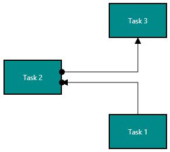
                 
###Using ConnectorPort

The following code example illustrates how to create ConnectorPort.



ObservableCollection<Node> nodes = new ObservableCollection<Node>();

ConnectorPort port = new ConnectorPort()
{
	Height = 10,
       Width = 10,
       Length = 0.5,
       PortVisibility = PortVisibility.Visible,
       UnitMode = UnitMode.Fraction,
       Constraints = PortConstraints.Inherit & ~PortConstraints.InheritPortVisibility,
       Shape = new EllipseGeometry() { RadiusX = 10, RadiusY = 10 },
       ShapeStyle = this.diagram.Resources["portshapestyle"] as Style
};

Node task1 = new Node()
{
	UnitWidth = 100,
       UnitHeight = 60,
       OffsetX = 100,
       OffsetY = 100,
       Annotations = new ObservableCollection<IAnnotation>()
       {
       	new AnnotationEditorViewModel()
              {
              	Content="Task 1",
                     ViewTemplate=this.diagram.Resources["viewtemplate"] as DataTemplate
		}
	},
       Shape = new RectangleGeometry() { Rect = new Rect(0, 0, 10, 10) },
       ShapeStyle = this.diagram.Resources["shapestyle"] as Style
};

Node task2 = new Node()
{
	UnitWidth = 100,
       UnitHeight = 60,
       OffsetX = 300,
       OffsetY = 100,
       Annotations = new ObservableCollection<IAnnotation>()
       {
       	new AnnotationEditorViewModel()
              {
              	Content="Task 2",
                     ViewTemplate=this.diagram.Resources["viewtemplate"] as DataTemplate
              }
	},
       Shape = new RectangleGeometry() { Rect = new Rect(0, 0, 10, 10) },
       ShapeStyle = this.diagram.Resources["shapestyle"] as Style
};

Node task3 = new Node()
{
	UnitWidth = 100,
       UnitHeight = 60,
       OffsetX = 200,
       OffsetY = 200,
       Annotations = new ObservableCollection<IAnnotation>()
       {
       	new AnnotationEditorViewModel()
              {
              	Content="Task 3",
                     ViewTemplate=this.diagram.Resources["viewtemplate"] as DataTemplate
              }
       },
       Shape = new RectangleGeometry() { Rect = new Rect(0, 0, 10, 10) },
       ShapeStyle = this.diagram.Resources["shapestyle"] as Style
};

nodes.Add(task1);
nodes.Add(task2);
nodes.Add(task3);
diagram.Nodes = nodes;

ObservableCollection<ConnectorViewModel> lines = new ObservableCollection<ConnectorViewModel>();
ConnectorViewModel connector = new ConnectorViewModel()
{
	SourceNode = task1,
       TargetNode = task2,
       Ports=new ObservableCollection<ConnectorPort>()
       {
       	port
       },
       ConnectorGeometryStyle = this.diagram.Resources["connectorstyle"] as Style,
       TargetDecoratorStyle = this.diagram.Resources["decoratorstyle1"] as Style,
};

ConnectorViewModel connector1 = new ConnectorViewModel()
{  
	SourceConnector=connector,
       TargetNode = task3,
       SourcePort = port,
       ConnectorGeometryStyle = this.diagram.Resources["connectorstyle"] as Style,
       TargetDecoratorStyle = this.diagram.Resources["decoratorstyle1"] as Style,
};

            
lines.Add(connector);
lines.Add(connector1);
diagram.Connectors = lines;



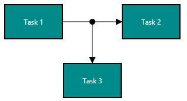

##Segments

The path of the Connector is defined with a collection of segments.

###Straight

Straight segment allows to create a straight line. To create a straight line, you should specify the segment as `StraightSegment` and add a straight segment to collection. The following code example illustrates how to create a default straight segment.



ObservableCollection<Connector> lines = new ObservableCollection<Connector>();
Connector connector = new Connector()
{
	SourcePoint = new Point(100, 100),
	TargetPoint = new Point(200, 200),
	//Add the Straight Segment to Segments
	Segments = new ObservableCollection<IConnectorSegment>()
	{
		new StraightSegment()
		{
		}
	}
};

lines.Add(connector);
diagram.Connectors = lines;



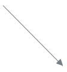

The `Point` property of straight segment allows you to define the end point of it. The following code example illustrates how to define the end point of a straight segment.



ObservableCollection<Connector> lines = new ObservableCollection<Connector>();
Connector connector = new Connector()
{
	SourcePoint = new Point(100, 100),
	TargetPoint = new Point(200, 300),
	//Add the Straight Segment to Segments
	Segments = new ObservableCollection<IConnectorSegment>()
	{
		new StraightSegment()
		{
			Point=new Point(100,200)
		}
	}
};

lines.Add(connector);
diagram.Connectors = lines;



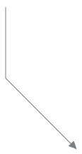

###Orthogonal

Orthogonal segments are used to create segments that are perpendicular to each other.

Set the segment as `OrthogonalSegment` to create the default orthogonal segment. The following code example illustrates how to create a default orthogonal segment.



ObservableCollection<Connector> lines = new ObservableCollection<Connector>();
Connector connector = new Connector()
{
	SourcePoint = new Point(100, 100),
       TargetPoint = new Point(200, 200),
	//Add the Orthoganal Segment to Segments
       Segments = new ObservableCollection<IConnectorSegment>()
	{
		new OrthogonalSegment()
		{
		}
	}
};

lines.Add(connector);
diagram.Connectors = lines;



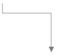



ObservableCollection<Connector> lines = new ObservableCollection<Connector>();
Connector connector = new Connector()
{
	SourcePoint = new Point(100, 100),
	TargetPoint = new Point(200, 200),
	//Add the Orthoganal Segment to Segments
	Segments = new ObservableCollection<IConnectorSegment>()
	{
		new OrthogonalSegment()
		{
			Length = 50,
			Direction = OrthogonalDirection.Bottom
		} 
	}
};

lines.Add(connector);
diagram.Connectors = lines;



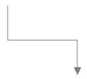

####Avoid overlapping

Orthogonal segments are automatically re-routed, in order to avoid overlapping with the source and target Nodes. The following images illustrates how orthogonal segments are re-routed.

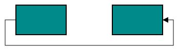

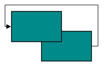

N> Overlapping with Source and Target nodes are only avoided. Other nodes are not considered as obstacles.

###CubicCurveSegment

Cubic curve segments are used to create curve segments and the curves are configurable with the control points.



ObservableCollection<Connector> lines = new ObservableCollection<Connector>();
Connector connector = new Connector()
{
	SourcePoint = new Point(100, 100),
	TargetPoint = new Point(200, 200),
	Segments = new ObservableCollection<CubicCurveSegment>()
	{

		new CubicCurveSegment()
		{
		}
	}
};

lines.Add(connector);
diagram.Connectors = lines;



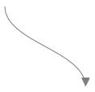

The `Point1` and `Point2` of cubic curve segment enable you to set the control points. The following code example 



ObservableCollection<Connector> lines = new ObservableCollection<Connector>();
Connector connector = new Connector()
{
	SourcePoint = new Point(100, 200),
	TargetPoint = new Point(250, 200),

	Segments = new ObservableCollection<CubicCurveSegment>()
	{
		new CubicCurveSegment()
		{
			Point1 = new Point(125,75),
			Point2 = new Point(225,75)
		},
	}
};

lines.Add(connector);
diagram.Connectors = lines;



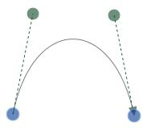

###Complex segments

Multiple segments can be defined one after another. To create a connector with multiple segments, define and add the segments to ConnectorSegments collection. The following code example illustrates how to create a connector with multiple segments.



ObservableCollection<Connector> lines = new ObservableCollection<Connector>();
Connector connector = new Connector()
{
	SourcePoint = new Point(100, 200),
	TargetPoint = new Point(250, 300),
	Segments = new ObservableCollection<IConnectorSegment>()
	{
		//Segment of length 100px to the bottom
		new OrthogonalSegment()
		{
			Length = 150,
			Direction = OrthogonalDirection.Bottom
		},
		//Defines the segment of 150px length to the right
		new OrthogonalSegment()
		{
			Length = 150,
			Direction = OrthogonalDirection.Right
		}
	}
};

lines.Add(connector);
diagram.Connectors = lines;



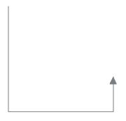

##Decorator

Start and end points of a Connector can be decorated with some customizable shapes like arrows, circles, diamond or path. You can decorate the connection end points with the SourceDecorator and TargetDecorator properties of Connector. 

The `SourceDecoratorStyle` and `TargetDecoratorStyle` properties allows to define the shape of the decorators. The following code example illustrates how to create decorators of various shapes.



ObservableCollection<Connector> lines = new ObservableCollection<Connector>();
Connector connector = new Connector()
{
	SourcePoint = new Point(100, 100),
	TargetPoint = new Point(200, 200),
	ConnectorGeometryStyle = this.diagram.Resources["connectorstyle"] as Style,
	
	// Ellipse shape decorator
	SourceDecorator = new EllipseGeometry() { RadiusX = 10, RadiusY = 10 },
	SourceDecoratorStyle = this.diagram.Resources["decoratorstyle1"] as Style,

	// Arrow shape decorator
	TargetDecorator = new PathGeometry()
	{
		Figures = new PathFigureCollection()
		{
			new PathFigure()
			{
				StartPoint = new Point(0, 0),
				Segments = new PathSegmentCollection()
				{
					new PolyLineSegment()
					{
						Points = new PointCollection()
						{
							new Point(10, 5),
							new Point(0, 10),
							new Point(0,0)
						}
					}
				}
			}
		}
	},
   
	TargetDecoratorStyle = this.diagram.Resources["decoratorstyle"] as Style
 };

 Connector connector1 = new Connector()
 {
 	SourcePoint = new Point(300, 100),
	TargetPoint = new Point(400, 200),
	ConnectorGeometryStyle = this.diagram.Resources["connectorstyle"] as Style,

	// Diamond shape decorator
	SourceDecorator = "M16,0L32,15.999985 16,32.000001 0,15.999985z",
	SourceDecoratorStyle = this.diagram.Resources["decoratorstyle1"] as Style,

	// Open arrow shape decorator
	TargetDecorator = "M2.7330054,0L16.31903,16.055999 1.6030035,31.999999 0,30.518999  
                          13.407025,15.994999 1.0660024,1.4089985z",
	TargetDecoratorStyle = this.diagram.Resources["decoratorstyle"] as Style
 };

Connector connector2 = new Connector()
{
	SourcePoint = new Point(500, 100),
	TargetPoint = new Point(600, 200),
	ConnectorGeometryStyle = this.diagram.Resources["connectorstyle"] as Style,

	// arrow shape decorator
	TargetDecorator = "M 376.892,225.284L 371.279,211.95L 376.892,198.617L 350.225,211.95L 
                          376.892,225.284 Z",
	TargetDecoratorStyle = this.diagram.Resources["decoratorstyle"] as Style
};

lines.Add(connector);
lines.Add(connector1);
lines.Add(connector2);
diagram.Connectors = lines;



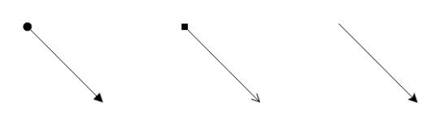

##Padding

Padding is used to leave space between the Connector’s end point and the object to where it is connected.

The `SourcePadding` and `TargetPadding` properties of Connector define the space to be left between the connection end points and the source and target Nodes of Connector. The following code example illustrates how to leave space between the connection end points and source, target Nodes.



ObservableCollection<ConnectorViewModel> lines = new ObservableCollection<ConnectorViewModel>();
ConnectorViewModel connector = new ConnectorViewModel()
{
	SourceNode = node,
	TargetNode = node1,
	SourcePoint = new Point(100, 100),
	TargetPoint = new Point(250, 150),
	ConnectorGeometryStyle = this.diagram.Resources["connectorstyle"] as Style,
	//Space between source point and source object
	SourcePadding = 5,
	//Space between target point and target object
	TargetPadding = 10
};
            
lines.Add(connector);
diagram.Connectors = lines;



The `ConnectorPadding` property of Node defines the space to be left between the Node bounds and its edges. The following code example illustrates how to leave the space between a Node and its connections.

[XAML]



<DataTemplate x:Key="viewtemplate">
  <TextBlock Text="{Binding Path=Content}" Foreground="White"/>
</DataTemplate>



[C#]



ObservableCollection<Node> nodes = new ObservableCollection<Node>();

Node node = new Node()
{
	ConnectorPadding = 5,
	UnitWidth = 100,
	UnitHeight = 60,
	OffsetX = 200,
	OffsetY = 200,
	Annotations = new ObservableCollection<IAnnotation>()
	{
		new AnnotationEditorViewModel()
		{
			Content="Task 1",
			ViewTemplate=this.diagram.Resources["viewtemplate"] as DataTemplate
		}
	},
	Shape = new RectangleGeometry() { Rect = new Rect(0, 0, 10, 10) },
	ShapeStyle = this.diagram.Resources["shapestyle"] as Style
};

Node node1 = new Node()
{
	UnitWidth = 100,
	UnitHeight = 60,
	OffsetX = 400,
	OffsetY = 200,
	Annotations = new ObservableCollection<IAnnotation>()
	{
		new AnnotationEditorViewModel()
		{
			Content="Task 2",
			ViewTemplate=this.diagram.Resources["viewtemplate"] as DataTemplate
		}
	},
	Shape = new RectangleGeometry() { Rect = new Rect(0, 0, 10, 10) },
	ShapeStyle = this.diagram.Resources["shapestyle"] as Style
};

nodes.Add(node);
nodes.Add(node1);
diagram.Nodes = nodes;

ObservableCollection<ConnectorViewModel> lines = new ObservableCollection<ConnectorViewModel>();

ConnectorViewModel connector = new ConnectorViewModel()
{
	SourceNode = node,
	TargetNode = node1,
	ConnectorGeometryStyle = this.diagram.Resources["connectorstyle"] as Style,
	TargetDecoratorStyle = this.diagram.Resources["decoratorstyle1"] as Style,
};

lines.Add(connector);
diagram.Connectors = lines;



The `ConnectorPadding` property of port defines the space between the ports and its in/out edges. The following code example illustrates how to leave the space between ports its connections.



NodePort port = new NodePort()
{
	ConnectorPadding = 10,
	Width = 10,
	Height = 10,
	NodeOffsetX = 0,
	NodeOffsetY = 0.5,
	UnitMode = UnitMode.Fraction,
	PortVisibility = PortVisibility.Visible,
	Constraints = PortConstraints.Default & ~PortConstraints.InheritPortVisibility,
	Shape = new EllipseGeometry() { RadiusX = 10, RadiusY = 10 },
	ShapeStyle = this.diagram.Resources["portshapestyle"] as Style
};

ObservableCollection<Node> nodes = new ObservableCollection<Node>();

Node node = new Node()
{
	UnitWidth = 100,
	UnitHeight = 60,
	OffsetX = 200,
	OffsetY = 200,
	Annotations = new ObservableCollection<IAnnotation>()
	{
		new AnnotationEditorViewModel()
		{
			Content="Task 1",
			ViewTemplate=this.diagram.Resources["viewtemplate"] as DataTemplate
		}
	},
	Shape = new RectangleGeometry() { Rect = new Rect(0, 0, 10, 10) },
	ShapeStyle = this.diagram.Resources["shapestyle"] as Style
};

Node node1 = new Node()
{
	UnitWidth = 100,
	UnitHeight = 60,
	OffsetX = 400,
	OffsetY = 200,
	Ports = new ObservableCollection<INodePort>()
	{
		port
	},
	Annotations = new ObservableCollection<IAnnotation>()
	{
		new AnnotationEditorViewModel()
		{
			Content="Task 2",
			ViewTemplate=this.diagram.Resources["viewtemplate"] as DataTemplate
		}
	},
	Shape = new RectangleGeometry() { Rect = new Rect(0, 0, 10, 10) },
	ShapeStyle = this.diagram.Resources["shapestyle"] as Style
};

nodes.Add(node);
nodes.Add(node1);
diagram.Nodes = nodes;

ObservableCollection<ConnectorViewModel> lines = new ObservableCollection<ConnectorViewModel>();

ConnectorViewModel connector = new ConnectorViewModel()
{
	TargetPort = port,
	SourceNode = node,
	TargetNode = node1,
	ConnectorGeometryStyle = this.diagram.Resources["connectorstyle"] as Style,
	TargetDecoratorStyle = this.diagram.Resources["decoratorstyle1"] as Style,
};

lines.Add(connector);
diagram.Connectors = lines;



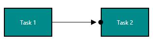

##Bridging

Line Bridging creates a bridge for lines to smartly cross over other lines, at points of interaction. When two lines Connectors meet each other, the line with higher z-order (upper one) draws an arc over the underlying Connector. Bridging can be enabled/disabled either with the `Constraints` property of Connector or with `GraphConstraints`. The following code example illustrates how to enable line bridging.



ObservableCollection<ConnectorViewModel> lines = new ObservableCollection<ConnectorViewModel>();

ConnectorViewModel connector = new ConnectorViewModel()
{
	SourcePoint = new Point(100, 100),
	TargetPoint = new Point(250, 300),
	ConnectorGeometryStyle = this.diagram.Resources["connectorstyle"] as Style,
	TargetDecoratorStyle = this.diagram.Resources["decoratorstyle1"] as Style,
	Constraints = ConnectorConstraints.Default & ~ConnectorConstraints.InheritBridging | 
                     ConnectorConstraints.Bridging
};
ConnectorViewModel connector1 = new ConnectorViewModel()
{
	SourcePoint = new Point(250, 50),
	TargetPoint = new Point(150, 300),
	ConnectorGeometryStyle = this.diagram.Resources["connectorstyle"] as Style,
	TargetDecoratorStyle = this.diagram.Resources["decoratorstyle1"] as Style,
	Constraints = ConnectorConstraints.Default & ~ConnectorConstraints.InheritBridging | 
                     ConnectorConstraints.Bridging
};

diagram.BridgeDirection = BridgeDirection.Bottom;
diagram.Constraints = GraphConstraints.Default | GraphConstraints.Bridging;

lines.Add(connector);
lines.Add(connector1);
diagram.Connectors = lines;



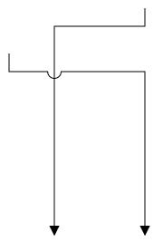

The direction of the bridge can be customized with the property `BridgeDirection` defines the intersecting segment where the bridge has to be inserted. By default, the bridge direction points to the top.

The following code example illustrates how to draw the bridge at the bottom direction.



<diagram:SfDiagram x:Name="diagram" BridgeDirection="Bottom">
<diagram:ConnectorViewModel SourcePoint="100,100" TargetPoint="250,150" 
                            Constraints="Bridging">




diagram.BridgeDirection = BridgeDirection.Bottom;
diagram.Constraints = GraphConstraints.Default | GraphConstraints.Bridging;



N> Bezier segments do not support Bridging.

##Corner radius

Corner radius allows to create Connectors with rounded corners. The radius of the rounded corner is set with `CornerRadius` property.



ObservableCollection<NodeViewModel> nodes = new ObservableCollection<NodeViewModel>();

NodeViewModel node1 = new NodeViewModel()
{
	UnitWidth = 100,
	UnitHeight = 60,
	OffsetX = 200,
	OffsetY = 200,
	Annotations = new ObservableCollection<IAnnotation>()
	{
		new AnnotationEditorViewModel()
		{
			Content="Task 1",
			ViewTemplate=this.diagram.Resources["viewtemplate"] as DataTemplate
		}
	},
	ContentTemplate = this.diagram.Resources["contenttemplate"] as DataTemplate,
	Shape = new RectangleGeometry() { Rect = new Rect(0, 0, 10, 10) },
	ShapeStyle = this.diagram.Resources["shapestyle"] as Style
};

NodeViewModel node2 = new NodeViewModel()
{
	UnitWidth = 100,
	UnitHeight = 60,
	OffsetX = 350,
	OffsetY = 300,
	Annotations = new ObservableCollection<IAnnotation>()
	{
		new AnnotationEditorViewModel()
		{
			Content="Task 1",
			ViewTemplate=this.diagram.Resources["viewtemplate"] as DataTemplate
    		}
	},
	Shape = new RectangleGeometry() { Rect = new Rect(0, 0, 10, 10) },
	ShapeStyle = this.diagram.Resources["shapestyle"] as Style
};

nodes.Add(node1);
nodes.Add(node2);
diagram.Nodes = nodes;

ObservableCollection<Connector> connectors = new ObservableCollection<Connector>();
Connector connector = new Connector()
{
	SourceNode = node1,
	TargetNode = node2,
	CornerRadius = 10,
	ConnectorGeometryStyle = this.diagram.Resources["connectorstyle"] as Style,
	TargetDecoratorStyle = this.diagram.Resources["decoratorstyle1"] as Style,
};

connectors.Add(connector);
diagram.Connectors = connectors;



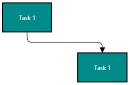

##Appearance

StrokeThickness, Stroke and style of the LineConnector and Decorators can be customized with a set of defined properties.

###Segment Appearance

The following code example illustrates how to customize the segment appearance.







ObservableCollection<Connector> lines = new ObservableCollection<Connector>();
Connector connector = new Connector()
{
	SourcePoint = new Point(100, 100),
	TargetPoint = new Point(200, 200),
	ConnectorGeometryStyle = this.diagram.Resources["connectorstyle"] as Style,
};

lines.Add(connector);
diagram.Connectors = lines;



###Decorator Appearance

The following code example illustrates how to customize the appearance of the decorator.

[XAML]





[C#]



TargetDecoratorStyle = this.diagram.Resources["decoratorstyle1"] as Style,



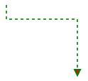

##Interaction

Diagram allows to edit the Connectors at runtime. To edit the Connector segments at runtime, refer to [Connection Editing](/wpf/sfdiagram/Interaction#Connection-Editing "Connection Editing").

##Constraints

The `Constraints` property of Connector allows to enable/disable certain features of Connectors. For more information about	constraints, refer to [Connector Constraints](/wpf/sfdiagram/Constraints#ConnectorConstraints "Connector Constraints").

