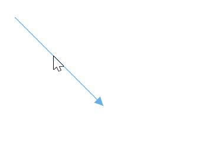
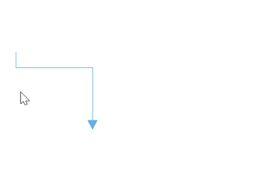

# Connector Selection and Dragging

Connectors can be selected and dragged over the diagram page. 

## How to select and edit the connector

The connector can be selected by tapping it. When connector is selected, circles will be added on the starting and ending of the connector, which is represented by `Thumbs`. Clicking and dragging those handles helps you to adjust the source and target points.

## How to drag the connector

Also, the entire connector can be dragged over the page by using the `Constraints` property and setting its value as Draggable.




<!--Initialize the Sfdiagram-->
<syncfusion:SfDiagram x:Name="diagram" DefaultConnectorType="Line">
    <syncfusion:SfDiagram.Connectors>
        <!--Initialize the Connector Collection-->
        <syncfusion:ConnectorCollection>
            <!--create the connector with draggable constraint-->
            <syncfusion:ConnectorViewModel x:Name="simpleConnector" SourcePoint="100,100" TargetPoint="200,200" Constraints="Default,Draggable" />
        </syncfusion:ConnectorCollection>
    </syncfusion:SfDiagram.Connectors>
</syncfusion:SfDiagram>




//Initialize the SfDiagram
SfDiagram diagram = new SfDiagram();

//Define the Connector Type
diagram.DefaultConnectorType = ConnectorType.Line;

//creating simple connector through collection using source and target points.
ConnectorViewModel simpleConnector = new ConnectorViewModel()
{
    SourcePoint = new Point(100,100),
    TargetPoint = new Point(200,200),
    //Define the constraint as draggable
    Constraints = ConnectorConstraints.Default | ConnectorConstraints.Draggable,
};

//Adding the connector into Collection
(diagram.Connectors as ConnectorCollection).Add(simpleConnector);




