### Connectors

Connectors are objects used to create a link between two nodes. A connector is a line that has connection points (Source Point and Target Point) at the ends of the line and stays connected to the objects that you attach it to.

{:.image }

Creating a Connector

Like nodes, connectors can also be added in two ways:

* Adding a Connector at Run Time
* Adding a Connector Through Code

Adding a Connector at Run Time

1. Set the Tool property of SfDiagram to _DrawOnce_ or _ContinuesDraw_.
2. Place the Source Point of the connector on the Source Node, and the corresponding node is treated as the source for the new connection.
3. Finally, drag the Target Point of the connector to the Target Node to create a connection between the Source Node and the Target Node.

Adding a Connector through Code

The following code illustrates how to create a connection between a Source Node and Target Node through code:

[C#]

// Creates NodeViewModel-SourceNode

ObservableCollection<NodeViewModel> nodes = new ObservableCollection<NodeViewModel>();

NodeViewModel source = new NodeViewModel()

{

Width = 75,

Height = 50,

OffsetX = 200,

OffsetY = 200,

Shape = new RectangleGeometry() { Rect = new Rect(0, 0, 10, 10) },

ShapeStyle = GetStyle()

};
// Adds Nodes to SfDiagram

nodes.Add(source);

// Creates NodeViewModel-TargetNode

NodeViewModel target = new NodeViewModel()

{

Width = 75,

Height = 50,

OffsetX = 200,

OffsetY = 330,

Shape = new RectangleGeometry() { Rect = new Rect(0, 0, 10, 10) },

ShapeStyle = GetStyle()

};

// Adds Nodes to SfDiagram

nodes.Add(target);

diagramcontrol.Nodes = nodes;

ObservableCollection<ConnectorViewModel> lines = new ObservableCollection<ConnectorViewModel>();

ConnectorViewModel con = new ConnectorViewModel()

{

SourceNode = source,

TargetNode = target,

ConnectorGeometryStyle = GetConStyle()

};

// Adds Connection to the SfDiagram

lines.Add(con);

diagramcontrol.Connectors = lines;

Setting the Connector Style

ConnectorGeometryStyle property is used to customize the style of the Connectors. The following code example illustrates how to do this:

[XAML]

&lt;Style TargetType="Path" x:Key="connectorstyle"&gt;

&lt;Setter Property="Stroke" Value="Red"&gt;&lt;/Setter&gt;

&lt;Setter Property="StrokeThickness" Value="2"&gt;&lt;/Setter&gt;

&lt;/Style&gt;

[C#]

// Creates Connection

ObservableCollection<ConnectorViewModel> lines = new ObservableCollection<ConnectorViewModel>();

ConnectorViewModel con = new ConnectorViewModel()

{

SourceNode = source,

TargetNode = target,

      ConnectorGeometryStyle =this.Resources["connectorstyle"] as Style       
};

// Adds Connection to SfDiagram

lines.Add(con);

diagramcontrol.Connectors = lines;

Customizing the Appearance of the Source and Target Points

SourceDecorator and TargetDecorator properties provide support to customize the appearance of the Source Point and Target Point of Connectors.The following code example illustrates this:

[C#]   

// Creates Connection

ObservableCollection<ConnectorViewModel> lines = new ObservableCollection<ConnectorViewModel>();

ConnectorViewModel con = new ConnectorViewModel()

{

SourceNode = source,

TargetNode = target,

ConnectorGeometryStyle = this.Resources["connectorstyle"] as Style,  
// Specifies DecoratorShape

TargetDecorator = new PathGeometry()

{

Figures = new PathFigureCollection()

{

new PathFigure()

{

StartPoint = new Point(0, 0),

Segments = new PathSegmentCollection()

{

new PolyLineSegment()

{

Points = new PointCollection()

{

new Point(10, 5),

new Point(0, 10),

new Point(0,0)

}

}

}

}

}

},              

};                        

// Adds Connection to SfDiagram

lines.Add(con);

diagramcontrol.Connectors = lines;

Customizing the Appearance of the Decorator Shapes

SourceDecoratorStyle and TargetDecoratorStyle shape properties provide support to customize the appearance of the Source and Target Decorator Shapes.

The following code example illustrates how to customize the Decorator Shape:

[XAML]

&lt;Style x:Key="decoratorstyle1" TargetType="Path"&gt;

&lt;Setter Property="Stroke" Value="Green" /&gt;

&lt;Setter Property="Fill" Value="Yellow" /&gt;

&lt;Setter Property="StrokeThickness" Value="1" /&gt;

&lt;Setter Property="Width" Value="10" /&gt;

&lt;Setter Property="Height" Value="10" /&gt;

&lt;Setter Property="Stretch" Value="Fill" /&gt;

&lt;/Style&gt;

[XAML]

&lt;Style x:Key="decoratorstyle" TargetType="Path"&gt;

&lt;Setter Property="Fill" Value="Black" /&gt;

&lt;Setter Property="Stroke" Value="Black" /&gt;

&lt;Setter Property="StrokeThickness" Value="2" /&gt;

&lt;Setter Property="Width" Value="10" /&gt;

&lt;Setter Property="Height" Value="10" /&gt;

&lt;Setter Property="Stretch" Value="Fill" /&gt;

&lt;/Style&gt;

[C#]

ConnectorViewModel cvm = new ConnectorViewModel()

{

SourceNode = node1,

TargetNode = node2,

ConnectorGeometryStyle = this.Resources["connectorstyle"] as Style,

TargetDecorator = new PathGeometry()

{

Figures = new PathFigureCollection()

{

new PathFigure()

{

StartPoint = new Point(0, 0),

Segments = new PathSegmentCollection()

{

new PolyLineSegment()

{

Points = new PointCollection()

{

new Point(10, 5),

new Point(0, 10),

new Point(0,0)

}

}

}

}

}

},

SourceDecorator = new EllipseGeometry() { RadiusX = 10, RadiusY = 10 },

SourceDecoratorStyle = this.Resources["decoratorstyle1"] as Style,

TargetDecoratorStyle = this.Resources["decoratorstyle"] as Style

};

(sfdiagram.Connectors as DiagramCollection).Add(cvm);

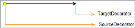
{:.image }

Segments

Segments are used to define the path connecting a source point and a target point. It can be a point, node, or connection port. Any number of segments can be added to this collection. When a connector is being rendered, each segment is iterated and the corresponding segments are drawn. When necessary, additional segments are added for the path to meet the specified target.

The following segments are available:

* ILineSegment
* ILineSegmentLength
* IOrthogonalSegment
* QuadraticCurveSegment
* CubicCurveSegment

ILineSegment

ILineSegment is used to create straight segments by defining the end point of the line segment.

[C#]

ConnectorViewModel con = new ConnectorViewModel()

{

        SourcePoint = new Point(100, 200),

 TargetPoint = new Point(200, 200),    

 // Customizes the ConnectorGeometryStyle.

 ConnectorGeometryStyle = this.Resources["connectorstyle"] as Style

};

//Adds Line Segment to Segments.

con.Segments = new ObservableCollection<IConnectorSegment>()

{

      new LineSegment() { Point = new Point(150,100) }

};

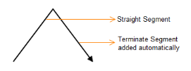
{:.image }

> 
{:.image }
_Note: A terminate segment is added to meet the given target point if the given segment is invalid. The terminate segment will be a type that is added previously._ 

ILineSegmentLength

ILineSegmentLength is used to create a straight segment by defining the length and angle of the line segment.

[C#]

ConnectorViewModel con = new ConnectorViewModel()

{

       SourcePoint = new Point(100, 200),

TargetPoint = new Point(200, 200), 

// Customizes the ConnectorGeometryStyle. 

ConnectorGeometryStyle = this.Resources["connectorstyle"] as Style

};

//Adds Line Segment to Segments.

con.Segments = new ObservableCollection<IConnectorSegment>()

{

      //Invalid Line Segment.

      new LineSegmentLength(){Length=50,Angle=-45}

};

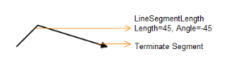
{:.image }

IOrthogonalSegment

IOrthogonalSegment is used to create an orthogonal segment by defining the length and direction of the segment.

[C#]

ConnectorViewModel con = new ConnectorViewModel()

{

       SourcePoint = new Point(100, 100),

TargetPoint = new Point(200, 200), 

// Customizing the ConnectorGeometryStyle. 

ConnectorGeometryStyle = this.Resources["connectorstyle"] as Style

};

//Adds Orthogonal Segment to Segments.

con.Segments = new ObservableCollection<IConnectorSegment>()

{

      //Invalid Orthogonal Segment.

new OrthogonalSegment()

};

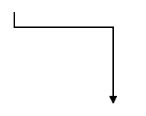
{:.image }

IQuadraticCurveSegment

IQuadraticCurveSegment is used to create a curved segment by defining one control point and the end point of the segment.

[C#]

ConnectorViewModel con = new ConnectorViewModel()

{

       SourcePoint = new Point(100, 100),

TargetPoint = new Point(300, 100), 

// Customizes the ConnectorGeometryStyle. 

ConnectorGeometryStyle = this.Resources["connectorstyle"] as Style

};

//Adds Quadratic Curve Segment to Segments.

con.Segments = new ObservableCollection<IConnectorSegment>()

{  

       //Adds Quadratic Curve Segment to Segments.        

new QuadraticCurveSegment()

{

Point1 = new Point(200,50)

}

};

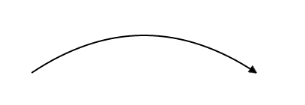
{:.image }

ICubicCurveSegment

ICubicCurveSegment is used to create a curved segment by defining two control points and the end point of the segment.

[C#]

ConnectorViewModel con = new ConnectorViewModel()

{

       SourcePoint = new Point(100, 100),

TargetPoint = new Point(400, 100), 

// Customizes the ConnectorGeometryStyle.

ConnectorGeometryStyle = this.Resources["connectorstyle"] as Style

};

//Adds Cubic Curve Segment to Segments.

con.Segments = new ObservableCollection<IConnectorSegment>()

{     

              //Invalid Cubic Curve Segment.

new CubicCurveSegment()

{

Point1 = new Point(200,50),

Point2 = new Point(300,150)

}

}

};

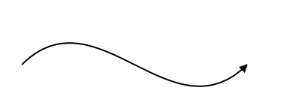
{:.image }

Segment Editing

Segment editing provides a way to dynamically edit segments of a line connector through the use of segment start points, end points, and control points.

Connector Constraints

_Table_ _2__: Constraints Table_

<table>
<tr>
<td>
Constraint</td><td>
Description</td></tr>
<tr>
<td>
None</td><td>
Disables all behaviors of control.</td></tr>
<tr>
<td>
Selectable</td><td>
Enables to connectors to be selected.</td></tr>
<tr>
<td>
SourceDraggable</td><td>
Enables the source end to be dragged.</td></tr>
<tr>
<td>
TargetDraggable</td><td>
Enables the target end of a connector to be dragged.</td></tr>
<tr>
<td>
EndDraggable</td><td>
Enables both the source and target ends of a connector to be dragged.</td></tr>
<tr>
<td>
EndThumbs</td><td>
Enables end points on line connectors for editing, such as source points and target points.</td></tr>
<tr>
<td>
SegmentThumbs</td><td>
Enables control points and end points of every segment in a line connector for editing.</td></tr>
<tr>
<td>
Thumbs</td><td>
Enables both EndThumbs and SegmentThumbs.</td></tr>
<tr>
<td>
Bridging</td><td>
Enables line bridging.</td></tr>
<tr>
<td>
Routing</td><td>
Enables line routing.</td></tr>
<tr>
<td>
SnapToHorizontalLines</td><td>
Enables connectors to be snapped to horizontal gridlines.</td></tr>
<tr>
<td>
SnapToVerticalLines</td><td>
Enables connectors to be snapped vertical gridlines.</td></tr>
<tr>
<td>
SnapToLines</td><td>
Enables connectors to be snapped to gridlines.</td></tr>
<tr>
<td>
InheritBridging</td><td>
Enables to inherit the Bridging behavior from node</td></tr>
<tr>
<td>
InheritRouting</td><td>
Enables to inherit the Routing behavior from node</td></tr>
<tr>
<td>
InheritSnapping</td><td>
Enables to inherit the Snapping behavior from node</td></tr>
<tr>
<td>
InheritSnapToObject</td><td>
Enables to inherit the SnapToObject behavior from node</td></tr>
<tr>
<td>
InheritSmoothness</td><td>
Enables to inherit the Smoothness behavior from node</td></tr>
<tr>
<td>
Inherit</td><td>
Enables to inherit the connecting behavior from node</td></tr>
<tr>
<td>
Default</td><td>
Enables all behaviors of the control.</td></tr>
</table>
End Thumbs Editing

[C#]

line.Constraints = ConnectorConstraints.Default | ConnectorConstraints.EndThumbs;

End thumbs editing allows only the source point and target point of a line connector to be edited.

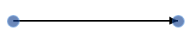
{:.image }

Segment Thumbs Editing

[C#]

line.Constraints = ConnectorConstraints.Default | ConnectorConstraints.SegmentThumbs;

Segment thumbs allow each segment of a line connector to be edited.

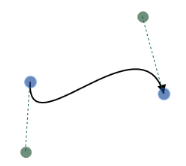
{:.image }

Orthogonal Segment Editing

Orthogonal segments can be edited at runtime by dragging control points, called thumbs. While dragging control points, some segments can be added or removed to maintain perpendicularity. 

Segments can be edited by dragging the segment thumbs. Segments are updated as neighboring segments are adjusted.

{:.image }

While dragging the end thumbs, new segments may be added.

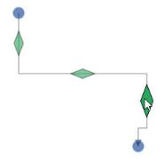
{:.image }

When one segment overlaps another segment, unwanted segments are deleted.

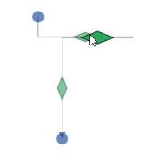
{:.image }

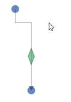
{:.image }

Line Routing

When drawing a connector between two nodes, when any other nodes are in the path of the connector, it is redrawn around the interfering nodes.

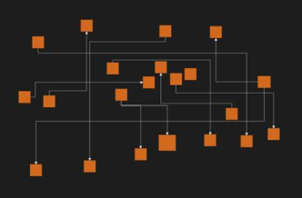
{:.image }

Enabling Line Routing

Line routing is disabled by default, but can be enabled in two ways:

Through GraphConstraints

[C#]

SfDiagram diagramControl = new SfDiagram();

diagramControl.Constraints = diagramControl.Constraints |GraphConstraints.Routing;

Through ConnectorConstraints

[C#]

 Connector conn = new Connector();

 connector.Constraints = conn.Constraints | ConnectorConstraints.Routing;

> 
{:.image }
_Note: When ConnectorConstraints is set to Inherit, GraphConstraints are considered to enable or disable routing. Otherwise, ConnectorConstraints are considered._

Line Bridging

Line bridging provides a visual bridge at the intersection of two or more line connectors. By default, an arc is used as a line bridge, but this shape can be overridden. 

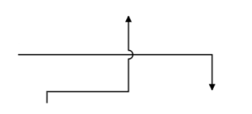
{:.image }

Line Bridging Direction

Direction of the Line Bridge is customized by using BridgeDirection property. This property decides the intersecting segment to show a bridge based path on the preferred direction. The Default value is BridgeDirection.Top.

_Table_ _3__: Property Table_

<table>
<tr>
<td>
Properties</td><td>
Description</td><td>
Value</td></tr>
<tr>
<td>
BridgeDirection</td><td>
Gets or Sets the BridgeDirection for Horizontal and vertical lines.</td><td>
EnumBridgeDirection.LeftBridgeDirection.RightBridgeDirection.TopBridgeDirection.Bottom</td></tr>
</table>
Example 1: Bridge for Horizontal Connector (with BridgeDirection.Top)
The following code example explains how to enable the Bridging and set Bridge Direction.

[C#]

//Initializes Bridging and setting Bridge Direction

diagram.Constraints = diagram.Constraints | GraphConstraints.Bridging;

diagram.BridgeDirection = BridgeDirection.Top;

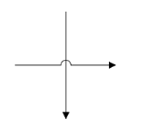
{:.image }

Example 2: Bridge for Vertical Connector (with BridgeDirection.Left)

[C#]

// sets Bridge Direction

diagramControl.BridgeDirection = BridgeDirection.Left;

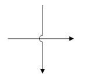
{:.image }

Enable Bridging

Line bridging is disabled by default. It can be enabled in two ways:

* Graph Constraints
* Connector Constraints

Graph Constraints

Enabling line bridging through graph constraints applies line bridging to all connectors.

[XAML]

  &lt;sync:SfDiagram x:Name="diagramcontrol" Constraints="Default, Bridging"&gt;

  &lt;/sync:SfDiagram&gt;

[C#]

//Initializes the Diagram control.

SfDiagram diagramcontrol = new SfDiagram();

//Enables line bridging.

diagramcontrol.Constraints |= GraphConstraints.Bridging;

Connector Constraints

Enabling line bridging through connector constraints applies line bridging only to corresponding connectors.

[XAML]

&lt;sync:SfDiagram x:Name="diagramcontrol"&gt;

&lt;sync:SfDiagram.Connectors&gt;

&lt;sync:DiagramCollection&gt;

<sync:Connector SourcePoint="100,200" 

		  TargetPoint="400,200" 

                Constraints="Bridging"/>

<sync:Connector SourcePoint="100,300" 

		  TargetPoint="300,100" 

                Constraints="Bridging"/>

&lt;/sync:DiagramCollection&gt;

&lt;/sync:SfDiagram.Connectors&gt;

&lt;/sync:SfDiagram&gt;  

[C#]

//Creates lines

ObservableCollection<ConnectorViewModel> lines = new

ObservableCollection<ConnectorViewModel>();

//Initializes line connectors.

ConnectorViewModel line1 = new ConnectorViewModel()

{

           SourcePoint = new Point(100, 200),

           TargetPoint = new Point(400, 200),

           Constraints = ConnectorConstraints.Default | ConnectorConstraints.Bridging

};

//Initializes line connectors.

ConnectorViewModel line2 = new ConnectorViewModel()

{

           SourcePoint = new Point(100, 300),

           TargetPoint = new Point(300, 100),

           Constraints = ConnectorConstraints.Default | ConnectorConstraints.Bridging

};

// Adds connection to the SfDiagram.

lines.Add(line1);

lines.Add(line2);

diagramcontrol.Connectors = lines; 

Inherit

When ConnectorConstraints is set to Inherit, GraphConstraints will be considered to enable or disable line bridging. Otherwise, ConnectorConstraints will be considered.

Custom Bridging Segment

Bridge segments can be customized by overriding the connector’s virtual method CreateSegments as shown in the following code sample:

[C#]

public class CustomLine : Connector

{

        //Overridess function to define custom segments.

        protected override IEnumerable<PathSegment> 

CreateSegments(Point start, Point end, double angle)

        {

            List<PathSegment> seg = new List<PathSegment>();

            seg.Add(new LineSegment() { Point = new Point(start.X, start.Y - 10) });

            seg.Add(new LineSegment() { Point = new Point(end.X, start.Y - 10) });

            seg.Add(new LineSegment() { Point = new Point(end.X, end.Y) });

            return seg;

        }

}

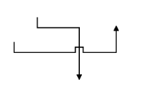
{:.image }

Freehand Drawing

You can draw freehand lines in the Diagram control. The control then converts the drawing into a series of Bezier curves to smooth the appearance and allowd you to adjust the drawing.

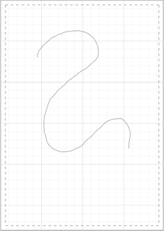
{:.image }

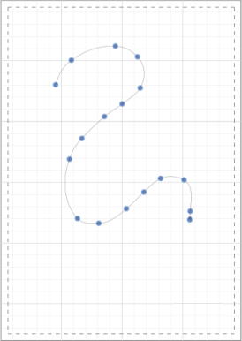
{:.image }

The following code example illustrates how to enable freehand drawing:

[C#]

//Enables DrawingTool 

diagramControl.Tool = diagramControl.Tool | Tool.DrawOnce;

//Enables FreeHandDrawing 

diagramControl.DefaultConnectorType = ConnectorType.PolyCubicBezier;

Runtime Connection Indicator

Description

When a connector is dragged towards a port or node for connection, the node is highlighted with an animated visualization.

Visualization

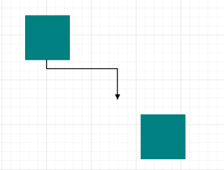
{:.image }

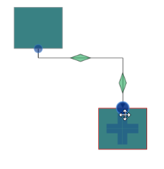
{:.image }

The node or port towards the connector is dragged and highlighted with a red border.The mouse position on the node is indicated by an animated circle.

Customization of Visualization

The data template of the connection indicator can be customized by the protected virtual method GetConnectionIndicator.

_Table_ _4__: Property Table_

<table>
<tr>
<td>
Property</td><td>
Description</td><td>
Arguments</td></tr>
<tr>
<td>
SfDiagram.GetConnectionIndicator</td><td>
Returns the DataTemplate of the runtime connection indicator.</td><td>
 Target(object): Node or port towards which the connector is moved.</td></tr>
</table>

Corner Radius 

CornerRadius support enables you to create connectors with rounded corners.

_Table_ _5__: Property Table_

<table>
<tr>
<td>
Properties</td><td>
Description</td><td>
Value</td></tr>
<tr>
<td>
CornerRadius</td><td>
Gets or sets the CornerRadius of the LineConnector. </td><td>
   Double</td></tr>
</table>
The following code example illustrates how to set corner radius for connectors.

[C#]

//Adds corner radius for connector

ConnectorViewModel con = new ConnectorViewModel()

{

CornerRadius = 10,

};

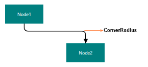
{:.image }

Connector Padding

Connector Padding allows you to adjust the space between the connector’s end point and the object that it is connected (Node, Group, or Port).

Endpoint adjustment with specific to Connector ends

You can adjust the padding distance between source or target end with its connected end (Node, Group, or Port) by using sourcePadding and targetPadding respectively.

The following code example illustrate how to adjust the distance by using padding property.

[C#]

//Adds ConnectorPadding for connector

ConnectorViewModel con = new ConnectorViewModel()

{

SourcePadding = 15,

TargetPadding = 10,

};

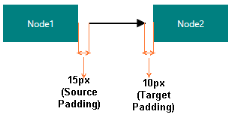
{:.image }

Endpoint adjustment with specific to Nodes

ConnectorPadding property of a Node is used to specify how much space in pixels is to be left between a Node and all its connected Edges.

The following code example illustrates how to pad Edges connected to a Node.

[C#]

//Adds ConnectorPadding for Node

NodeViewModel node = new NodeViewModel()

{

ConnectorPadding = 10,

};

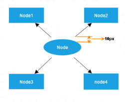
{:.image }

Endpoint adjustment with specific to Ports

ConnectorPadding property of a port is used to specify, the amount of space needed in pixels between a port and all its connected edges.

The following code example illustrates how to pad Edges connected to a Port.

[C#]

//Adds ConnectorPadding for port

NodePort port = new NodePort()

{

ConnectorPadding = 10,

};

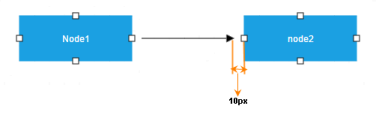
{:.image }

