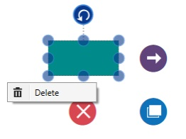

#Context Menu

In graphical user interface (GUI), a ContextMenu is a type of Menu that appears when you perform right-click operation. Nested level of Context Menu items can be created. Diagram provided some in-build ContextMenu items and allows to define custom menu items.

##Default Context Menu

The `ContentMenu` Constraint helps you to enable/disable the context menu. Diagram provides some default context menu items to ease the execution of some frequently used commands. 

The following code illustrates how to enable/disable the default context menu items.



//Disable context menu
diagram.Constraints = GraphConstraints.Default & ~GraphConstraints.ContextMenu;

//Enable context menu
diagram.Constraints = GraphConstraints.Default | GraphConstraints.ContextMenu;



##Customize Context Menu

Apart from the default ContextMenu items, you can define some additional menu items by using `Menu` property of SfDiagram, Node and Connector. Those additional items have to be defined and added to `MenuItems` Property. 

The following code example illustrates how to add custom context menu items to Menu property of SfDiagram.



DiagramMenuItem menu = new DiagramMenuItem() 
	{
		Content = "Delete", 
		Command = (diagram.Info as IGraphInfo).Commands.Delete,
	};
Diagram.Menu.MenuItems.Add(menu);



###Menu for Node and Connector

The default value of Menu property for Node and Connector is null.

The following code example illustrates how to set ContextMenu and ContextMenuItems to Node.



node.Constraints = node.Constraints | NodeConstraints.Menu;
node.Menu = new DiagramMenu();
node.Menu.MenuItems=new ObservableCollection<DiagramMenuItem>();
DiagramMenuItem mi = new DiagramMenuItem()
{
	Content = "Delete",
	Command = (diagram.Info as IGraphInfo).Commands.Delete
};
(node.Menu.MenuItems as ICollection<DiagramMenuItem>).Add(mi);



You can be notified with events when you click the custom menu items. The following code example illustrates the how to define the event for custom context menu.



menu.ClickedEvent += menu_ClickedEvent;

private void menu_ClickedEvent(object sender, MenuItemClickedEventArgs args)
{
	//Source – in which object Event get fired
    //Item - MenuItem     
}



##Context Menu Events

You would be notified with events when you click the menu items. The following code example illustrates how to define those events.



(Diagram.Info as IGraphInfo).MenuItemClickedEvent += MainPage_MenuItemClickedEvent;

void MainPage_MenuItemClickedEvent(object sender, MenuItemClickedEventArgs args)
{
	//Source – in which object Event get fired
    //Item - MenuItem     
}


