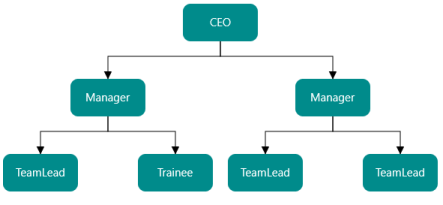

### DataSource Support

SfDiagram is populated with the node taken from an external hierarchical data source. SfDiagram exposes its specific, data-related properties and allows you to specify the data source fields from where the node information is retrieved from.

DataSource Settings

Two mapping fields are necessary to map a hierarchical datatsource with the Diagram. Id property is used for unique identification of a record. ParentId property is used to identify the parent object where a particular object is connected.

<table>
<tr>
<td>
Properties</td><td>
Description</td><td>
Value</td></tr>
<tr>
<td>
DataSource</td><td>
Data source based on the Diagram that is to be generated.</td><td>
Object</td></tr>
<tr>
<td>
ParentId</td><td>
Specifies the mapping parent id property of the data source items.</td><td>
String</td></tr>
<tr>
<td>
Id</td><td>
Specifies the mapping unique id property of data source items.</td><td>
String</td></tr>
</table>

DataSource

The following code example illustrates how to bind data to the SfDiagram.

[C#]

//Creates Data

ObservableCollection<Employee> employee = new ObservableCollection<Employee>();

employee.Add(new Employee() { Name = "Steve", Designation = "CEO" });

employee.Add(new Employee() { Name = "Kevin", ParentId = "Steve", Designation = "Manager" });

employee.Add(new Employee() { Name = "John", ParentId = "Steve", Designation = "Manager" });

employee.Add(new Employee() { Name = "Raj",  ParentId = "Kevin", Designation = "TeamLead" });

employee.Add(new Employee() { Name = "Will", ParentId = "Kevin", Designation = "s/w Developer"});

employee.Add(new Employee() { Name = "Sarah",  ParentId = "John", Designation = "TeamLead"});

employee.Add(new Employee() { Name = "Mike", ParentId = "John”, Designation = "Testing Engineer"});

//Sets ParentId-For Relation

diagram.Nodes = new ObservableCollection<object>();

diagram.Connectors = new ObservableCollection<object>();

//Sets ParentId-For Relation

diagram.DataSourceSchema.RelativeTo = "ParentId";

//Sets ID-for Mapping

diagram.DataSourceSchema.MappingName = "Name";

//Assigns Collection

diagram.DataSourceSchema.DataSource = employee;

{:.image }

