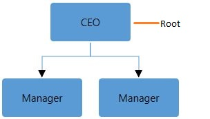

# DataSource

SfDiagram is populated with the Node taken from an external hierarchical data source. SfDiagram exposes its specific, data-related properties and allows you to specify the data source fields where the node information is retrieved from.

DataSource Settings

Two mapping fields are necessary to map a hierarchical datasource with the diagram. Id property is used for unique identification of a record. ParentId property is used to identify the parent object to which a particular object is connected.

<table>
<tr>
<td>
Properties  </td><td>
Description  </td><td>
Value  </td></tr>
<tr>
<td>
DataSource   </td><td>
Data source based on the diagram that is to be generated.  </td><td>
Object  </td></tr>
<tr>
<td>
ParentId  </td><td>
Specifies the mapping parent id property of the data source items.  </td><td>
String  </td></tr>
<tr>
<td>
Id  </td><td>
Specified the mapping unique id property of data source items.  </td><td>
String  </td></tr>
<tr>
<td>
Root  </td><td>
Specifies the root element of the data source items.  </td><td>
String  </td></tr>
</table>
DataSource

The following code example illustrates how to bind data to SfDiagram.

<table>
<tr>
<td>
diagram.Nodes = new ObservableCollection<Node>();  diagram.Connectors = new ObservableCollection<Connector>();  DataSourceSettings dataSourceSetttings = new DataSourceSettings();    dataSourceSetttings.ParentId = "ParentId";  dataSourceSetttings.Id = "EmpId";  dataSourceSetttings.Root = "1";  ObservableCollection<Employee> employee = new ObservableCollection<Employee>();  employee.Add(new Employee() { Name = "Steve", EmpId = 1, ParentId = "",  Designation = "CEO" });  employee.Add(new Employee() { Name = "Kevin", EmpId = 2, ParentId = "1",   Designation = "Manager" });  employee.Add(new Employee() { Name = "John", EmpId = 3, ParentId = "1",   Designation = "Manager" });  employee.Add(new Employee() { Name = "Raj", EmpId = 4, ParentId = "2",   Designation = "Team Lead" });  employee.Add(new Employee() { Name = "Will", EmpId = 5, ParentId = "2",   Designation = "S/w Developer" });  employee.Add(new Employee() { Name = "Sarah", EmpId = 6, ParentId = "3",   Designation = "TeamLead" });  employee.Add(new Employee() { Name = "Mike", EmpId = 7, ParentId = "3",  Designation = "Testing Engineer" });    dataSourceSetttings.DataSource = employee;  diagram.DataSourceSettings = dataSourceSetttings;    </td></tr>
</table>

DataSource Root:

During Automatic Layout, Node without parent is treated as Root of the layout. But, now we have provided the option to specify this Root by using the DataSource settings.

The following code illustrates how to specify the root object for the Diagram**.******

<table>
<tr>
<td>
{{'____'| markdownify }}//Object with id “Steve”, is considered as root of tree layout.****  diagram.DataSourceSettings.Root = “Steve”;    </td></tr>
</table>
____
____

______DataSource__ __with__ __Root____.______

