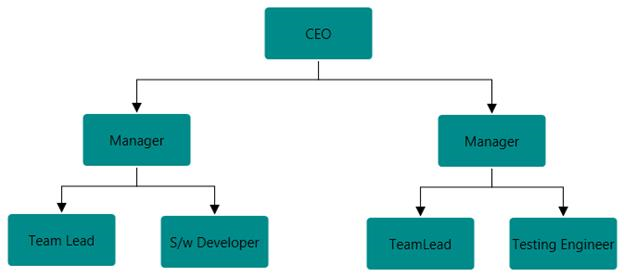
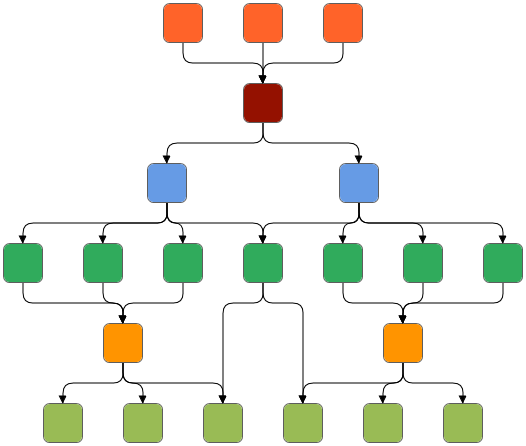
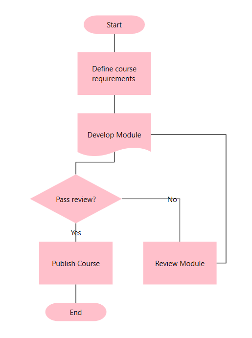

# DataSource

Diagram can be populated with the nodes and connectors based on the information provided from an external data source.

* The DataSourceSettings `DataSource` property is used to define the data source as a collection of objects which needs to be populated as diagram.

* The DataSourceSettings `Id` property is used to define the unique field of each data.

* The DataSourceSettings `ParentId` property is used to defines the parent field which builds the relationship between id and parent field.

* The DataSourceSettings `Root` property is used to define root node for the diagram populated from the data source.

To explore those properties, see [DataSourceSettings](https://help.syncfusion.com/cr/cref_files/wpf/Syncfusion.SfDiagram.WPF~Syncfusion.UI.Xaml.Diagram.DataSourceSettings_members.html)




<!-- Initializes the employee collection-->
<local:Employees x:Key="employees">
    <local:Employee Name="Steve" EmpId="1" ParentId="" Designation="CEO"/>
    <local:Employee Name="Kevin" EmpId="2" ParentId="1" Designation="Manager"/>
    <local:Employee Name="John" EmpId="3" ParentId="1" Designation="Manager"/>
    <local:Employee Name="Raj" EmpId="4" ParentId="2" Designation="Team Lead"/>
    <local:Employee Name="Will" EmpId="5" ParentId="2" Designation="S/w Developer"/>
    <local:Employee Name="Sarah" EmpId="6" ParentId="3" Designation="TeamLead"/>
    <local:Employee Name="Mike" EmpId="7" ParentId="3" Designation="Testing Engineer"/>
</local:Employees>

<!--Initializes the DataSourceSettings -->
<syncfusion:DataSourceSettings x:Key="DataSourceSettings" DataSource="{StaticResource employees}"
                               ParentId="ParentId" Id="EmpId" Root="1"/>
               
<!--Initializes the Layout-->                
<syncfusion:DirectedTreeLayout x:Key="treeLayout" HorizontalSpacing="80" VerticalSpacing="50" 
                               SpaceBetweenSubTrees="20" Orientation="TopToBottom"/>
<syncfusion:LayoutManager x:Key="layoutManager" Layout="{StaticResource treeLayout}"/>                               
         
<!--Initializes the SfDiagram-->          
<syncfusion:SfDiagram x:Name="diagram" LayoutManager="{StaticResource layoutManager}"                           
                      DataSourceSettings="{StaticResource DataSourceSettings}">
    <!--Initializes the NodeCollection-->                  
    <syncfusion:SfDiagram.Nodes>
        <syncfusion:NodeCollection/>
    </syncfusion:SfDiagram.Nodes>
    <!--Initializes the ConnectorCollection-->
    <syncfusion:SfDiagram.Connectors>
        <syncfusion:ConnectorCollection/>
    </syncfusion:SfDiagram.Connectors>
</syncfusion:SfDiagram>




Sample Link : [DataSource Sample](http://www.syncfusion.com/downloads/support/directtrac/195355/ze/DataSource-2014750971)

## Root

By default, the node without parent is treated as root of the layout. Now, `DataSourceSettings` have option to specify the root node of the layout.




//object with id “CEO”, is considered as root of tree layout.
diagram.DataSourceSettings.Root = “CEO”;




## Layout with Multiple Parent

Tree layout and data sources will now support nodes having multiple parents.The child Node is arranged in center of the parent positions.

Please find [Multi Parent Sample](http://www.syncfusion.com/downloads/support/directtrac/195355/ze/Multi_Parent-231048937) to depict this support.

Navigation->WPF->Diagram->Automatic layout->Multi Parent Hierarchical Tree

## FlowchartDataSourceSettings

FlowchartDataSourceSettings is the derived class of DataSourceSettings which contains the following mapping properties.These properties will map the property in the underlying data object to the datasource item.

The FlowchartDataSourceSettings `ContentMapping` property is used to display text on the Node.

The FlowchartDataSourceSettings `ConnectorTextMapping` property is used to display text on the Connection between the data source items.
The FlowchartDataSourceSettings `ShapeMapping` property is used to set specific shape for the data source items.
The FlowchartDataSourceSettings `WidthMapping` property is used to set width for the data source items.
The FlowchartDataSourceSettings `HeightMapping` property is used to set height for the data source items.



<!-- Initializes the DataSource collection-->
<local:DataItems x:Key="Dataitems">
<local:ItemInfo Id="1" NodeShape="{StaticResource StartOrEnd}" Width="100" Height="30" Name="Start"></local:ItemInfo>
<local:ItemInfo Id="2" NodeShape="{StaticResource Rectangle}" Width="120" Height="70" Name="Define course requirements">
    <local:ItemInfo.ParentId>
        <local:LabelList>
            <sys:String>1</sys:String> 
        </local:LabelList>
    </local:ItemInfo.ParentId>
</local:ItemInfo>
<local:ItemInfo Id="3" NodeShape="{StaticResource Document}" Width="120" Height="70" Name="Develop Module">
    <local:ItemInfo.ParentId>
        <local:LabelList>
            <sys:String>2</sys:String>
            <sys:String>6</sys:String>
        </local:LabelList>
    </local:ItemInfo.ParentId>
</local:ItemInfo>
<local:ItemInfo Id="4" NodeShape="{StaticResource Decision}" Width="150" Height="80" Name="Pass review?">
    <local:ItemInfo.ParentId>
        <local:LabelList>
            <sys:String>3</sys:String>
            </local:LabelList>
    </local:ItemInfo.ParentId>
</local:ItemInfo>
<local:ItemInfo Id="5" NodeShape="{StaticResource Rectangle}" Width="120" Height="70" Name="Publish Course">
    <local:ItemInfo.ParentId>
        <local:LabelList>
            <sys:String>4</sys:String>
        </local:LabelList>
    </local:ItemInfo.ParentId>
    <local:ItemInfo.Label>
        <local:LabelList>
            <sys:String>Yes</sys:String>
        </local:LabelList>
    </local:ItemInfo.Label>
</local:ItemInfo>
<local:ItemInfo Id="6" NodeShape="{StaticResource PredefinedProcess}" Width="120" Height="70" Name="Review Module">
    <local:ItemInfo.ParentId>
        <local:LabelList>
            <sys:String>4</sys:String>
        </local:LabelList>
    </local:ItemInfo.ParentId>
    <local:ItemInfo.Label>
        <local:LabelList>
            <sys:String>No</sys:String>
        </local:LabelList>
    </local:ItemInfo.Label>
</local:ItemInfo>
<local:ItemInfo Id="7" NodeShape="{StaticResource StartOrEnd}" Width="100" Height="30" Name="End">
    <local:ItemInfo.ParentId>
        <local:LabelList>
            <sys:String>5</sys:String>
        </local:LabelList>
    </local:ItemInfo.ParentId>
</local:ItemInfo>
</local:DataItems>
<!--Initializes the Layout-->
<syncfusion:FlowchartLayout x:Key="Layout"                            
                            HorizontalSpacing="80" 
                            VerticalSpacing="50"/>

<!--Initializes the DataSourceSettings -->
<syncfusion:FlowchartDataSourceSettings x:Key="DataSourceSettings"
                                        DataSource="{StaticResource Dataitems}"   
                                        ParentId="ParentId" Id="Id" 
                                        Shape="NodeShape" Width="Width" Height="Height" ConnectorLabel="Label" Content="Name" />
            
<!--Initializes the LayoutManager-->
<syncfusion:LayoutManager x:Key="layoutmanager" 
                          Layout="{StaticResource Layout}"/>

 <!--Initializes the SfDiagram-->          
<syncfusion:SfDiagram x:Name="diagram" LayoutManager="{StaticResource layoutManager}"                      
                      DataSourceSettings="{StaticResource DataSourceSettings}">
    <!--Initializes the NodeCollection-->                  
    <syncfusion:SfDiagram.Nodes>
        <syncfusion:NodeCollection/>
    </syncfusion:SfDiagram.Nodes>
    <!--Initializes the ConnectorCollection-->
    <syncfusion:SfDiagram.Connectors>
        <syncfusion:ConnectorCollection/>
    </syncfusion:SfDiagram.Connectors>
</syncfusion:SfDiagram>




Sample Link: Navigation->WPF->Diagram->Automatic layout->Flowchart Layout.