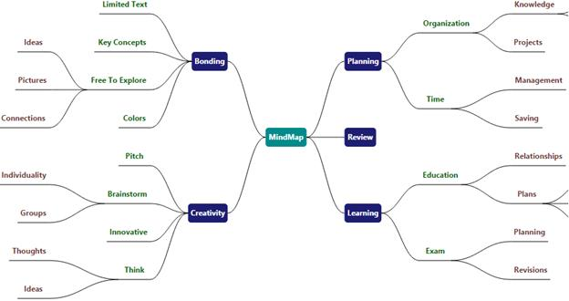

# Exporting

Diagram provides support to extent its content as image files

## Exporting Options

Diagram provides support to export the desired region of the Diagram to desired formats.

Format

SfDiagram can be exported to be following File formats.

* PNG
* JPEG
* TIFF
* GIF
* BMP

Contents of the Diagram can be exported as raster image files by using Export function. This exporting can be customized by using ExportSettings.

The following code illustrates how to use `ExportSettings` property of the SfDiagram:



ExportSettings settings = new ExportSettings()
{

  ImageStretch = Stretch.Fill,
  ExportMode = ExportMode.PageSettings

};

diagram.ExportSettings = settings;


The following code shows how to export the SfDiagram

//Method to Export the SfDiagram
diagram.Export();


### Mode

| ExportMode | Description |
|---|---|
| PageSettings | The area to be exported is based on PageSettings and how Children are arranged. |
| Content | Areas occupied by children are exported exactly. |

