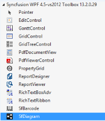
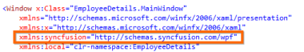
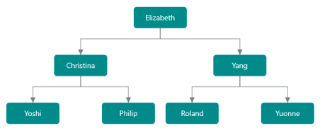

### Getting Started  

Creating a simple diagram:

This section demonstrates how to visualize the Employee details in the Organizational Chart arrangement by using the SfDiagram.

1. Add the SfDiagram from the Toolbox.

Drag and drop the SfDiagram control from the Toolbox to the XAML Page.

{:.image }

The xmlns namespace is added to the MainPage.xaml.

{:.image }

2. Initialize the SfDiagram

The SfDiagram exists in the http://schemas.syncfusion.com/wpf namespace. Initialize the SfDiagram in the XAML page as shown in the following code example.

[XAML]

<Window

    x:Class="EmployeeDetails.MainWindow"

    xmlns="http://schemas.microsoft.com/winfx/2006/xaml/presentation"

    xmlns:x="http://schemas.microsoft.com/winfx/2006/xaml"

    xmlns:local="clr-namespace:EmployeeDetails" 

xmlns:syncfusion="http://schemas.syncfusion.com/wpf">  

&lt;Grid&gt;

		&lt;syncfusion:SfDiagram&gt;            

		&lt;/syncfusion:SfDiagram&gt;  

     &lt;/Grid&gt;

&lt;/Window&gt;

3. Initialize Nodes and Connectors

To initialize the Nodes and Connectors property of the SfDiagram, Nodes property is assigned with the NodeCollection, that is, ObservableCollection of the Node. Connectors property is assigned with the ConnectorCollection, that is, ObservableCollection of the Coneector.

[XAML]

<Window

    x:Class="EmployeeDetails.MainWindow "

    xmlns="http://schemas.microsoft.com/winfx/2006/xaml/presentation"

    xmlns:syncfusion="http://schemas.syncfusion.com/wpf"

    xmlns:local="clr-namespace:EmployeeDetails" >

     &lt;Grid&gt;

       &lt;syncfusion:SfDiagram  x:Name="diagram&gt;

         &lt;!-- Custom Collection for Node and Connector&gt;-->

           &lt;syncfusion:SfDiagram.Nodes&gt;

              &lt;local:NodeList&gt;&lt;/local:NodeList&gt;

            &lt;/syncfusion:SfDiagram.Nodes&gt;

            &lt;syncfusion:SfDiagram.Connectors&gt;

              &lt;local:ConnectorList&gt;&lt;/local:ConnectorList&gt;

            &lt;/syncfusion:SfDiagram.Connectors&gt;

      &lt;/syncfusion:SfDiagram&gt;

    &lt;/Grid&gt;
&lt;/Window&gt;

[C#]

namespace EmployeeDetails

{

public sealed partial class MainWindow: Window

{

  		public MainWindow ()

  		{

      		this.InitializeComponent();
  		}
}

    //Custom collection for Node.

    public class NodeList : ObservableCollection<Node>

    {

    }

    //Custom collection for Connector.

    public class ConnectorList : ObservableCollection<Connector>

    {

    }

}

4. Create a class to store employee information

Now, you have to create a class named Employee with properties to store the employee’s information like name, designation, ID, reporting person ID, etc. You also have to create a collection that stores a collection of employees.

[C#]

namespace EmployeeDetails

{

public sealed partial class MainWindow: Window

{

  		public MainWindow ()

  		{

      		this.InitializeComponent();
  		}
}

//Employee -Business Object.

	public class Employee 
{

public string ParentId { get; set; }

public int Empid { get; set; }

public string Name { get; set; }

	    public string Designation { get; set; }  

}

//Employee Collection.

public class Employees : ObservableCollection<Employee>

{

}

}

5. Initialize Data

Create a collection of employees with each employee having an ID in the Epmid and the reporting person’s ID in the ParentId. This collection is placed in the Window resource and later incorporated in the diagram. This is explained in the next point.

[XAML]

<Window

    x:Class="EmployeeDetails.MainWindow "

    xmlns="http://schemas.microsoft.com/winfx/2006/xaml/presentation"

    xmlns:syncfusion="http://schemas.syncfusion.com/wpf"

xmlns:local="clr-namespace:EmployeeDetails">

&lt;Window.Resources&gt;

      &lt;!--Initializes the employee collection--&gt;

&lt;local:Employees x:Key="Employees"&gt;

&lt;local:Employee Name="Elizabeth" Empid="1" 	 					Designation="CEO"/&gt;

&lt;local:Employee Name="Christina" Empid="2" ParentId="1"    				Designation="Manager"/&gt;

&lt;local:Employee Name="Yang" Empid="3" ParentId="1" 					Designation="Manager"/&gt;

&lt;local:Employee Name="Yoshi" Empid="4" ParentId="2" 					Designation="TeamLead"/&gt;

&lt;local:Employee Name="Philip" Empid="5" ParentId="2" 					Designation="TeamLead"/&gt;

&lt;local:Employee Name="Roland" Empid="6" ParentId="3" 					Designation="TeamLead"/&gt;

&lt;local:Employee Name="Yuonne" Empid="7" ParentId="3" 					Designation="TeamLead"/&gt;

&lt;/local:Employees&gt;

&lt;/Window.Resources&gt;

  &lt;Grid&gt;

&lt;syncfusion:SfDiagram  x:Name="diagram&gt;

&lt;!-- Custom Collection for Node and Connector&gt;-->

&lt;syncfusion:SfDiagram.Nodes&gt;

              &lt;local:NodeList&gt;&lt;/local:NodeList&gt;

            &lt;/syncfusion:SfDiagram.Nodes&gt;

            &lt;syncfusion:SfDiagram.Connectors&gt;

              &lt;local:ConnectorList&gt;&lt;/local:ConnectorList&gt;

            &lt;/syncfusion:SfDiagram.Connectors&gt;

&lt;/syncfusion:SfDiagram&gt;

   &lt;/Grid&gt;

&lt;/Window&gt;

6. Initialize DataSourceSettings

To populate employee information as nodes and connectors, configure the DataSourceSettings with the DataSource, ID, and ParentId. The ID property is used as a unique identifier for each node, and the parent ID represents the parent node where a node has to be connected. The following code example illustrates how to define the DataSourceSetting and set it to the Diagram.

[XAML]

<Window

    x:Class="EmployeeDetails.MainWindow "

    xmlns="http://schemas.microsoft.com/winfx/2006/xaml/presentation

    xmlns:syncfusion="http://schemas.syncfusion.com/wpf"

    xmlns:local="clr-namespace:EmployeeDetails" >

   &lt;Window.Resources&gt;

     ……    

     &lt;!--Initializes the DataSourceSettings --&gt;

	<syncfusion:DataSourceSettings 

		x:Key="DataSourceSettings" 

		DataSource="{StaticResource Employees}" 

		ParentId="ParentId" 

Id="Empid"

            >

     &lt;/syncfusion:DataSourceSettings&gt;

   &lt;/Window.Resources&gt;

     &lt;Grid&gt;

	<syncfusion:SfDiagram  

x:Name="diagram”

DataSourceSettings="{StaticResource DataSourceSettings}">

         &lt;!-- Custom Collection for Node and Connector&gt;-->

&lt;syncfusion:SfDiagram.Nodes&gt;

              &lt;local:NodeList&gt;&lt;/local:NodeList&gt;

            &lt;/syncfusion:SfDiagram.Nodes&gt;

            &lt;syncfusion:SfDiagram.Connectors&gt;

              &lt;local:ConnectorList&gt;&lt;/local:ConnectorList&gt;

            &lt;/syncfusion:SfDiagram.Connectors&gt;

&lt;/syncfusion:SfDiagram&gt;

   &lt;/Grid&gt;

&lt;/Window&gt;

7. Visualize Employees

Now, diagram is configured to load the employees’ information as a tree of organization chart. Next, give visual appearance for the node. To visualize the employees’ details in the Node, a node has to be created for each employee, and then the employee’s details are stored in the node’s content property. To visualize the employee information, define the appearance as a data template and apply it to the node’s content template as shown in the following code example.

[XAML]

<Window

    x:Class="EmployeeDetails.MainWindow "

    xmlns="http://schemas.microsoft.com/winfx/2006/xaml/presentation"

    xmlns:syncfusion="http://schemas.syncfusion.com/wpf"

    xmlns:local="clr-namespace:EmployeeDetails" >

   &lt;Window.Resources&gt;

     ……    

      &lt;!—Style for Node--&gt; 

&lt;Style TargetType="syncfusion:Node"&gt;

            &lt;Setter Property="UnitWidth" Value="180" /&gt;

            &lt;Setter Property="UnitHeight" Value="70" /&gt;

            &lt;Setter Property="FontSize" Value="15"&gt;&lt;/Setter&gt;

            &lt;Setter Property="Foreground" Value="White"&gt;&lt;/Setter&gt;

            <Setter Property="HorizontalContentAlignment               

             Value="Stretch">&lt;/Setter&gt;

            <Setter Property="VerticalContentAlignment" 

             Value="Stretch">&lt;/Setter&gt;

            &lt;Setter Property="ContentTemplate"&gt;

                &lt;Setter.Value&gt;

                    &lt;DataTemplate&gt;

                        <Border Width="100" Height="40" Background="#008b8b"    

                              CornerRadius="5">

                            <TextBlock Text="{Binding Name}"   

                              HorizontalAlignment="Center"              

                              VerticalAlignment="Center"/>

                        &lt;/Border&gt;

                    &lt;/DataTemplate&gt;

                &lt;/Setter.Value&gt;

            &lt;/Setter&gt;

        &lt;/Style&gt;

        &lt;!--&lt; ! -Style for the Connector&gt;-->

        &lt;Style TargetType="syncfusion:Connector"&gt;

            &lt;Setter Property="ConnectorGeometryStyle"&gt;

                &lt;Setter.Value&gt;

                    &lt;Style TargetType="Path"&gt;

                        &lt;Setter Property="Stroke" Value="Black" /&gt;

                        &lt;Setter Property="StrokeThickness" Value="1" /&gt;

                    &lt;/Style&gt;

                &lt;/Setter.Value&gt;

            &lt;/Setter&gt;

        &lt;/Style&gt;

&lt;/Window.Resources&gt;

     &lt;Grid&gt;

<syncfusion:SfDiagram  x:Name="diagram

DataSourceSettings="{StaticResource DataSourceSettings}">

         &lt;!-- Custom Collection for Node and Connector&gt;-->

&lt;syncfusion:SfDiagram.Nodes&gt;

              &lt;local:NodeList&gt;&lt;/local:NodeList&gt;

            &lt;/syncfusion:SfDiagram.Nodes&gt;

            &lt;syncfusion:SfDiagram.Connectors&gt;

              &lt;local:ConnectorList&gt;&lt;/local:ConnectorList&gt;

            &lt;/syncfusion:SfDiagram.Connectors&gt;

&lt;/syncfusion:SfDiagram&gt;

   &lt;/Grid&gt;

8. Initialize Layout

Employees are initialized, populated in the diagram, and appearance for employees are defined. Now, place the nodes and connector by using the layout manager. The following code example shows how to initialize the LayoutManager, specify the layout as the DirectedTreeLayout and set it to the diagram.

[XAML]

<Window x:Class="EmployeeDetails.MainWindow"

        xmlns="http://schemas.microsoft.com/winfx/2006/xaml/presentation"

        xmlns:x="http://schemas.microsoft.com/winfx/2006/xaml"

        xmlns:syncfusion="http://schemas.syncfusion.com/wpf"

        xmlns:local="clr-namespace:EmployeeDetails"

        xmlns:layout="clr-namespace:Syncfusion.UI.Xaml.Diagram.Layout;assembly=Syncfusion.SfDiagram.Wpf"> 

    &lt;Window.Resources&gt;

     …….

      &lt;!--Initializes the Layout--&gt;

	<layout:DirectedTreeLayout 

		x:Key="TreeLayout" 

		HorizontalSpacing="80" 

		VerticalSpacing="50" 

		SpaceBetweenSubTrees="20" 

Orientation="TopToBottom"/>

	<layout:LayoutManager 

		x:Name="LayoutManager"  

Layout="{StaticResource TreeLayout}"/>

    &lt;/Window.Resources&gt;

    &lt;Grid&gt;

	<syncfusion:SfDiagram  

x:Name="diagram

DataSourceSettings="{StaticResource DataSourceSettings}"

LayoutManager="{StaticResource LayoutManager}">

           &lt;!-- Custom Collection for Node and Connector&gt;-->

&lt;syncfusion:SfDiagram.Nodes&gt;

              &lt;local:NodeList&gt;&lt;/local:NodeList&gt;

            &lt;/syncfusion:SfDiagram.Nodes&gt;

            &lt;syncfusion:SfDiagram.Connectors&gt;

              &lt;local:ConnectorList&gt;&lt;/local:ConnectorList&gt;

            &lt;/syncfusion:SfDiagram.Connectors&gt;

&lt;/syncfusion:SfDiagram&gt;

    &lt;/Grid&gt;
&lt;/Window&gt;

The final MainWindow.Xaml looks like this.

[XAML]

<Window x:Class="EmployeeDetails.MainWindow"

        xmlns="http://schemas.microsoft.com/winfx/2006/xaml/presentation"

        xmlns:syncfusion ="http://schemas.syncfusion.com/wpf" 

        xmlns:local="clr-namespace:EmployeeDetails"

xmlns:layout="using:Syncfusion.UI.Xaml.Diagram.Layout;assembly=Syncfusion.SfDiagram.Wpf">                       

    &lt;Window.Resources&gt;

      &lt;!-- Initializes Data--&gt;

&lt;local:Employees x:Key="Employees"&gt;

		<local:Employee Name="Elizabeth" Empid="1" 

Designation="CEO"/>

		<local:Employee Name="Christina" Empid="2" ParentId="1"            

                  Designation="Manager"/>

		<local:Employee Name="Yang" Empid="3" ParentId="1" 

Designation="Manager"/>

&lt;local:Employee Name="Yoshi" Empid="4" ParentId="2" 					Designation="TeamLead"/&gt;

&lt;local:Employee Name="Philip" Empid="5" ParentId="2" 					Designation="TeamLead"/&gt;

&lt;local:Employee Name="Roland" Empid="6" ParentId="3" 					Designation="TeamLead"/&gt;

&lt;local:Employee Name="Yuonne" Empid="7" ParentId="3" 					Designation="TeamLead"/&gt;

&lt;/local:Employees&gt;

&lt;!--Initializes the DataSourceSettings --&gt;

<syncfusion:DataSourceSettings 

		x:Key="DataSourceSettings" 

		DataSource="{StaticResource Employees}" 

		ParentId="ParentId" 

Id="Empid">

     &lt;/syncfusion:DataSourceSettings&gt;

       &lt;!--&lt; ! -Style for the Node&gt;-->

        &lt;Style TargetType="syncfusion:Node"&gt;

            &lt;Setter Property="UnitWidth" Value="180" /&gt;

            &lt;Setter Property="UnitHeight" Value="70" /&gt;

            &lt;Setter Property="FontSize" Value="15"&gt;&lt;/Setter&gt;

            &lt;Setter Property="Foreground" Value="White"&gt;&lt;/Setter&gt;

            <Setter Property="HorizontalContentAlignment" 

               Value="Stretch">&lt;/Setter&gt;

            <Setter Property="VerticalContentAlignment" 

               Value="Stretch">&lt;/Setter&gt;

            &lt;Setter Property="ContentTemplate"&gt;

                &lt;Setter.Value&gt;

                    &lt;DataTemplate&gt;

                        <Border Width="100" Height="40" Background="#008b8b"   

                               CornerRadius="5">

                            <TextBlock Text="{Binding Name}"     

                               HorizontalAlignment="Center"  

                               VerticalAlignment="Center"/>

                        &lt;/Border&gt;

                    &lt;/DataTemplate&gt;

                &lt;/Setter.Value&gt;

            &lt;/Setter&gt;

        &lt;/Style&gt;

        &lt;!--&lt; ! -Style for the Connector&gt;-->

        &lt;Style TargetType="syncfusion:Connector"&gt;

            &lt;Setter Property="ConnectorGeometryStyle"&gt;

                &lt;Setter.Value&gt;

                    &lt;Style TargetType="Path"&gt;

                        &lt;Setter Property="Stroke" Value="Black" /&gt;

                        &lt;Setter Property="StrokeThickness" Value="1" /&gt;

                    &lt;/Style&gt;

                &lt;/Setter.Value&gt;

            &lt;/Setter&gt;

        &lt;/Style&gt;

      &lt;!--Initializes the Layout--&gt;

	<layout:DirectedTreeLayout x:Key="TreeLayout" 

		HorizontalSpacing="80" 

		VerticalSpacing="50" 

		SpaceBetweenSubTrees="20" 

Orientation="TopToBottom"/>

	<layout:LayoutManager x:Name="LayoutManager"  

Layout="{StaticResource TreeLayout}"/>

    &lt;/Window.Resources&gt;

    &lt;Grid&gt;

	<syncfusion:SfDiagram  

x:Name="diagram

DataSourceSettings="{StaticResource DataSourceSettings}"

LayoutManager="{StaticResource LayoutManager}">

            &lt;!-- Custom Collection for Node and Connector&gt;-->

&lt;syncfusion:SfDiagram.Nodes&gt;

              &lt;local:NodeList&gt;&lt;/local:NodeList&gt;

            &lt;/syncfusion:SfDiagram.Nodes&gt;

            &lt;syncfusion:SfDiagram.Connectors&gt;

              &lt;local:ConnectorList&gt;&lt;/local:ConnectorList&gt;

            &lt;/syncfusion:SfDiagram.Connectors&gt;

&lt;/syncfusion:SfDiagram&gt;

    &lt;/Grid&gt;
&lt;/ Window &gt;

The Employee data is displayed in the SfDiagram as follows:

{:.image }

