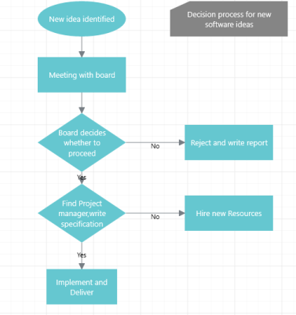
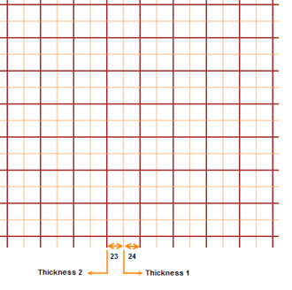
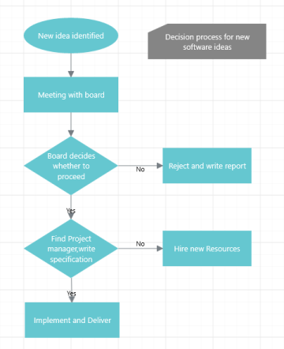
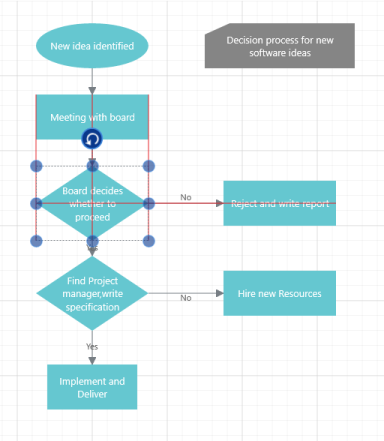
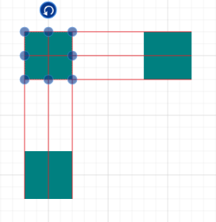
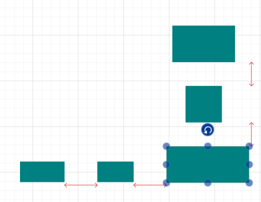
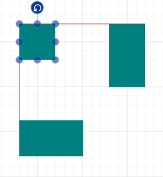
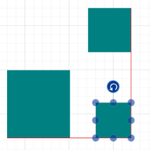
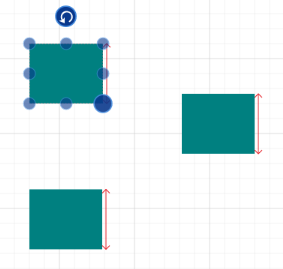

# Gridlines

Gridlines are horizontal and vertical lines behind the Diagram elements. They provide visual guidance when dragging or arranging objects on the Diagram surface.

Diagram with Gridlines Enabled
{:.caption}

### SfDiagram.SnapSettings.SnapConstraints

The visibility of gridlines and their snapping feature can be enabled or disabled by changing the values of the enum property SfDiagram.SnapSettings.SnapConstraints.

<table>
<tr>
<th>
Elements</th><th>
Description</th></tr>
<tr>
<td>
ShowHorizontalLines</td><td>
Display horizontal gridlines.</td></tr>
<tr>
<td>
ShowVerticalLines</td><td>
Show vertical gridlines.</td></tr>
<tr>
<td>
ShowLines</td><td>
Show both horizontal and vertical gridlines.</td></tr>
<tr>
<td>
SnapToHorizontalLines</td><td>
Snap to horizontal gridlines.</td></tr>
<tr>
<td>
SnapToVerticalLines</td><td>
Snap to vertical gridlines.</td></tr>
<tr>
<td>
SnapToLines</td><td>
Snap to both horizontal and vertical gridlines.</td></tr>
<tr>
<td>
All</td><td>
Show and snap to both horizontal and vertical gridlines.</td></tr>
<tr>
<td>
None</td><td>
Disable gridlines and disable snapping.</td></tr>
</table>

## Enabling and Disabling Gridlines

The visibility of gridlines can be enabled or disabled by changing the values of the enum property SfDiagram.SnapSettings.SnapConstraints.

SnapConstraints.All and SnapConstraints.ShowLines enables the visibility of both horizontal and vertical gridlines.



diagramControl.SnapSettings.SnapConstraints = SnapConstraints.All; 

Or

diagramControl.SnapSettings.SnapConstraints = SnapConstraints.ShowLines;



SnapConstraints.HorizontalLines enables the visibility of horizontal gridlines.



 diagramControl.SnapSettings.SnapConstraints = SnapConstraints.HorizontalLines;



SnapConstraints.VerticalLines enables the visibility of vertical gridlines.



 diagramControl.SnapSettings.SnapConstraints = SnapConstraints.VerticalLines;



SnapConstraints.None disables gridlines.



 diagramControl.SnapSettings.SnapConstraints = SnapConstraints.None;


 
## Customization of Gridlines

The spacing and appearance of the gridlines can be customized by using the HorizontalGridlines and VerticalGridlines properties of SfDiagram.SnapSettings that is of Gridlines type.

The Gridlines class enables the definition of spacing between gridlines, snapping intervals, and the style and thickness of gridlines.

### LinesInterval

The spacing and thickness of gridlines can be customized by changing the value of the LinesInterval property. LinesInterval is a DoubleCollection that contains a series of line thicknesses separated by the space left before the next gridline thickness. This series is repeated throughout the Diagram.

To change spacing between lines:



 Gridlines gridlines = new Gridlines()

 {

     LinesInterval = new List<double>() { 2, 23, 1, 24 }

 };

 diagramControl.SnapSettings.HorizontalGridlines = gridlines;

 diagramControl.SnapSettings.VerticalGridlines = gridlines;



<table>
<tr>
<th>
LinesInterval</th><th>
Effect</th></tr>
<tr>
<td>
2</td><td>
A line with a two-pixel thickness is drawn.</td></tr>
<tr>
<td>
23</td><td>
A 23-pixel gap is left.</td></tr>
<tr>
<td>
1</td><td>
A line with a one-pixel thickness is drawn at the 25th pixel (2+23).</td></tr>
<tr>
<td>
24</td><td>
A 24-pixel gap is left.</td></tr>
<tr>
<td>
</td><td>
The cycle starts again with the first item in the collection.</td></tr>
</table>

### Strokes

Styles for a pattern of gridlines can be assigned to the Strokes property. This collection is applied to each line pattern of the Diagram.

To change the appearance of the gridlines:



 Style brown = new Style(typeof(Path));

 brown.Setters.Add(new Setter(Path.StrokeProperty, new SolidColorBrush(Colors.Brown)));

 Style sandyBrown = new Style(typeof(Path));

 sandyBrown.Setters.Add(new Setter(Path.StrokeProperty, new SolidColorBrush(Colors.SandyBrown)));

 Gridlines gridlines = new Gridlines()

 {
       LinesInterval = new List<double>() { 2, 23, 1, 24 }

       Strokes = new List<Style>() { brown, sandyBrown }

 };

 diagramControl.SnapSettings.HorizontalGridlines= gridlines;

 diagramControl.SnapSettings.VerticalGridlines= gridlines;



In the following screenshot, the gridline styles are customized. 

Customized Gridlines
{:.caption}

## Snapping

Snap to Grid

The snap-to-grid feature allows Diagram objects to snap to the nearest intersection of gridlines when being dragged or resized. This feature enables easier alignment during layout or design.

Diagram Objects Snapped to Gridlines
{:.caption}

### Enabling and Disabling Snapping to Gridlines

Snapping to gridlines can be enabled or disabled by changing the value of the enum property

SfDiagram.SnapSettings.SnapConstraints.



//Enables snapping to both horizontal and vertical lines.

 diagramControl.SnapSettings.SnapConstraints = SnapConstraints.All; 

//Enables snapping to both horizontal and vertical lines.

diagramControl.SnapSettings.SnapConstraints = SnapConstraints.SnapToLines; 

//Enables snapping to horizontal lines.

diagramControl.SnapSettings.SnapConstraints = SnapConstraints.SnapToHorizontalLines; 

//Enables snapping to vertical lines.

diagramControl.SnapSettings.SnapConstraints = SnapConstraints.SnapToVerticalLines;

//Disables snapping to lines.

diagramControl.SnapSettings.SnapConstraints = SnapConstraints.None; 



When snapping is set in the SfDiagram control (diagramControl.SnapSettings), the same setting is applied to every element of the SfDiagram control by default.

When there is a need to change or disable snapping to a gridline for a particular element, you can set the constraints of a particular object to SnapToLines, SnapToHorizontalLines, or SnapToVerticalLines.



//Disables inheritance of snapping from SfDiagram.

obj.Constraints = obj.Constraints & ~NodeConstraints.InheritSnapping;

//Enables snapping to horizontal lines for a specific object (For example, node, connector).

obj.Constraints |= NodeConstraints.SnapToHorizontalLines; 

//Enables snapping to vertical lines for a specific object (For example, node, connector).

obj.Constraints |= NodeConstraints.SnapToVerticalLines; 

//Enables snapping to both horizontal and vertical lines 

//For a specific object (For example, node, connector).

obj.Constraints |= NodeConstraints.SnapToLines; 



### Customizing Snap Interval

The gridline or position where the Diagram object snaps can be customized by changing the value of the Gridlines.SnapInterval property.

By default, diagramControl.SnapSettings.HorizontalGridlines and diagramControl.SnapSettings.VerticalGridlines are set to null, and gridline intervals are internally calculated based on measurement units and ruler segments. 

Gridlines.SnapInterval is a double collection that determines the space between patterns of gridlines.

 

Gridlines gridlines = new Gridlines()

 {

       SnapInterval = new List<double>() { 40, 25 }

 };

 diagramControl.SnapSettings.HorizontalGridlines= gridlines;

 diagramControl.SnapSettings.VerticalGridlines= gridlines;



### Snap to Object

The snap-to-object feature provides visual cues to assist with aligning and spacing Diagram nodes. A node can be snapped with its neighboring objects based on certain alignments. Such alignments are visually represented as guidelines. For example, you can easily arrange a column of nodes to be evenly spaced apart and horizontally centered with each other.

Guidelines in a Diagram
{:.caption}

### Enabling and Disabling Snapping to Objects

diagramControl.SnapSettings.SnapToObject determines whether nodes can be snapped to objects. 

Snapping to objects can be enabled by assigning values other than SnapToObject.None to SfDiagram.SnapSettings.SnapToObject.



//Enables snapping to objects.

diagramControl.SnapSettings.SnapToObject = SnapToObject.All; 

//Disables snapping to objects. 

diagramControl.SnapSettings.SnapToObject = SnapToObject.None; 



The value set to diagramControl.SnapSettings is applied to every element of the SfDiagram control.

When there is a need to change or deny snapping to a particular object, you can set the desired value to the SnapToObject property of that particular object.



//Disables inheritance of snapping from the SfDiagram.

obj.Constraints = obj.Constraints & ~NodeConstraints.InheritSnapToObject;

//Enables SnapToObject.

node.SnapToObject = SnapToObject.All;



#### Examples

Center Alignment
{:.caption}

Equal Spacing 
{:.caption}

Left and Top Alignment
{:.caption}

Bottom and Right Alignment
{:.caption}

Same Size Alignment
{:.caption}

The following table describes many enumerable elements of the SnapToObject property.

<table>
<tr>
<th>
Enumerable Elements</th><th>
Description</th></tr>
<tr>
<td>
LeftLeft</td><td>
Snaps the left side of an object to the left side of another object.</td></tr>
<tr>
<td>
LeftRight</td><td>
Snaps the left side of an object to the right side of another object.</td></tr>
<tr>
<td>
Left</td><td>
Behaves as both the LeftLeft and LeftRight settings are applied.</td></tr>
<tr>
<td>
RightRight</td><td>
Snaps the right side of an object to the right side of another object.</td></tr>
<tr>
<td>
RightLeft</td><td>
Snaps the right side of an object to the left side of another object.</td></tr>
<tr>
<td>
Right</td><td>
Behaves as both the RightRight and RightLeft settings are applied.</td></tr>
<tr>
<td>
TopTop</td><td>
Snaps the top side of an object to the top side of another object.</td></tr>
<tr>
<td>
TopBottom</td><td>
Snaps the top side of an object to the bottom side of an another object.</td></tr>
<tr>
<td>
Top</td><td>
Behaves as if both the TopTop and TopBottom settings are applied.</td></tr>
<tr>
<td>
BottomBottom</td><td>
Snaps the bottom side of an object to the bottom side of an another object.</td></tr>
<tr>
<td>
BottomTop</td><td>
Snaps the bottom side of an object to the top side of an another object.</td></tr>
<tr>
<td>
Bottom</td><td>
Behaves as both the BottomBottom and BottomTop settings are applied.</td></tr>
<tr>
<td>
VerticalCenter</td><td>
Center aligns an object vertically.</td></tr>
<tr>
<td>
HorizontalCenter</td><td>
Center aligns an object horizontally.</td></tr>
<tr>
<td>
VerticalSpacing</td><td>
Aligns objects so that they are equally spaced vertically.</td></tr>
<tr>
<td>
HorizontalSpacing</td><td>
Aligns objects so that they are equally spaced horizontally.</td></tr>
<tr>
<td>
Width</td><td>
Highlights objects with the same width.</td></tr>
<tr>
<td>
Height</td><td>
Highlights objects with the same height.</td></tr>
<tr>
<td>
Size</td><td>
Sets the width and height of an object.</td></tr>
</table>

### Customization of Snapping

By default, the objects are snapped based on the diagramControl.SnapSettings.SnapConstraints or diagramControl.SnapToObject. In some cases, when the suggested snapping is not desired, snapping can be disabled or modified by overriding the protected virtual method OnSnap.

<table>
<tr>
<th>
Virtual Method</th><th>
Description</th><th>
Parameters</th></tr>
<tr>
<td>
Node.OnSnap</td><td>
Snaps an object to the grid, an object, or to a custom position.</td><td>
List&lt;SnapParameter&gt;,out SnapAccepted</td></tr>
</table>

The following table lists the properties associated with SnapParameter.

<table>
<tr>
<th>
Property</th><th>
Description</th><th>
Value</th></tr>
<tr>
<td>
SnapChanges</td><td>
Gets the property that is changed because of the suggested snap.</td><td>
SnapChanges-enumSnapChanges.X,SnapChanges.Y,SnapChanges.Width,SnapChanges.Height,SnapChanges.Angle</td></tr>
<tr>
<td>
SnapReason</td><td>
Gets the reason/target of the suggested snap.</td><td>
SnapReason-enumSnapReason.Gridlines,SnapReason.Sides,SnapReason.Segment,SnapReason.Size,SnapReason.Angle</td></tr>
<tr>
<td>
SnapInfo</td><td>
Gets the information about the target.</td><td>
objectThe value of this property may be:GridlineSnapInfoObjectSnapInfoSegmentSnapInfoSameSizeSnapInfoEqualSpaceSnapInfo</td></tr>
<tr>
<td>
Current</td><td>
Gets the current status of the object that is being manipulated.</td><td>
SnapState</td></tr>
<tr>
<td>
Proposed</td><td>
Gets the proposed status of the object that is being manipulated.</td><td>
SnapState</td></tr>
</table>

SnapInfo property of SnapParameter gives details about the cause of snapping. The following table lists the possible cases and corresponding values of SnapParameter.

<table>
<tr>
<th>
Change</th><th>
Possible Snap</th><th>
SnapReason</th><th>
SnapChanges</th><th>
SnapInfo</th></tr>
<tr>
<td rowspan = "4">
Dragging</td><td>
SnapToGrid</td><td>
GridLine</td><td>
X/Y</td><td>
GridlineSnapInfo : SnapInfo</td></tr>
<tr>
<td>
SnapToObject</td><td>
Sides</td><td>
X/Y</td><td>
ObjectSnapInfo: SnapInfo</td></tr>
<tr>
<td>
SnapToSegment</td><td>
Segment</td><td>
None</td><td>
SegmenSnaptInfo: SnapInfo</td></tr>
<tr>
<td>
EquallySpaced</td><td>
EqualSpace</td><td>
X/Y</td><td>
EqualSpaceSnapInfo: SnapInfo</td></tr>
<tr>
<td rowspan = "3">
Resizing</td><td>
SnapToGrid</td><td>
GridLine|Size</td><td>
Width/Height</td><td>
GridlineSnapInfo: SnapInfo</td></tr>
<tr>
<td>
SnapToObject</td><td>
Sides|Size</td><td>
Width/Height</td><td>
ObjectSnapInfo</td></tr>
<tr>
<td>
SameSize</td><td>
Size</td><td>
Width/Height</td><td>
EqualSizeSnapInfo</td></tr>
<tr>
<td>
Rotating</td><td>
Rotate</td><td>
Angle</td><td>
Angle</td><td>
null</td></tr>
</table>

#### Properties associated with GridlineSnapInfo.

<table>
<tr>
<th>
Property</th><th>
Description</th><th>
Value</th></tr>
<tr>
<td>
TargetLine</td><td>
Gets the position of the target gridline.</td><td>
double</td></tr>
<tr>
<td>
Side</td><td>
Gets the direction of the node movement.</td><td>
enum Side Side.LeftSide.RightSide.TopSide.Bottom</td></tr>
</table>

#### Properties associated with the ObjectSnapInfo.

<table>
<tr>
<th>
Property</th><th>
Description</th><th>
Value</th></tr>
<tr>
<td>
TargetObject</td><td>
Gets the target object towards the node that has to be snapped.</td><td>
object</td></tr>
<tr>
<td>
SnapToObject</td><td>
Gets the possible snap.</td><td>
enum SnapToObject</td></tr>
</table>

#### Properties associated with the EqualSpaceSnapInfo.

<table>
<tr>
<th>
Property</th><th>
Description</th><th>
Value</th></tr>
<tr>
<td>
Target</td><td>
Gets the target of the snap.</td><td>
object</td></tr>
<tr>
<td>
SnapToObject</td><td>
Gets the possible snap.</td><td>
SnapToObject enum</td></tr>
<tr>
<td>
Distance</td><td>
Gets the equal distance between objects.</td><td>
double</td></tr>
<tr>
<td>
EquallySpacedObjects</td><td>
Gets the collection of objects that are equally spaced.</td><td>
List&lt;object&gt;</td></tr>
</table>

#### Properties associated with the SameSizeSnapInfo.

<table>
<tr>
<th>
Property</th><th>
Description</th><th>
Value</th></tr>
<tr>
<td>
SnapToObject</td><td>
Gets the possible snap.</td><td>
SnapToObject enum</td></tr>
<tr>
<td>
EquallySizedObjects</td><td>
Gets the collection of objects that are of the same size.</td><td>
List&lt;object&gt;</td></tr>
</table>

#### Properties associated with the SegmentSnapInfo.

<table>
<tr>
<th>
Property</th><th>
Description</th><th>
Value</th></tr>
<tr>
<td>
TargetConnectors</td><td>
Gets the collection of TargetConnectors that are closest to the node.</td><td>
object</td></tr>
</table>

#### Properties associated with the TargetConnector.

<table>
<tr>
<th>
Property</th><th>
Description</th><th>
Value</th></tr>
<tr>
<td>
Connector</td><td>
Gets the nearest connector.</td><td>
Connector</td></tr>
<tr>
<td>
TargetSegment</td><td>
Gets the nearest connector segment.</td><td>
IConnectorSegment</td></tr>
<tr>
<td>
SegmentStartingPoint</td><td>
Gets the starting point of the nearest segment.</td><td>
Point</td></tr>
<tr>
<td>
IntersectingPoints</td><td>
Gets the collection of points where the TargetSegment intersects the object.</td><td>
List&lt;Point&gt;</td></tr>
</table>

The following table lists the properties associated with SnapState.

<table>
<tr>
<th>
Property</th><th>
Description</th><th>
Value</th></tr>
<tr>
<td>
X</td><td>
Gets OffsetX value of the object.</td><td>
double</td></tr>
<tr>
<td>
Y</td><td>
Gets OffsetY value of the object.</td><td>
double</td></tr>
<tr>
<td>
Width</td><td>
Gets the width of the object.</td><td>
double</td></tr>
<tr>
<td>
Height</td><td>
Gets the height of the object.</td><td>
double</td></tr>
<tr>
<td>
Angle</td><td>
Gets the RotateAngle of the object.</td><td>
double</td></tr>
</table>