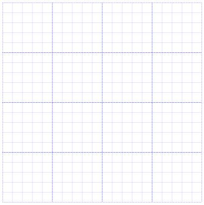

# Gridlines

Gridlines are the pattern of lines drawn behind the Diagram elements. It provides a visual guidance while dragging or arranging the objects on the Diagram surface.

Customize the gridlines visibility

The SnapConstraints property of SnapSettings enables you to show/hide the gridlines. The following code example illustrates how to show or hide gridlines.

[XAML]

<table>
<tr>
<td>
<diagram:SfDiagram x:Name="diagram" Height="400" Width="400">  <diagram:SfDiagram.SnapSettings>  <diagram:SnapSettings SnapConstraints="ShowLines"/>  </diagram:SfDiagram.SnapSettings>  </diagram:SfDiagram>    </td></tr>
</table>
[C#]

<table>
<tr>
<td>
diagram.Width = 400;  diagram.Height = 400;  diagram.SnapSettings.SnapConstraints = SnapConstraints.ShowLines;    </td></tr>
</table>

To show only horizontal/vertical gridlines or to hide gridlines, refer to **[SnapConstraints](#SnapConstraints "")**

Appearance

You can customize the appearance of the gridlines by using a set of predefined properties. The HorizontalGridLines and VerticalGridLines properties allow to customize the appearance of the gridlines. The following code example illustrates how to customize the appearance of gridlines.

<table>
<tr>
<td>
Style blue =new Style(typeof(Path));  blue.Setters.Add(new Setter(Path.StrokeProperty,new SolidColorBrush(Colors.Blue)));  blue.Setters.Add(new Setter(Path.StrokeDashArrayProperty, new DoubleCollection() { 2 }));   Gridlines gridlines = new Gridlines()  {  Strokes = new List<Style>() { blue }  };  diagram.SnapSettings.HorizontalGridlines = gridlines;  diagram.SnapSettings.VerticalGridlines = gridlines;    </td></tr>
</table>

Line Intervals

Thickness and the space between gridlines can be customized by using LineInterval property. In the lineInterval collections, values at the odd places are referred as the thickness of lines and the values at the even places are referred as the space between gridlines.

The following code example illustrates how to customize the thickness of lines and the line intervals.

<table>
<tr>
<td>
diagram.Width = 400;  diagram.Height = 400;  diagram.SnapSettings.SnapConstraints = SnapConstraints.ShowLines;  Style blue =new Style(typeof(Path));  blue.Setters.Add(new Setter(Path.StrokeProperty,new SolidColorBrush(Colors.Blue)));  blue.Setters.Add(new Setter(Path.StrokeDashArrayProperty, new DoubleCollection() { 2 }));   Gridlines gridlines = new Gridlines()  {  Strokes = new List<Style>() { blue },  LinesInterval = new List<double>() { 1.25, 14, 0.25, 15, 0.25, 15, 0.25, 15, 0.25, 15 }  };  diagram.SnapSettings.HorizontalGridlines = gridlines;  diagram.SnapSettings.VerticalGridlines = gridlines;    </td></tr>
</table>

Snapping

Snap To Lines

This feature allows the Diagram objects to snap to the nearest interaction of gridlines while being dragged or resized. This feature enables easier alignment during layout or design.

Snapping to gridlines can be enabled/disabled with the SnapConstraints property of SnapSettings. The following code example illustrates how to enable/disable the snapping to gridlines.

<table>
<tr>
<td>
diagram.SnapSettings.SnapConstraints = SnapConstraints.SnapToLines;    </td></tr>
</table>
To enable/disable snapping to horizontal/vertical lines, refer to **[SnapConstraints](#SnapConstraints "")**

Snap To Objects

The snap-to-object provides visual cues to assist with aligning and spacing Diagram. A Node can be snapped with its neighboring objects based on certain alignments. Such alignments are visually represented as smart guides.

diagramControl.SnapSettings.SnapToObject determines whether Nodes can be snapped to objects.

Snapping to objects can be enabled by assigning values other than SnapToObject.None to SfDiagram.SnapSettings.SnapToObject.

The following code illustrates how to enable/disable the smart guide.

<table>
<tr>
<td>
diagram.SnapSettings.SnapConstraints = SnapConstraints.All;  diagram.SnapSettings.SnapToObject = SnapToObject.None;    </td></tr>
</table>
