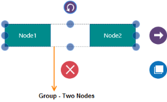
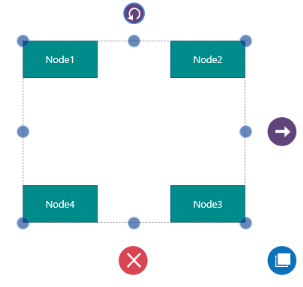
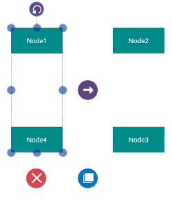
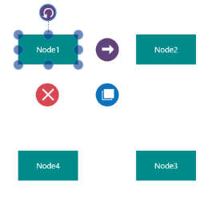
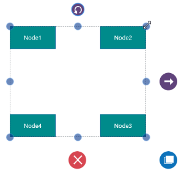
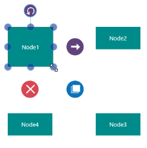
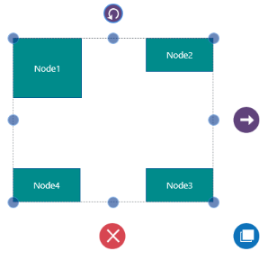

# Groups

The SfDiagram provides support to group and ungroup nodes. Grouping feature is useful when you want to apply the same edits to a number of objects, and yet retain their individuality. All the operations performed on a group also affect the individual items in the group. However, any item in the group can also be edited individually. On ungrouping, the items in the group again act as individual entities. 

## Create Group

You can create a group by using the following methods:

* By Using Nodes Property
* By Using ParentGroup Property in Node

By Using Nodes Property

The following code example illustrates how to create a group by using Nodes property:

  

// Creating Nodes

ObservableCollection<NodeViewModel> nodes = new ObservableCollection<NodeViewModel>();

Node n1 = AddNode("Node1",100,100);

Node n2 = AddNode("Node2",300,100);  

// Creating Groups

ObservableCollection<GroupViewModel> groups = new ObservableCollection<GroupViewModel>();

GroupViewModel g = new GroupViewModel()

{

Nodes=new ObservableCollection<object>()

{

n1,n2

}

};

// Adding Nodes to the Sfdiagram

nodes.Add(n1);

nodes.Add(n2);

diagramcontrol.Nodes = nodes;

// Adding Groups to the SfDiagram

groups.Add(g);

diagramcontrol.Groups = groups;

// Creating Nodes

private Node AddNode(string name, double x, double y)

{

Node n = new Node()

{

Width = 100,

Height = 50,

OffsetX = x,

OffsetY = y

}

return n;

}



### By using the ParentGroup property in Node

The following code example illustrates how to create a group by using ParentGroup property of Node:



// Creating Groups

ObservableCollection<GroupViewModel> groups = new ObservableCollection<GroupViewModel>();

GroupViewModel g = new GroupViewModel();

// Creates Nodes

ObservableCollection<NodeViewModel> nodes = new ObservableCollection<NodeViewModel>();

Node n1 = AddNode("Node1",100,100);

Node n2 = AddNode("Node2",300,100);  

// Adds Nodes to the Sfdiagram

nodes.Add(n1);

nodes.Add(n2);

diagramcontrol.Nodes = nodes;

// Adds Groups to the SfDiagram

groups.Add(g);

diagramcontrol.Groups = groups;

// Creates Nodes

private Node AddNode(string name, double x, double y)

{

Node n = new Node()

{

Width = 100,

Height = 50,

OffsetX = x,

OffsetY = y, 

ParentGroup=g,               

}

return n;

}



## Selecting a Group

You can select a group by clicking on any one of its children. Consecutive clicks on a child object, select the parent groups in the order of their creation. In a similar manner, consecutive clicks on a child object leads to the selection of inner groups, and eventually the object itself, and the cycle continues.

The following steps illustrate how to select an object that has two groups.

1. Click on Node1 to select the outer group.

2. Click again to select the inner group to where it belongs.

   

3. Finally, click again to select the child node after all groups have been traversed.

   

## Editing a Group

To edit a group, you have to make sure that the corresponding group is selected. The following features apply to the edits performed on an object.

* When the edit operation is performed on an object that is a group, then all its children are also affected. For example, resizing a group, automatically resizes its child objects to fit the selection area.

  

* When an individual object is selected, then the edit operation is performed on that particular object only.

  

* When size or position of a node contained in a group is getting changed, the group's size and position update its area to fit the child objects.

  