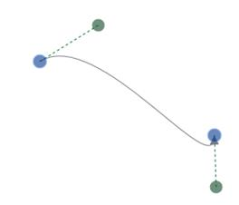

# Interaction

**Selection******

Selector provides a visual representation of selected elements. It behaves like a container and enables you to update the size, position, and rotation angle of the selected elements through interaction and programmatically. Single or multiple elements can be selected at a time.

**Single** **Selection******

An element can be selected by clicking that element. During single click, all previously selected items are cleared. The following image shows how the selected elements are visually represented.

****************************
****

****
****************
****

**********Selecting** **a** **Group******

When a child element of any Group is clicked, its contained Group is selected instead of the child element. With consecutive clicks on the selected element, selection is changed from top to bottom in the hierarchy of parent Group to its children.

**Multiple** **Selection******

Multiple elements can be selected with the following ways.

1. Ctrl+Click

During single click, any existing item in the selection list be clearied, and only the item clicked recently is there in the selection list. To avoid cleaning the old selected item, Ctrl key must be on hold when clicking.

2. Selection rectangle / Rubber band selection

Clicking and dragging the Diagram area allows to create a rectangular region. The elements that are covered under the rectangular region are selected at the end.

Multiple selected elements are visually represented as shown.

**Select****/****Unselect** **the** **elements** **programmatically**

The IsSelected Property is used to select/unselect the elements at runtime.

The following code example illustrates how to select/unselect an item through programmatically.

<table>
<tr>
<td>
// Selects an elements   node.IsSelected = true;  // Unselect an element  node.IsSelected = false;    </td></tr>
</table>
**Drag******

* An object can be dragged by clicking and dragging it. When multiple elements are selected, dragging any one of the selected elements move every selected element.
* While dragging, the objects are snapped towards the nearest objects to make better alignments. For better alignments, refer to [Snapping](http://help.syncfusion.com/js/Diagram/Gridlines#snapping "Snapping").

**Resize******

* Selector is surrounded by eight thumbs. When dragging these thumbs, selected items can be resized smaller or larger.
* When one corner of the selector is dragged, opposite corner is in a static position.
* While resizing, the objects are snapped towards the nearest objects to make better alignments. For better alignments, refer to [Snapping](http://help.syncfusion.com/js/Diagram/Gridlines#snapping "Snapping").

**Rotate******

* A rotate handler is placed above the selector. Clicking and dragging the handler in a circular direction lead to rotate the Node.
* The Node is rotated with reference to the static pivot point.
* Pivot thumb (thumb at the middle of the Node) appears while rotating the Node to represent the static point.
* For more information about pivot, refer to [Position](http://help.syncfusion.com/js/Diagram/Node#position "Position").

**Connection** **Editing**

* Each segment of a selected Connector is editable with some specific handles/thumbs.****

**End** **point** **handles******

Source and target points of the selected Connectors are represented with two handles. Clicking and dragging those handles help you to adjust the source and target points.

**Straight** **segment** **editing** 

* End point of each straight segment is represented by a thumb that enables to edit the segment.
* Any number of new segments can be inserted into a straight line by clicking that when shift and ctrl keys are pressed. (Ctrl+Shift+Click).
* Straight segments can be removed by clicking the segment end point, when ctrl and shift keys are pressed. (Ctrl+Shift+Click).

**Orthogonal** **thumbs******

* Orthogonal thumbs allow to adjust the length of adjacent segments by clicking and dragging it.****

****
****

***** When necessary, some segments are added or removed automatically, when dragging the segment. This is to maintain proper routing of orthogonality between segments.****

****
****

**Bezier** **thumbs******

* Bezier segments are annotated with two thumbs to represent the control points. Control points of the curve can be configured by clicking and dragging the control thumbs.****

****
****

**Drag** **and** **Drop** **Nodes** **over** **other** **elements******

Diagram provides support to drop a node/connector over another node/connector. Drop event is raised to notify that an element is dropped over another one and it is disabled by default. It can enabled with the constraints property. The following code illustrates how to enable **dropping**.

<table>
<tr>
<td>
(diagram.Info as IGraphInfo).ItemDropEvent += MainWindow_ItemDropEvent;  ObservableCollection<Node> nodes = new ObservableCollection<Node>();  Node node = new Node()  {  UnitHeight = 100,  UnitWidth = 100,  OffsetX = 400,  OffsetY = 400,  Shape = new RectangleGeometry() { Rect = new Rect(0, 0, 10, 10) },  ShapeStyle = this.Resources["shapestyle"] as Style,  Constraints = NodeConstraints.Default |  NodeConstraints.AllowDrop  };  Connector connector = new Connector()  {  SourcePoint = new Point(500, 500),  TargetPoint = new Point(600, 600),  Constraints = ConnectorConstraints.Default | ConnectorConstraints.AllowDrop  };  ObservableCollection<Group> groups = new ObservableCollection<Group>();  Group group = new Group()  {  Nodes = new ObservableCollection<Node>  {  Node  },  Connectors = new ObservableCollection<Connector>  {  connector  },  };  groups.Add(group);  diagram.Groups = groups;  Node node1 = new Node()  {  UnitWidth = 100,  UnitHeight = 100,  OffsetX = 300,  OffsetY = 300,  Shape = new RectangleGeometry() { Rect = new Rect(0, 0, 10, 10) },  ShapeStyle = this.Resources["shapestyle"] as Style,  Constraints=NodeConstraints.Default | NodeConstraints.AllowDrop  };  nodes.Add(node1);  diagram.Nodes = nodes;  private void MainWindow_ItemDropEvent(object sender, ItemDropEventArgs args)  {  //Source - Node  //Target – Group  }    </td></tr>
</table>
**Zoom** **pan******

* When a large Diagram is loaded, only certain portion of the Diagram is visible. The remaining portions are clipped. Clipped portions can be explored by scrolling the scrollbars or panning the Diagram.
* Diagram can be zoomed in or out by using Ctrl + mouse wheel.

**Keyboard******

Diagram provides support to interact with the elements with key gestures. By default, some in-built commands are bound with a relevant set of key combinations.

The following table illustrates List of Commands with key Gesture

<table>
<tr>
<td>
**Shortcut** **Key******  </td><td>
**Command******  </td><td>
**Description******  </td></tr>
<tr>
<td>
Ctrl + A  </td><td>
Select all  </td><td>
Select all the Nodes/Connectors in diagram  </td></tr>
<tr>
<td>
Ctrl + C  </td><td>
Copy  </td><td>
Copy the selected elements in the diagram  </td></tr>
<tr>
<td>
Ctrl + X  </td><td>
Cut  </td><td>
Cut the selected elements in the diagram  </td></tr>
<tr>
<td>
Ctrl + V  </td><td>
Paste  </td><td>
Paste the cut or copy the elements in the diagram  </td></tr>
<tr>
<td>
Ctrl + Z  </td><td>
Undo  </td><td>
Undo(Reverse the last editing action performed on diagram)  </td></tr>
<tr>
<td>
Ctrl + Y  </td><td>
Redo  </td><td>
Redo(Restores the last editing action when no other actions have occurred since the last undo on diagram)****  </td></tr>
<tr>
<td>
Ctrl + D  </td><td>
Duplicate  </td><td>
Copies the selected element from the diagram and pastes the copied element into the diagram.  </td></tr>
<tr>
<td>
Delete  </td><td>
Delete  </td><td>
Delete the selected elements in the diagram  </td></tr>
<tr>
<td>
LeftArrow  </td><td>
MoveLeft  </td><td>
MoveLeft (move the selected elements towards left by one pixel)  </td></tr>
<tr>
<td>
RightArrow  </td><td>
MoveRight  </td><td>
MoveRight (move the selected elements towards right by one pixel)  </td></tr>
<tr>
<td>
UpArrow  </td><td>
MoveUp  </td><td>
MoveUp (move the selected elements towards up by one pixel)  </td></tr>
<tr>
<td>
DownArrow  </td><td>
MoveDown  </td><td>
MoveDown (move the selected elements towards up by one pixel)  </td></tr>
<tr>
<td>
Ctrl + MouseScroll  </td><td>
Zoom  </td><td>
Zoom(Zoom in/Zoom out the diagram)  </td></tr>
<tr>
<td>
Ctrl + G  </td><td>
Group  </td><td>
Grouping the element in the diagram  </td></tr>
<tr>
<td>
Ctrl + G  </td><td>
UnGroup  </td><td>
UnGrouping the element in the diagram  </td></tr>
<tr>
<td>
Ctrl + Shift + [  </td><td>
SendToBack  </td><td>
Moves the selected element behind all the other overlapped elements.  </td></tr>
<tr>
<td>
Ctrl + [  </td><td>
SendBackward  </td><td>
Moves the selected element behind the underlying element.  </td></tr>
<tr>
<td>
Ctrl + Shift + ]  </td><td>
BringFront  </td><td>
Brings the selected element to front over all the other overlapped elements.  </td></tr>
<tr>
<td>
Ctrl + ]  </td><td>
BringForward****  </td><td>
Moves the selected element over the nearest overlapping element****  </td></tr>
</table>
