# Interaction

## Selection

Selector provides a visual representation of selected elements. It behaves like a container and enables you to update the size, position, and rotation angle of the selected elements through interaction and programmatically. Single or multiple elements can be selected at a time.

### Single Selection

An element can be selected by clicking that element. During single click, all previously selected items are cleared. The following image shows how the selected elements are visually represented.

### Selecting a Group

When a child element of any Group is clicked, its contained Group is selected instead of the child element. With consecutive clicks on the selected element, selection is changed from top to bottom in the hierarchy of parent Group to its children.

### Multiple Selection

Multiple elements can be selected with the following ways.

1. Ctrl+Click

During single click, any existing item in the selection list be cleared, and only the item clicked recently is there in the selection list. To avoid cleaning the old selected item, Ctrl key must be on hold when clicking.

2. Selection rectangle / Rubber band selection

Clicking and dragging the Diagram area allows to create a rectangular region. The elements that are covered under the rectangular region are selected at the end.

Multiple selected elements are visually represented as shown.

### Select/Unselect the elements programmatically

The IsSelected Property is used to select/unselect the elements at runtime.

The following code example illustrates how to select/unselect an item through programmatically.



// Selects an elements 

node.IsSelected = true;

// Unselect an element

node.IsSelected = false;



## Drag

* An object can be dragged by clicking and dragging it. When multiple elements are selected, dragging any one of the selected elements move every selected element.
* While dragging, the objects are snapped towards the nearest objects to make better alignments. For better alignments, refer to [Snapping](/wpf/sfdiagram/Gridlines#snapping "Snapping").

## Resize

* Selector is surrounded by eight thumbs. When dragging these thumbs, selected items can be resized smaller or larger.
* When one corner of the selector is dragged, opposite corner is in a static position.
* While resizing, the objects are snapped towards the nearest objects to make better alignments. For better alignments, refer to [Snapping](/wpf/sfdiagram/Gridlines#snapping "Snapping").

## Rotate

* A rotate handler is placed above the selector. Clicking and dragging the handler in a circular direction lead to rotate the Node.
* The Node is rotated with reference to the static pivot point.
* Pivot thumb (thumb at the middle of the Node) appears while rotating the Node to represent the static point.For more information about pivot, refer to [Position](/wpf/sfdiagram/Node#position "Position").

## Connection Editing

* Each segment of a selected Connector is editable with some specific handles/thumbs.

### End point handles

Source and target points of the selected Connectors are represented with two handles. Clicking and dragging those handles help you to adjust the source and target points.

### Straight segment editing

* End point of each straight segment is represented by a thumb that enables to edit the segment.
* Any number of new segments can be inserted into a straight line by clicking that when shift and ctrl keys are pressed. (Ctrl+Shift+Click).
* Straight segments can be removed by clicking the segment end point, when ctrl and shift keys are pressed. (Ctrl+Shift+Click).

### Orthogonal thumbs

* Orthogonal thumbs allow to adjust the length of adjacent segments by clicking and dragging it.

* When necessary, some segments are added or removed automatically, when dragging the segment. This is to maintain proper routing of orthogonality between segments.

### Bezier thumbs

* Bezier segments are annotated with two thumbs to represent the control points. Control points of the curve can be configured by clicking and dragging the control thumbs.

## Drag and Drop Nodes over other elements

Diagram provides support to drop a node/connector over another node/connector. Drop event is raised to notify that an element is dropped over another one and it is disabled by default. It can enabled with the constraints property. The following code illustrates how to enable **dropping**.



(diagram.Info as IGraphInfo).ItemDropEvent += MainWindow_ItemDropEvent;

ObservableCollection<Node> nodes = new ObservableCollection<Node>();

Node node = new Node()
{
	UnitHeight = 100,
       UnitWidth = 100,
       OffsetX = 400,
       OffsetY = 400,
       Shape = new RectangleGeometry() { Rect = new Rect(0, 0, 10, 10) },
       ShapeStyle = this.Resources["shapestyle"] as Style,
       Constraints = NodeConstraints.Default |  NodeConstraints.AllowDrop
};

Connector connector = new Connector()
{
	SourcePoint = new Point(500, 500),
       TargetPoint = new Point(600, 600),
       Constraints = ConnectorConstraints.Default | ConnectorConstraints.AllowDrop
};

ObservableCollection<Group> groups = new ObservableCollection<Group>();

Group group = new Group()
{
	Nodes = new ObservableCollection<Node>
       {
       	Node
	},
       Connectors = new ObservableCollection<Connector>
       {
       	connector
      	},
};

groups.Add(group);
diagram.Groups = groups;

Node node1 = new Node()

{
	UnitWidth = 100,
       UnitHeight = 100,
       OffsetX = 300,
       OffsetY = 300,
       Shape = new RectangleGeometry() { Rect = new Rect(0, 0, 10, 10) },
       ShapeStyle = this.Resources["shapestyle"] as Style,
       Constraints=NodeConstraints.Default | NodeConstraints.AllowDrop
};

nodes.Add(node1);
diagram.Nodes = nodes;

private void MainWindow_ItemDropEvent(object sender, ItemDropEventArgs args)
{
	//Source - Node
       //Target – Group
}



## Automatic Port creation

We have provided support to create a Port at the intersection point on Node or Connector at runtime. This can be achieved by using the combination of SetTool and ObjectDrawnEvent.

### Enable Drawing in SetTool

This SetTool method will be invoked when Mouse/Pointer is over on Diagramming Element. In this method, We can make decision to start drawing of the Connector.

Please refer to the code example as below



//Override the SetTool method
protected override void SetTool(SetToolArgs args)
{
    if (args.Source is INode || args.Source is IConnector)
    {
    	args.Action = ActiveTool.Draw;
    }
    else
    {
    	base.SetTool(args);
    }
}



### Set Port for intersection

The `ObjectDrawn` event will be invoked while drawing the objects. We have provided two properties in the argument of this event to set Source and Target Port of the Connector.

Please refer to the code example as below



//Hook the ObjectDrawn Event
(diagram.Info as IGraphInfo).ObjectDrawn += MainWindow_ObjectDrawn;

private void MainWindow_ObjectDrawn(object sender, ObjectDrawnEventArgs args)
{
    //SourcePort should be set on Started state
    if (args.State == DragState.Started)
    {
    	if (args.Item is IConnector)
        {
        	IConnector connector = args.Item as IConnector;
        	if (connector.SourceNode != null)
        	{
            	if ((connector.SourceNode as NodeViewModel).Ports == null)
                	//Initialize the Port collection
                    (connector.SourceNode as NodeViewModel).Ports = new ObservableCollection<IPort>();

				//Set the TargetPort as NodePort to the Node
                args.SourcePort = new NodePortViewModel();
			}
            if (connector.SourceConnector != null)
            {
            	if ((connector.SourceConnector as ConnectorViewModel).Ports == null)
            		//Initialize the Port collection
                	(connector.SourceConnector as ConnectorViewModel).Ports = new ObservableCollection<IPort>();
				//Set the TargetPort as ConnectorPort to the Connector
                args.SourcePort = new ConnectorPortViewModel();
         	}
		}
	}

	//TargetPort should be set on Started state
    if (args.State == DragState.Completed)
    {
    	if (args.Item is IConnector)
        {
        	IConnector connector = args.Item as IConnector;
            if (connector.TargetNode != null)
            {
            	if ((connector.TargetNode as NodeViewModel).Ports == null)
                	//Initialize the Port collection
                    (connector.TargetNode as NodeViewModel).Ports = new ObservableCollection<IPort>();
				//Set the TargetPort as NodePort to the Node
                args.TargetPort = new NodePortViewModel();
			}
            if (connector.TargetConnector != null)
            {
          		if ((connector.TargetConnector as ConnectorViewModel).Ports == null)
                	//Initialize the Port collection
                    (connector.TargetConnector as ConnectorViewModel).Ports = new ObservableCollection<IPort>();
				//Set the TargetPort as ConnectorPort to the Connector
                args.TargetPort = new ConnectorPortViewModel();
        	}
		}
	}
}



ConnectionIndicator animation for Node

ConnectionIndicator animation for Connector

ConnectorPort to NodePort Connection

## Zoom pan 

* When a large Diagram is loaded, only certain portion of the Diagram is visible. The remaining portions are clipped. Clipped portions can be explored by scrolling the scrollbars or panning the Diagram.

* Diagram can be zoomed in or out by using Ctrl + mouse wheel.

## Keyboard

Diagram provides support to interact with the elements with key gestures. By default, some in-built commands are bound with a relevant set of key combinations.

The following table illustrates List of Commands with key Gesture.

| Shortcut Key | Command | Description |
|---|---|---|
| Ctrl + A | Select all | Select all the Nodes/Connectors in diagram. |
| Ctrl + C | Copy | Copy the selected elements in the diagram. |
| Ctrl + X | Cut | Cut the selected elements in the diagram. |
| Ctrl + V | Paste | Paste the cut or copy the elements in the diagram. |
| Ctrl + Z | Undo | Undo(Reverse the last editing action performed on diagram). |
| Ctrl + Y | Redo | Redo(Restores the last editing action when no other actions have occurred since the last undo on diagram). |
| Ctrl + D | Duplicate | Copies the selected element from the diagram and pastes the copied element into the diagram. |
| Delete | Delete | Delete the selected elements in the diagram. |
| LeftArrow | MoveLeft | MoveLeft (move the selected elements towards left by one pixel). |
| RightArrow | MoveRight | MoveRight (move the selected elements towards right by one pixel). |
| UpArrow | MoveUp | MoveUp (move the selected elements towards up by one pixel). |
| DownArrow | MoveDown | MoveDown (move the selected elements towards up by one pixel). |
| Ctrl + MouseScroll | Zoom | Zoom(Zoom in/Zoom out the diagram). |
| Ctrl + G | Group | Grouping the element in the diagram. |
| Ctrl + G | UnGroup | UnGrouping the element in the diagram. |
| Ctrl + Shift + [ | SendToBack | Moves the selected element behind all the other overlapped elements. |
| Ctrl + [ | SendBackward | Moves the selected element behind the underlying element. |
| Ctrl + Shift + ] | BringFront | Brings the selected element to front over all the other overlapped elements. |
| Ctrl + ] | BringForward | Moves the selected element over the nearest overlapping element. |

To add custom commands, configure or modify key/mouse gesture through [Command Manager](/wpf/sfdiagram/Commands#Command-Manager "Command Manager");

## QuickCommand

QuickCommands are used to execute the commonly or frequently used commands around the Nodes, Connectors and Groups. There are 3 default QuickCommands for Nodes and Groups to execute Draw, Delete and Duplicate commands.

### Create QuickCommand

QuickCommand can be created and added in Commands collection programmatically. It can be set for either Node or Connector or both. 

**Add QuickCommand through Commands collection**

To create a QuickCommand, you have to define the QuickCommand object and add that to Commands collection of the SelectoViewModel.

The following code example illustrates how to create and add a Quick Command in Commands Collection.


<!--Style for QuickCommand-->




QuickCommandViewModel quick = new QuickCommandViewModel();

// To define the Icon Shape

quick.Content = "F1M11.8,11.1L11.1,11.8L8,8.7L4.9,11.8L4.2,11.1L7.3,8L4.2,4.93L4.93,4.22L8,7.3L11.1,4.22L11.8,4.93L8.8,8z";

// To define the Background Shape

quick.Shape = "F1M23.467,11.733C23.467,18.213 18.214,23.466 11.734,23.466 5.253,23.466 0,18.213 0,11.733 0,5.253 5.253,0 11.734,0 18.214,0 23.467,5.253 23.467,11.733";

// To define the Background style

quick.ShapeStyle = this.Resources["QuickCommandstyle"] as Style;

// Adding new QuickCommand object in Commands collection

(Diagram.SelectedItems as SelectorViewModel).Commands = new QuickCommandCollection
{

quick

};



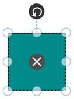

### Appearance

Appearance of the QuickCommand can be modified by Shape, ShapeStyle, Content and ContentTemplate.

The following table illustrates the defination of the Shape,ShapeStyle,Content and ContentTemplate.

| Property | Description |
|---|---|
| Shape | To define the shape of the background area by set any path data. |
| ShapeStyle | To define the style for the background area by set the Style with TargetType of Path. |
| Content | To define the Icon shape by set any path Data. |
| ContentTemplate |To define the Icon shape by set any DataTemplate. |

The below code example illustrates, how to use customize the appearence of the QuickCommand. 


<!--Style for QuickCommand-->

<!--ContentTemplate for QuickCommand-->

<DataTemplate x:Key="Template">

<Image HorizontalAlignment="Center" VerticalAlignment="Center" Width="18" Height="18" Source="{Binding Path=Content,RelativeSource={RelativeSource Mode=TemplatedParent}}"/>

</DataTemplate>




QuickCommandViewModel Quick = new QuickCommandViewModel();

// To define the Icon Shape

Quick.Content = "./Image/Icon_Delete.png";

Quick.OffsetX = 0;

Quick.OffsetY = 0.5;

// To define the Icon Template

Quick.ContentTemplate = this.Resources["Template"] as DataTemplate;

Quick.Margin = new Thickness( -25,0, 0, 0);

// To define the Background Shape

Quick.Shape = "M0.5,0.5L25.5,0.5L25.5,25.557L0.5,25.557z";

Quick.Command = (Diagram.Info as IGraphInfo).Commands.Zoom;

Quick.CommandParameter = zoomin;

// To define the Background style

Quick.ShapeStyle = this.Resources["CustomQuickCommandstyle"] as Style;

// Adding new QuickCommand object in Commands collection

(Diagram.SelectedItems as SelectorViewModel).Commands = new QuickCommandCollection

{

Quick

};



N>To define the host of the QuickCommand either Node or Connector or both. By default, the VisibilityMode as Node. The following code example illustrates to represent the VisibilityMode.


// Set QuickCommand Visibility for Node
quick.VisibilityMode = VisibilityMode.Node;

// Set QuickCommand Visibility for Connector
quick.VisibilityMode = VisibilityMode.Connector;


### Alignment

QuickCommand can be aligned relative to boundaries of the Node or segments of the Connector. It has Margin, Offset, Horizontal and Vertical Alignment settings. It is quite tricky when all four alignments are used together but gives you more control over alignment.

**Offset**

The `OffsetX` and `OffsetY` property of QuickCommand is used to align the QuickCommand based on fractions. 0 represents Top / Left corner, 1 represents Bottom / Right corner, and 0.5 represents half of Width / Height.

### Horizontal and Vertical alignments

The `HorizontalAlignment` property of QuickCommand is used to set how the QuickCommad is horizontally aligned at the QuickCommand position and its can determined from the fraction values. The `VerticalAlignment` property is used to set how QuickCommand is vertically aligned at the QuickCommand position.

The following table illustrates all the possible alignments visually with `Offset (0, 0)`.

| Horizontal Alignment | Vertical Alignment | Output with OffsetX and OffsetY as (0,0)|
|---|---|---|
| Left | Top | 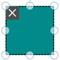 |
| Center | | 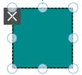 |
| Right | | 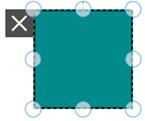 |
| Left | Center | 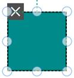 |
| Center | | 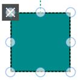 |
| Right | | 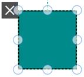 |
| Left | Bottom | 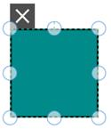 |
| Center | | 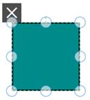 |
| Right | | 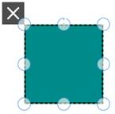 |

### Margin

**Margin** is an absolute value used to add some blank space in any one of its four sides. You can displace the QuickCommand with the `Margin` property. The following code example illustrates how to align a QuickCommand based on its Offset, HorizontalAlignment, VerticalAlignment and Margin values.


quick.Margin=new Thickness(0,70,0,0);

HorizontalAlignment = HorizontalAlignment.Left;

VerticalAlignment = VerticalAlignment.Top;



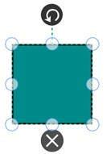

### QuickCommand Interaction 
### Command

Command is used to execute the certain action. By default, diagram have several commands. For more information about Commands, refer to [Commands] (/wpf/sfdiagram/commands).

### DragCommand

We can define the Commands which are needed to be executed while dragging the QuickCommand. This DragCommand will be executed when click on QuickCommand and move the mouse while keeping the mouse button pressed State. 

Example: Duplicate, Draw  

### CommandParameter

A parameter can be passed through the "CommandParameter" property. CommandParameter is effective only for the parameter required Commands. ( Example: ZoomIn and ZoomOut)