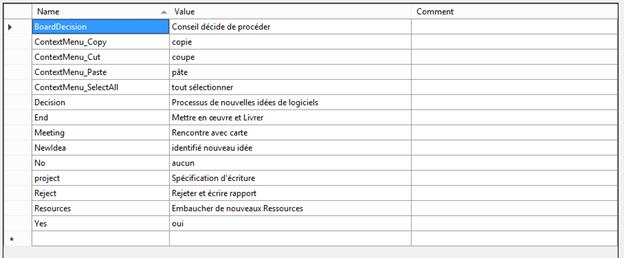
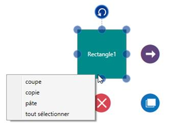

# Localization

Localization is the process of providing controls in different cultures to help you set your own culture easily. Diagram provides localization support for Context Menu items.

Customizing Context Menu

The following code illustrates how to provide localization support for Context Menu items.

<table>
<tr>
<td>
System.Threading.Thread.CurrentThread.CurrentUICulture = new System.Globalization.CultureInfo("fr");//French  System.Resources.ResourceManager manager;  Assembly assembly = Application.Current.GetType().Assembly;  manager = new System.Resources.ResourceManager("Localization.Resources.Syncfusion.SfDiagram.WPF",   assembly);    </td></tr>
</table>

