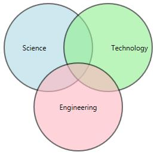
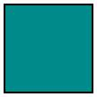
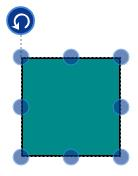
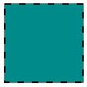

# Node

Nodes are graphical objects used to visually represent the geometrical information, process flow, internal business procedure, entity, or any other kind of data.

Create Node

A Node can be created and added to the Diagram, either programmatically or interactively. Nodes are stacked on the Diagram area from bottom to top in the order they are added.

Add Node through Nodes collection 

To create a Node, You have to define the Node object and add that to Nodes collection of the Diagram. The following code example illustrate how to add the Node to the Diagram.

[XAML]

<table>
<tr>
<td>
<diagram:SfDiagram x:Name="diagram">  <diagram:SfDiagram.Nodes>  <diagram:DiagramCollection>  <diagram:NodeViewModel UnitWidth="100" UnitHeight="100" OffsetX="200" OffsetY="200">  <diagram:NodeViewModel.Shape>  <RectangleGeometry Rect="0,0,10,10"/>  </diagram:NodeViewModel.Shape>  <diagram:NodeViewModel.ShapeStyle>    </diagram:NodeViewModel.ShapeStyle>  </diagram:NodeViewModel>  </diagram:DiagramCollection>  </diagram:SfDiagram.Nodes>  </diagram:SfDiagram>    </td></tr>
</table>
[C#]

<table>
<tr>
<td>
ObservableCollection<NodeViewModel> nodes = new ObservableCollection<NodeViewModel>();  NodeViewModel node = new NodeViewModel()  {  UnitWidth = 100,  UnitHeight = 100,  OffsetX = 200,  OffsetY = 200,    Shape = new RectangleGeometry() { Rect = new Rect(0, 0, 10, 10) },  ShapeStyle = this.diagram.Resources["shapestyle"] as Style  };    nodes.Add(node);  diagram.Nodes = nodes;    </td></tr>
</table>

Add Node from stencil

Nodes can be predefined and added to palette and can be dropped into the Diagram when needed. For more information about adding Nodes from Stencil, refer to **[Stencil](#_Stencil "")**.

Create Node through data source

Nodes can be generated automatically with the information provided through data source.For more information about data source, 

refer to **[Data Source](#_DataSource_Support "")**.

Draw Nodes

Nodes can be interactively drawn by clicking and dragging the Diagram surface by using **Drawing** **Tool**. For more information about drawing Nodes, refer to **[Draw Nodes](#_Tools "")****.**

Position

Position of a Node is controlled by using its OffsetX and OffsetY properties. By default, these Offset properties represent the distance between origin of the Diagram’s page and Node’s center point. You may except this Offset values to represent the distance between page origin and Node’s top left corner instead of center. Pivot property helps solve this problem. Default value of Node’s pivot point is (0.5, 0.5), that means center of Node.

The following table illustrates how pivot relates Offset values with Node boundaries.

<table>
<tr>
<td>
Pivot   </td><td>
Offset  </td></tr>
<tr>
<td>
(0,5, 0.5)  </td><td>
OffsetX and OffsetY values are considered as the Node’s center point.  </td></tr>
<tr>
<td>
(0,0)  </td><td>
OffsetX and OffsetY values are considered as the top left corner of Node  </td></tr>
<tr>
<td>
(1,1)  </td><td>
OffsetX and OffsetY values are considered as the bottom right corner of the Node.  </td></tr>
</table>
[XAML]

<table>
<tr>
<td>
<diagram:SfDiagram x:Name="diagram">  <diagram:SfDiagram.Nodes>  <diagram:DiagramCollection>  <diagram:NodeViewModel UnitWidth="100" UnitHeight="100" OffsetX="200" OffsetY="200"  Pivot="0,0">  <diagram:NodeViewModel.Shape>  <RectangleGeometry Rect="0,0,10,10"/>  </diagram:NodeViewModel.Shape>  <diagram:NodeViewModel.ShapeStyle>    </diagram:NodeViewModel.ShapeStyle>  </diagram:NodeViewModel>  </diagram:DiagramCollection>  </diagram:SfDiagram.Nodes>  </diagram:SfDiagram>    </td></tr>
</table>
[C#]

<table>
<tr>
<td>
ObservableCollection<NodeViewModel> nodes = new ObservableCollection<NodeViewModel>();  NodeViewModel node = new NodeViewModel()  {  UnitWidth = 100,  UnitHeight = 100,  OffsetX = 200,  OffsetY = 200,  Pivot = new Point(0, 0)  };  nodes.Add(node);  diagram.Nodes = nodes;    </td></tr>
</table>

Appearance

You can customize the appearance of a Node by changing its Style. The following code illustrates how to customize the appearance of the shape.

[XAML]

<table>
<tr>
<td>
    </td></tr>
</table>
[C#]

<table>
<tr>
<td>
Style style = new Style(typeof(Path));  style.Setters.Add(new Setter(Path.FillProperty, Brushes.DarkCyan));  style.Setters.Add(new Setter(Path.StrokeProperty, Brushes.Black));  style.Setters.Add(new Setter(Path.StrokeThicknessProperty, 2d));  style.Setters.Add(new Setter(Path.StrokeDashArrayProperty, new DoubleCollection() { 5 }));            style.Setters.Add(new Setter(Path.StretchProperty, Stretch.Fill));  return style;    </td></tr>
</table>

Interaction

Diagram provides support to drag, resize, or rotate the Node interactively. For more information about editing a Node at runtime, refer to **[Interaction](#_Interaction "")**.

Constraints

The constraints property of Node allows you to enable/disable certain features. For more information about Node constraints, refer to **[Node Constraints](#NodeConstraints "")**.

