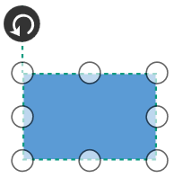
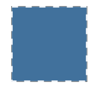

# Node

Nodes are graphical objects used to visually represent the geometrical information, process flow, internal business procedure or any other kind of data and it represents the functions of a complete system in regards to how it interacts with external entities.

## Shapes

We have provided some basic built-in shapes as ResourceDictionary.For more information, refer to [Shapes](/wpf/sfdiagram/shapes). 

## Create Node

A Node can be created and added to the Diagram, either programmatically or interactively. Nodes are stacked on the Diagram area from bottom to top in the order they are added.

### Add Node through Nodes collection 

To create a Node, You have to define the Node object and add that to Nodes collection of the Diagram.



<syncDiagram:SfDiagram.Nodes>
    <!--Observable Collection of NodeViewModel-->
    <syncDiagram:NodeCollection>
        <!—Declaring the NodeViewModel-->
        <syncDiagram:NodeViewModel ID="Begin" OffsetX="300" OffsetY="60" Shape="{StaticResource Ellipse}" UnitHeight="40" UnitWidth="120">                  
        </syncDiagram:NodeViewModel>
    </syncDiagram:NodeCollection>
</syncDiagram:SfDiagram.Nodes>



// Creating the NodeViewModel
NodeViewModel Begin = new NodeViewModel()
{
    ID = "Begin",
    UnitWidth = 120,
    UnitHeight = 40,
    OffsetX = 300,
    OffsetY = 60,
    //Specify shape to the Node from built-in Shape Dictionary
    Shape = this.Resources["Ellipse"],
    //Apply style to Shape
    ShapeStyle = this.Resources["ShapeStyle"] as Style,
};

// Add Node to Nodes property of the Diagram
(diagram.Nodes as NodeCollection).Add(Begin);


 

Now,Node would be like this,

### Add Node from stencil

Nodes can be predefined and added to palette and can be dropped into the Diagram when needed. For more information about adding Nodes from Stencil, refer to [Stencil](/wpf/sfdiagram/stencil "Stencil").

### Create Node through data source

Nodes can be generated automatically with the information provided through data source.For more information about data source, 

refer to [Data Source](/wpf/sfdiagram/datasource "DataSource").

### Draw Nodes

Nodes can be interactively drawn by clicking and dragging the Diagram surface by using **Drawing Tool**. For more information about drawing Nodes, refer to [Draw Nodes](/wpf/sfdiagram/tools#drawing-tools:shapes "Draw Nodes").

## Position

Position of a Node is controlled by using its `OffsetX` and `OffsetY` properties. By default, these Offset properties represent the distance between origin of the Diagram’s page and Node’s center point. You may expect this Offset values to represent the distance between page origin and Node’s top left corner instead of center. `Pivot` property helps solve this problem. Default value of Node’s pivot point is (0.5, 0.5), that means center of Node.

The following table illustrates how pivot relates Offset values with Node boundaries.

| Pivot | Offset |
|---|---|
| (0,5, 0.5) |  OffsetX and OffsetY values are considered as the Node’s center point. |
| (0,0) | OffsetX and OffsetY values are considered as the top left corner of Node. |
| (1,1) | OffsetX and OffsetY values are considered as the bottom right corner of the Node. |



<!--Style for Node-->

    </Setter.Value>
  </Setter>
</Style>

<!--Initialize the Sfdiagram-->
<syncfusion:SfDiagram x:Name="diagram">
  <syncfusion:SfDiagram.Nodes>
    <!--Initialize the NodeCollection-->
    <syncfusion:NodeCollection>
      <!--Initialize the Node-->
      <syncfusion:NodeViewModel UnitHeight="65" UnitWidth="100" OffsetX="100" OffsetY="100" Pivot="0,0" Shape="{StaticResource Rectangle}">
      </syncfusion:NodeViewModel>
    </syncfusion:NodeCollection>
  </syncfusion:SfDiagram.Nodes>
</syncfusion:SfDiagram>




//Define the NodeCollection
diagram.Nodes = new NodeCollection();
//Define the Node
NodeViewModel node = new NodeViewModel()
{
    //sets the size
    UnitHeight = 65,
    UnitWidth = 100,
    //sets the position
    OffsetX = 100,
    OffsetY = 100,
    //sets the Pivot point
    Pivot=new Point(0,0),
    Shape = new RectangleGeometry() { Rect = new Rect(0, 0, 10, 10) },
};
//Adding Node to Collection
(diagram.Nodes as NodeCollection).Add(node);




## Padding

Padding is used to leave space between the Connector’s end point and the object to where it is connected. The `ConnectorPadding` property of Node defines the space to be left between the Node bounds and its edges.



//Define NodeCollection
diagram.Nodes = new NodeCollection();
//Define NodeProperty
NodeViewModel node1 = AddNode(200,200,65,100);
//Space between Connector and Node
node1.ConnectorPadding = 5;
//Adding Node to Collection
(diagram.Nodes as NodeCollection).Add(node1);
NodeViewModel node2 = AddNode(400,200,65,100);
(diagram.Nodes as NodeCollection).Add(node2);
//Define ConnectorCollection
diagram.Connectors = new ConnectorCollection();
ConnectorViewModel conn1 = new ConnectorViewModel()
{
    SourceNode = node1,
    TargetNode=node2
};
//Adding Connector to Collection
(diagram.Connectors as ConnectorCollection).Add(conn1);

//Method for Creating Node
public NodeViewModel AddNode(double offsetX, double offsetY,double height,double width)
{
    NodeViewModel node = new NodeViewModel();
    node.OffsetX = offsetX;
    node.OffsetY = offsetY;
    node.UnitHeight = height;
    node.UnitWidth = width;
    node.Shape = new RectangleGeometry { Rect = new Rect(0, 0, 10, 10) } ;
    return node;
}




## Appearance

You can customize the appearance of a Node by changing its `ShapeStyle`. The following code illustrates how to customize the appearance of the `Shape`.






Style style = new Style(typeof(Path));
style.Setters.Add(new Setter(Path.FillProperty, Brushes.SteelBlue));
style.Setters.Add(new Setter(Path.StrokeProperty, Brushes.WhiteSmoke));
style.Setters.Add(new Setter(Path.StrokeThicknessProperty, 2d));
style.Setters.Add(new Setter(Path.StrokeDashArrayProperty, new DoubleCollection() { 5 }));
style.Setters.Add(new Setter(Path.StretchProperty, Stretch.Fill));
return style;



## Flip

Diagram provides support to flip the node.`Flip` is performed to give the mirrored node of the Original element.
The flip types are below,
* Flip
 `Flip` which involves both vertical and horizontal changes of the element. 
* VerticalFlip
 `VerticalFlip` which involves changes in the vertical direction of the element.
* HorizontalFlip
 `HorizontalFlip` which involves changes in the horizontal direction of the element.
 
## Interaction

Diagram provides support to drag, resize, or rotate the Node interactively. 

### Select
Node can be selected by clicking on it.

To explore about selection and selection related events , refer to [Selection](/wpf/sfdiagram/interaction#selection) .

### Drag

* Selected object can be dragged by clicking and dragging it. When multiple elements are selected, dragging any one of the selected elements move every selected element.
* While dragging, the objects are snapped towards the nearest objects to make better alignments. For better alignments, refer to [Snapping](https://help.syncfusion.com/wpf/sfdiagram/snapping "Snapping").

* `NodeChangedEvent` will notify the `OffsetX` and `OffsetY` changes with their old and new values.Along with that, this event will give information about interaction state. To explore about aruguments, please refer to [NodeChangedEventArgs](https://help.syncfusion.com/cr/cref_files/wpf/Syncfusion.SfDiagram.WPF~Syncfusion.UI.Xaml.Diagram.NodeChangedEventArgs.html) .

### Resize

* Selector is surrounded by eight thumbs. When dragging these thumbs, selected items can be resized smaller or larger.
* When one corner of the selector is dragged, opposite corner is in a static position.
* While resizing, the objects are snapped towards the nearest objects to make better alignments. For better alignments, refer to [Snapping](https://help.syncfusion.com/wpf/sfdiagram/snapping "Snapping").

* `NodeChangedEvent` will notify the `UnitHeight` and `UnitWidth` changes with their old and new values.Along with that, this event will give information about  interaction state. To explore about arguments, please refer to [NodeChangedEventArgs](https://help.syncfusion.com/cr/cref_files/wpf/Syncfusion.SfDiagram.WPF~Syncfusion.UI.Xaml.Diagram.NodeChangedEventArgs.html) .

### Rotate

* A rotate handler is placed above the selector. Clicking and dragging the handler in a circular direction lead to rotate the Node.
* The Node is rotated with reference to the static pivot point.
* Pivot thumb (thumb at the middle of the Node) appears while rotating the Node to represent the static point.For more information about pivot, refer to [Position](/wpf/sfdiagram/node#position "Position").

* `NodeChangedEvent` will notify the `RotateAngle` changes with their old and new values.Along with that, this event will give information about iteraction State. To explore about arguments, please refer to the [NodeChangedEventArgs](https://help.syncfusion.com/cr/cref_files/wpf/Syncfusion.SfDiagram.WPF~Syncfusion.UI.Xaml.Diagram.NodeChangedEventArgs.html) .

## Events
* `ItemTappedEvent` is invoked on clicking the node. To explore about arguments, please refer to [ItemTappedEventargs](https://help.syncfusion.com/cr/cref_files/wpf/Syncfusion.SfDiagram.WPF~Syncfusion.UI.Xaml.Diagram.ItemTappedEventargs.html).
* `ItemDoubleTappedEvent` is invoked on double clicking the node. To explore about arguments, please refer to [ItemDoubleTappedEventargs](https://help.syncfusion.com/cr/cref_files/wpf/Syncfusion.SfDiagram.WPF~Syncfusion.UI.Xaml.Diagram.ItemDoubleTappedEventargs.html).
* `MouseDown` and `MouseUp` are invoked as similar to framework element, which is raised together with either MouseLeftButtonUp or MouseRightButtonUp. To explore about arguments, please refer to [MouseDownEventArgs](https://help.syncfusion.com/cr/cref_files/wpf/Syncfusion.SfDiagram.WPF~Syncfusion.UI.Xaml.Diagram.MouseDownEventArgs.html) and
[MouseUpEventArgs](https://help.syncfusion.com/cr/cref_files/wpf/Syncfusion.SfDiagram.WPF~Syncfusion.UI.Xaml.Diagram.MouseUpEventArgs.html).  

## Constraints

The `Constraints` property of Node allows you to enable/disable certain features. For more information about Node constraints, refer to [Node Constraints](/wpf/sfdiagram/constraints#node-constraints "Node Constraints").