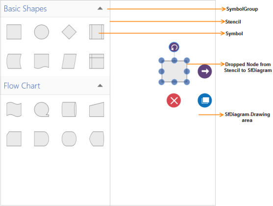
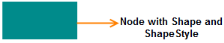
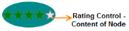
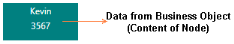
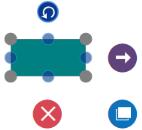

### Nodes

Nodes are graphical objects used to represent data in the SfDiagram.

Creating a Node

A node can be created and added to the Diagram by using the following methods:

* Through Stencil
* Through Code

Adding Nodes through Stencil

Drag the desired Symbol from the Stencil to the drawing area and release the pointer. The desired node is now added to the diagram.

{:.image }

Adding Nodes through Code

The NodeViewModel is implemented with the INode interface. The NodeViewModel does not have any default Shape.

[C#]

ObservableCollection<NodeViewModel> nodes = new ObservableCollection<NodeViewModel>();

NodeViewModel node = new NodeViewModel()

{

// Unique Guid for NodeViewModel

ID=Guid.NewGuid()               

};

nodes.Add(node);

diagramcontrol.Nodes = nodes;

Setting the Node Shape and Shape Style

Shape is a type of geometry that can be customized by using ShapeStyle property. A node shape visually lies between the content and background of the node.

[XAML]

&lt;Style TargetType="Path" x:Key="shapestyle"&gt;

    &lt;Setter Property="Fill" Value="DeepSkyBlue"&gt;&lt;/Setter&gt;

    &lt;Setter Property="StrokeThickness" Value="1"&gt;&lt;/Setter&gt;

    &lt;Setter Property="Stretch" Value="Fill"&gt;&lt;/Setter&gt;

&lt;/Style&gt;

[C#]  

ObservableCollection<NodeViewModel> nodes = new ObservableCollection<NodeViewModel>();

NodeViewModel node = new NodeViewModel()

{

     UnitWidth = 75,

     UnitHeight = 50,

     //Unique Guid for NodeViewModel

     ID = Guid.NewGuid(),

     //Shape for NodeViewModel

     Shape = new RectangleGeometry() { Rect = new Rect(0, 0, 10, 10) },

     //ShapeStyle

     ShapeStyle = this.Resources["shapestyle"] as Style

};

nodes.Add(node);

diagramcontrol.Nodes = nodes;

{:.image }

Node Content

A node is used to visually represent UI elements by using the Content property. You can host any content inside a node through the content template of the node which provides support for all types of content.

> 
{:.image }
_Note: Nodes can include both Content and Shape at the same time. In such a case, the Content will be placed over the Shape._

[C#]

&lt;!--&lt;NodeViewModel&gt;-->

&lt;SynDiagram:NodeViewModel Width="110" Height="50" OffsetX="100" OffsetY="100"&gt;

&lt;!--&lt;Content-RatingControl&gt;-->

&lt;SynDiagram:NodeViewModel.Content&gt;

&lt;rating:SfRating ItemsCount="5" Margin="0,10,0,0"&gt;

&lt;rating:SfRating.Resources&gt;

&lt;Style TargetType="rating:SfRatingItem"&gt;

&lt;Setter Property="Width" Value="20"&gt;&lt;/Setter&gt;

&lt;Setter Property="Height" Value="23"&gt;&lt;/Setter&gt;

&lt;Setter Property="RatedFill" Value="Green"&gt;&lt;/Setter&gt;

&lt;/Style&gt;

&lt;/rating:SfRating.Resources&gt;

&lt;/rating:SfRating&gt;

&lt;/SynDiagram:NodeViewModel.Content&gt;

&lt;!--&lt;Shape-Ellipse&gt;-->

&lt;SynDiagram:NodeViewModel.Shape&gt;

&lt;EllipseGeometry RadiusX="10" RadiusY="10"&gt;                                

&lt;/EllipseGeometry&gt;

&lt;/SynDiagram:NodeViewModel.Shape&gt;

&lt;!--&lt;Shape-Style&gt;-->

&lt;SynDiagram:NodeViewModel.ShapeStyle&gt;

&lt;Style TargetType="Path"&gt;

&lt;Setter Property="Fill" Value="DeepSkyBlue"&gt;&lt;/Setter&gt;

&lt;Setter Property="Stretch" Value="Fill"&gt;&lt;/Setter&gt;

&lt;/Style&gt;

&lt;/SynDiagram:NodeViewModel.ShapeStyle&gt;

&lt;/SynDiagram:NodeViewModel&gt;

{:.image }

Using Business Objects as Node Content

Business objects can also be used as node content. In such cases, the content template will determine the representation of the business objects.
The following example illustrates how to add business objects to Node Content:

1. Create an Employee class.

[C#]  

public class Employee

{    

public string Name

{

get;

set;

}

public int ID

{

get;

set;

}

}    

2. Create the Content Template.

[XAML]

&lt;DataTemplate x:Key="contenttemplate"&gt;

&lt;Border BorderBrush="Black" BorderThickness="2" Background="DeepSkyBlue"&gt;

&lt;StackPanel Orientation="Vertical"&gt;

&lt;TextBlock Text="{Binding Name}" Foreground="White"                        FontSize="12"&gt;

&lt;/TextBlock&gt;

&lt;TextBlock Text="{Binding ID}" Foreground="White"FontSize="12"&gt;

&lt;/TextBlock&gt;

&lt;/StackPanel&gt;

&lt;/Border&gt;

&lt;/DataTemplate&gt;

3. Add the Node Content and Content Template to the INode interface.

[C#]

ObservableCollection<NodeViewModel> nodes = new ObservableCollection<NodeViewModel>();

NodeViewModel node = new NodeViewModel()

{

    UnitWidth = 100,

    UnitHeight = 50,

    OffsetX = 200,

    OffsetY = 200,

    // Unique Guid for NodeViewModel

    ID = Guid.NewGuid(),

  Content = new Employee() { Name = "Kevin", ID = 3567 },    ContentTemplate = this.Resources["contenttemplate"] as DataTemplate

};

nodes.Add(node);

diagramcontrol.Nodes = nodes;

{:.image }

Node Constraints

NodeConstraints property is used to enable or disable certain behaviors of Nodes. This property is applicable only to the Node of SfDiagram control.

_Table_ _1__: Constraints Table_

<table>
<tr>
<td>
Constraints</td><td>
Description</td></tr>
<tr>
<td>
None</td><td>
Disables all behaviors of the control.</td></tr>
<tr>
<td>
Selectable</td><td>
Enables a node to be selected.</td></tr>
<tr>
<td>
Draggable</td><td>
Enables the node to be dragged.</td></tr>
<tr>
<td>
Resizable</td><td>
Enables a node to be resized.</td></tr>
<tr>
<td>
Rotatable</td><td>
Enables a node to be rotated.</td></tr>
<tr>
<td>
InConnect</td><td>
Enables connecting to the incoming connector.</td></tr>
<tr>
<td>
OutConnect</td><td>
Enables connecting the outgoing connector.</td></tr>
<tr>
<td>
SnapToHorizontalLines</td><td>
Enables nodes to snap to horizontal gridlines.</td></tr>
<tr>
<td>
SnapToVerticalLines</td><td>
Enables nodes to snap to vertical gridlines.</td></tr>
<tr>
<td>
SnapAngle</td><td>
Enables snap while rotating.</td></tr>
<tr>
<td>
SnapToLines</td><td>
Enables nodes to snap to gridlines.</td></tr>
<tr>
<td>
Connectable</td><td>
Enables a node to connect to the connector.</td></tr>
<tr>
<td>
AllowPan</td><td>
Enables panning on the node.</td></tr>
<tr>
<td>
InheritSnapping </td><td>
Enables to inherit the value of SnapToLines and SnapAngle from SfDiagram by SnapConstraints in SnapSettings.</td></tr>
<tr>
<td>
InheritSnapToObject </td><td>
Enables to inherit the value to SnapToObject from SfDiagram by SnapConstraints in SnapSettings.</td></tr>
<tr>
<td>
InheritPortVisibility </td><td>
Enables to inherit the value for PortVisibility from SfDiagram. </td></tr>
<tr>
<td>
Inherit </td><td>
Enables to inherit all the Snapping, SnapToObject, and PortVisibility from SfDiagram. </td></tr>
<tr>
<td>
AspectRatio</td><td>
Enables node to be Resized all the direction </td></tr>
<tr>
<td>
Default</td><td>
Enables all behaviors of the control.</td></tr>
<tr>
<td>
ResizeNorthEast</td><td>
Enables or disables resizing nodes in the north east.</td></tr>
<tr>
<td>
ResizeEast</td><td>
Enables or disables resizing nodes in the east.</td></tr>
<tr>
<td>
ResizeSouthEast</td><td>
Enables or disables resizing nodes in the south east.</td></tr>
<tr>
<td>
ResizeSouth</td><td>
Enables or disables resizing nodes in the south.</td></tr>
<tr>
<td>
ResizeSouthWest</td><td>
Enables or disables resizing nodes in the south west.</td></tr>
<tr>
<td>
ResizeWest</td><td>
Enables or disables resizing nodes in the west.</td></tr>
<tr>
<td>
ResizeNorthWest</td><td>
Enables or disables resizing nodes in the north west.</td></tr>
<tr>
<td>
ResizeNorth</td><td>
Enables or disables resizing nodes in the north.</td></tr>
</table>

The default value for NodeConstraints property is Default.

Example 1

The following code example illustrates how to disable Dragging in a Node in SfDiagram:

[C#]

node.Constraints = node.Constraints &~ NodeConstraints.Selectable &~ NodeConstraints.Draggable;

Example 2

The following code example illustrates how to disable the resizing node in a particular direction.

[C#]

//Disable Selector Thumb Resize in Particular direction

node.Constraints = node.Constraints & ~(NodeConstraints.ResizeNorthWest | NodeConstraints.ResizeNorthEast | NodeConstraints.ResizeSouthWest | NodeConstraints.ResizeSouthEast);

Here, node is instance of a Node.

{:.image }

> 
{:.image }
_Note: NodeConstraints property is manipulated using bitwise operations. For more information about bitwise operations, see_ Bitwise Operations_._

Aspect Ratio 

Aspect Ratio is used to enable/disable proportional resizing of Nodes. When the width of a node is resized to double its value, its height also automatically doubles to maintain its Aspect Ratio.

The following code example illustrates how to enable Aspect Ratio.

[C#] 

//Enables AspectRatio. 

node.Constraints = node.Constraints | NodeConstraints.AspectRatio;

