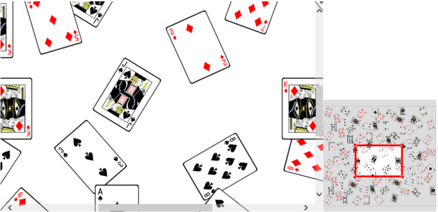

# Overview

**Essential Diagram WPF** creates rich Visio like applications. Its Framework comprises of many Elements that helps you to create an application easily. The rich feature set of the Diagram control includes Snapping, Guidelines, Gridlines, Serialization and Zooming.

The list of list features of Diagram control in WinRT is as follows.

* **Node, Connector, Group, Port:** Element used to compose diagram.
* **Clipboard Commands:** Performs cut, copy and paste operation.
* **Undo/Redo:** Performs correction in recent change.
* **Stencil:** It holds a list of symbols that is dropped over diagram.
* **Serialization:** Save current state of diagram, and load them back when needed.
* **Snapping:** Snap the diagram elements towards the nearest element.
* **Gridlines:** Visual horizontal/vertical lines that helps to align elements on diagram.
* **Interaction:** Zoom, pan, multiple selections, snapping.
* **Layouts:** Arranges Nodes in a tree like structure based on relationship on Nodes.

