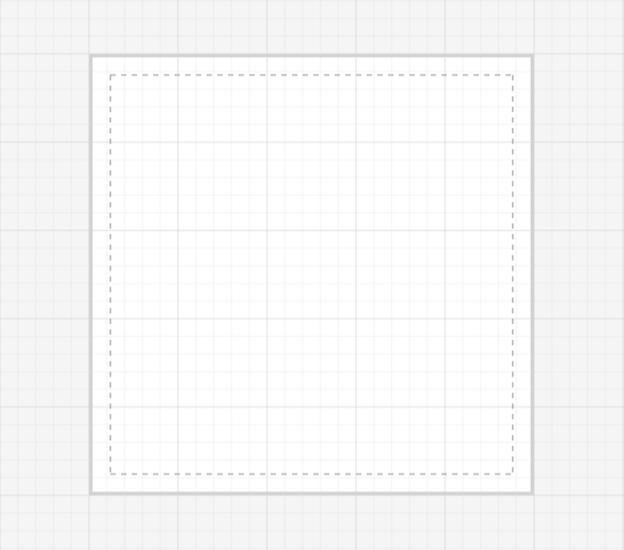

# Page Settings

Page settings enable to customize the appearance, width, and height of the Diagram page. The size and appearance of the Diagram pages can be customized with the `PageSettings` property.

The `PageWidth` and `PageHeight` properties of page settings define the size of the page. In addition to that, you can customize the appearance of the page with a set of appearance specific properties. 

You can also customize the appearance of off-page regions with the property BackgroundColor.




<diagram:SfDiagram x:Name="diagram" Background="WhiteSmoke">
  <diagram:SfDiagram.PageSettings>
    <diagram:PageSettings PageWidth="500" PageHeight="500" 
                          PageBorderThickness="4" PageBackground="White"
                          PageBorderBrush="LightGray" ShowPageBreaks="True"     
                          MultiplePage="True" PageOrientation="Portrait"/>
    </diagram:SfDiagram.PageSettings> 
  <diagram:SfDiagram.SnapSettings>
    <diagram:SnapSettings SnapConstraints="ShowLines"/>
  </diagram:SfDiagram.SnapSettings>
</diagram:SfDiagram>





diagram.Background = new SolidColorBrush(Colors.WhiteSmoke);
diagram.PageSettings.PageWidth = 500;
diagram.PageSettings.PageHeight = 500;
diagram.PageSettings.PageBorderThickness = new Thickness(4);
diagram.PageSettings.PageBackground = new SolidColorBrush(Colors.White);
diagram.PageSettings.PageBorderBrush = new SolidColorBrush(Colors.LightGray);
diagram.PageSettings.ShowPageBreaks = true;
diagram.PageSettings.MultiplePage = true;
diagram.PageSettings.PageOrientation = PageOrientation.Portrait;
diagram.SnapSettings.SnapConstraints = SnapConstraints.ShowLines;




## Multiple Page and Page Breaks

When MultiplePage is enabled, size of the page dynamically increases or decreases in multiple of page width and height and completely fits diagram within the page boundaries. Page Breaks is used as a visual guide to see how pages are split into multiple pages.
`MultiplePage` and `ShowPageBreak` properties of page settings allow you to enable/disable multiple pages and page breaks respectively.




diagram.PageSettings.ShowPageBreaks = true;
diagram.PageSettings.MultiplePage = true;




## Origin customization of Page

By default, Origin of the Page will be (0,0). Now, We have provided virtual and public methods to customize the Origin of the Page based on Pixels and PageSize (`PageWidth` and `PageHeight`).
Let us explain the API for this customization.

We have provided `AdjustPageOrigin` virtual method in PageSettings class and It's Info have `Trim` and `Truncate` methods for customization.

<table>
  <tr>
<td>
Trim()
</td>
<td>
This method will be customized the Origin in Pixel.
</td>
</tr>
<tr>
<td>
Truncate()
</td>
<td>
This method will be customized the Origin based the Size of the Page. 
</td>
</tr>
  </table>




//Need to create a custom class which should be derived from PageSetting class.
public class PageCustomClass : PageSettings
    {
        public override void AdjustPageOrigin()
        {
            Info.Trim();
        }
    }
    



N> This customization will play role in reducing the number of pages in printing.
