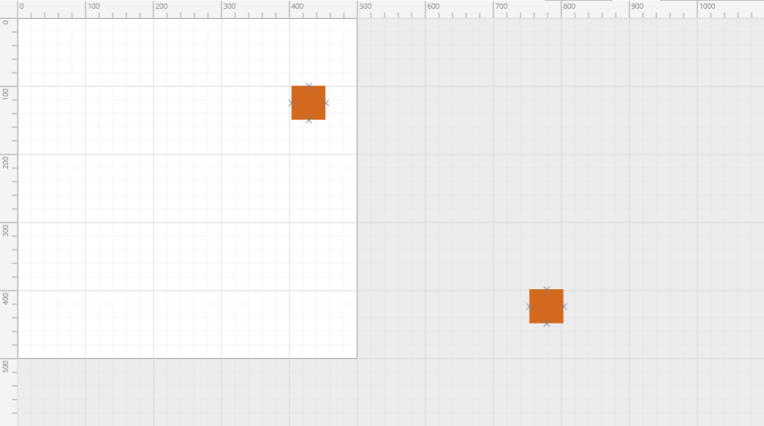
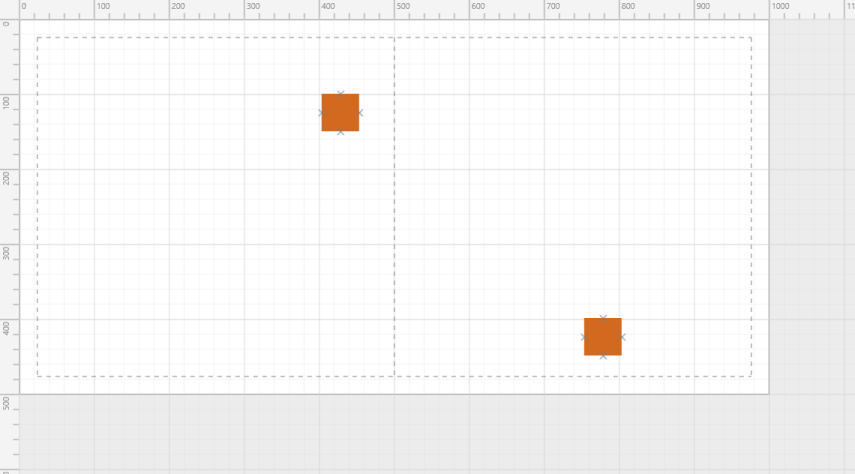
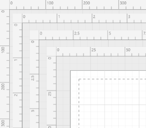

# Page Settings

#### Description

Page settings enable you to customize the appearance, width, height, and measurement units of the Diagram page. Page size is based on any one of the following options:

* Content of the page.
* Specified PageWidth and PageHeight.
* Both the content of the page and the specified PageWidth and PageHeight values.

### Page Appearance Based on Content of the Page

When the PageWidth and PageHeight are not specified, the page size is updated based on the content of the page.

By default, the page size is updated based on the content.

Content-based Page Size
{:.caption}

### Page Appearance Based on PageWidth and PageHeight

When PageWidth and PageHeight are specified and MultiplePage is set to false, the page size would be the specified values.

## Set PageWidth and PageHeight



//Initializing the SfDiagram

SfDiagram diagramControl = new SfDiagram();

diagramControl.PageSettings.PageWidth = 500;

diagramControl.PageSettings.PageHeight = 500;



Single Page with Specified Width and Height
{:.caption}

## MultiplePage and PageBreaks

When MultiplePage is set to true, based on the content of the page, the page size is in multiples of the specified PageWidth and PageHeight. When ShowPageBreaks is set to true, page break lines are rendered to separate the pages.

### Set MultiplePage



//Initializing the SfDiagram

SfDiagram diagramControl = new SfDiagram();

diagramControl.PageSettings.PageWidth = 500;

diagramControl.PageSettings.PageHeight = 500;

diagramControl.PageSettings.MultiplePage = false;



Multiple Pages in a Diagram
{:.caption}

## Measurement Units

#### Description

An element’s position, size, and many other numeric values are measured in pixels, by default. These values can be changed to standard measurement units like inches, centimeters, etc. These units can also be changed at runtime. Once the unit is changed, all numeric values are updated to the new unit to maintain the same visual appearance. Rulers and gridlines are updated accordingly.

To change measurement units



//Initializing the SfDiagram

SfDiagram diagramControl = new SfDiagram();

LengthUnit unit=diagramControl.PageSettings.Unit as LengthUnit;

unit.Unit = LengthUnits.Feets;



Rulers with Different Measurement Units
{:.caption}

## Supported Units

MeasurementUnit is an abstract class. LengthUnit is a class that implements this abstract class. LengthUnit supports following units:

* Centimeters
* Feets
* Inches
* Kilometers
* Miles
* Millileters
* Meters
* Pixels
* Yards

## Custom Units

MeasurementUnit is an abstract class. The Unit property of PageSettings is of MeasurementUnit type. A new kind of measurement unit can also be created by implementing this abstract base class.