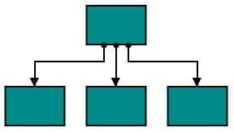
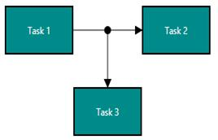
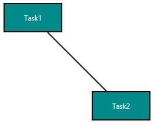
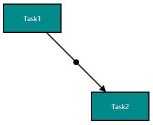
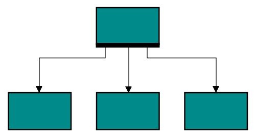
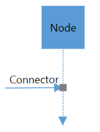
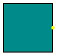
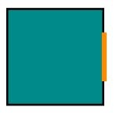

# Port

Essential Diagram for WPF provides support to define ports for making connections.

When a Connector is connected between two Nodes, its end points are automatically docked to Node’s nearest boundary as shown in the following image.

Port act as the connection points of node and allows to create connections with only specific points as shown in the following image.

### Data Binding

In order to achieve Properties of ViewModel are bind to View, we have provided the Default Style for View in “BindingStyle.xaml”. For more information, refer to [Data Binding](/wpf/sfdiagram/Data-Binding).

## Node Port

To specify and make connection with Node at precise Point. 

### Define Node Port

`Ports` property of a Node should be initialized with Collection. Port itself having properties to update position, appearance, visibility and interaction with this. 

Please find the common style for Node and NodePort.



<!--Style for Node-->

  </Setter.Value>
 </Setter>
</Style>
<!--style for NodePort-->

  </Setter.Value>
 </Setter>
 <Setter Property="Shape">
  <Setter.Value>
   <RectangleGeometry Rect="0,0,10,10"/>
  </Setter.Value>
 </Setter>
</Style>

<syncfusion:SfDiagram x:Name="diagram" PortVisibility="Visible">
  <!--Initializes the NodeCollection-->
  <syncfusion:SfDiagram.Nodes>
    <syncfusion:NodeCollection>
    <!--Initializes the Node-->
      <syncfusion:NodeViewModel  UnitHeight="100" UnitWidth="100" OffsetX="100" OffsetY="100" Shape="{StaticResource Rectangle}">
      <!--Initialization of PortCollection-->
         <syncfusion:NodeViewModel.Ports>
           <syncfusion:PortCollection>
            <!--Initialization of NodePort-->
             <syncfusion:NodePortViewModel x:Name="port" NodeOffsetX="0.5" NodeOffsetY="0.5">
             </syncfusion:NodePortViewModel>
          </syncfusion:PortCollection>
        </syncfusion:NodeViewModel.Ports>
      </syncfusion:NodeViewModel>
    </syncfusion:NodeCollection>
  </syncfusion:SfDiagram.Nodes>
</syncfusion:SfDiagram>




//Define Nodes Property
diagram.Nodes = new NodeCollection();

NodeViewModel node = new NodeViewModel()
{
 UnitHeight = 100,
 UnitWidth = 100,
 OffsetX = 100,
 OffsetY = 100,
 Shape = new RectangleGeometry() { Rect = new Rect(0, 0, 10, 10) },
 //Define PortCollection
 Ports = new PortCollection()
 {
 //Define the NodePortViewModel
   new NodePortViewModel()
  {
   //Initializing the position of NodePort
   NodeOffsetX=0.5,
   NodeOffsetY=0.5,
  }
 }
};
//Adding Node to Collection
(diagram.Nodes as NodeCollection).Add(node);

			


>N The default value of `PortVisibility` is `PortVisibility.MouseOver`. For more information , refer to the PortVisibility 

## Connector Port
 To specify and make connection with Connector at precise Length.
  
### Define Connector Port  
`Ports` property of a Connector should be initialized with Collection. Port itself having properties to update position, appearance, visibility and interaction with this.

Please find the common style for Connector and ConnectorPort.



<!--Style for the Connector-->

  </Setter.Value>
 </Setter>
 <Setter Property="TargetDecoratorStyle">
  <Setter.Value>
   
  </Setter.Value>
 </Setter>
</Style>
<!--Style For ConnectorPort-->

  </Setter.Value>
 </Setter>
 <Setter Property="Shape">
  <Setter.Value>
   <RectangleGeometry Rect="0,0,10,10"/>
  </Setter.Value>
 </Setter>
</Style>

<!--Initialize the sfdiagram-->
<syncfusion:SfDiagram x:Name="diagram" PortVisibility="Visible">
 <!--Initialize the ConnectorCollection-->
 <syncfusion:SfDiagram.Connectors>
  <syncfusion:ConnectorCollection>
   <!--Initialize the Connector-->
   <syncfusion:ConnectorViewModel SourcePoint="100,100" TargetPoint="200,200">
    <syncfusion:ConnectorViewModel.Ports>
     <!--Iitializes the PortCollection-->
     <syncfusion:PortCollection>
      <!--Initializes the ConnectorPort-->
      <syncfusion:ConnectorPortViewModel x:Name="Port"  Length="0.5">
      </syncfusion:ConnectorPortViewModel>
     </syncfusion:PortCollection>
    </syncfusion:ConnectorViewModel.Ports>
   </syncfusion:ConnectorViewModel>
  </syncfusion:ConnectorCollection>
 </syncfusion:SfDiagram.Connectors>
</syncfusion:SfDiagram>




//Define Connector Property
diagram.Connectors = new ConnectorCollection();
ConnectorViewModel connector = new ConnectorViewModel()
{
 SourcePoint = new Point(100, 100),
 TargetPoint = new Point(200, 200),
 //Define the PortCollection
 Ports = new PortCollection()
 {
  //Define the ConnectorPortViewModel
  new ConnectorPortViewModel()
  {
   Length=0.5,
  }
 }
};
//Adding Connector to Collection
(diagram.Connectors as ConnectorCollection).Add(connector);


			

>N The default value of `PortVisibility` is `PortVisibility.MouseOver`. For more information , refer to the PortVisibility 

## Dock Port

DockPort is different from standard ports like NodePort and ConnectorPort, as it allows you to create connection at any point within specific intervals as shown in the following image.

To add a collection port, you need to define the port object and add it to `Ports` property of Node. The `SourcePoint` and `TargetPoint` properties of DockPort allow you to define its end points. The following code illustrates how to add DockPort to the Node.

The following code illustrates how to add ports to Node.



<!--Style for Node-->

        </Setter.Value>
    </Setter>
    <Setter Property="Shape">
        <Setter.Value>
            <RectangleGeometry Rect="0,0,10,10"/>
        </Setter.Value>
    </Setter>
</Style>

<!--Style for DockPort-->

        </Setter.Value>
    </Setter>
</Style>



[C#]



//Create port collection
public class PortCollection : ObservableCollection<IPort>
{

}



[XAML]



<!--Initializes the SfDiagram-->
<syncfusion:SfDiagram x:Name="diagram" PortVisibility="Visible">
	<!--Initializes the NodeCollection-->
	<syncfusion:SfDiagram.Nodes>
		<syncfusion:NodeCollection>
		    <!--Initializes the Node-->
        	<syncfusion:NodeViewModel x:Name="node" OffsetX="100" 
				                      OffsetY="100" UnitHeight="100"
									  UnitWidth="100">	
				<!--Initializes the PortCollection-->					  						                                   
                <syncfusion:NodeViewModel.Ports>
                    <local:PortCollection>
                        <!--Initializes the NodePort-->
                        <syncfusion:DockPortViewModel x:Name="port" SourcePoint="0,1" TargetPoint="1,1">
						    <!--Initializes the PortCollection-->					  						                                   
                            <syncfusion:DockPortViewModel.Ports>
                                <local:PortCollection>
								</local:PortCollection>
					        </syncfusion:DockPortViewModel.Ports>
                        </syncfusion:DockPortViewModel>
                    </local:PortCollection>
                </syncfusion:NodeViewModel.Ports>
        	</syncfusion:NodeViewModel>
       	</syncfusion:NodeCollection>
	</syncfusion:SfDiagram.Nodes>
</syncfusion:SfDiagram>



## Port to Port Connection

Connector’s `SourcePort` and `TargetPort` properties allow to create connections between some specific points of source/target Nodes/Connectors.

### Connection for NodePort



<!--Initialization of sfdiagram-->
<syncfusion:SfDiagram x:Name="diagram" PortVisibility="Visible">
 <!--Initialization of Nodes-->
 <syncfusion:SfDiagram.Nodes>
  <!--Initialization of NodeCollection-->
  <syncfusion:NodeCollection>
   <syncfusion:NodeViewModel UnitHeight="65" UnitWidth="65" OffsetX="100" OffsetY="200" Shape="{StaticResource Diamond}">
     <!--Initialization of Ports-->
     <syncfusion:NodeViewModel.Ports>
      <!--Initialization of PortCollection-->
      <syncfusion:PortCollection>
       <syncfusion:NodePortViewModel ID="port1" x:Name="port1" NodeOffsetX="0.5" NodeOffsetY="0">
       </syncfusion:NodePortViewModel>
      </syncfusion:PortCollection>
     </syncfusion:NodeViewModel.Ports>
    </syncfusion:NodeViewModel>
   <syncfusion:NodeViewModel UnitHeight="55" UnitWidth="55" OffsetX="200" OffsetY="150" Shape="{StaticResource Rectangle}">
    <syncfusion:NodeViewModel.Ports>
     <syncfusion:PortCollection>
      <syncfusion:NodePortViewModel ID="port2" x:Name="port2" NodeOffsetX="0" NodeOffsetY="0.2">
      </syncfusion:NodePortViewModel>
     </syncfusion:PortCollection>
    </syncfusion:NodeViewModel.Ports>
  </syncfusion:NodeViewModel>
 </syncfusion:NodeCollection>
</syncfusion:SfDiagram.Nodes>
 <!--Initialization of Connectors-->
 <syncfusion:SfDiagram.Connectors>
  <!--Initialization of ConnectorCollection-->
  <syncfusion:ConnectorCollection>
   <syncfusion:ConnectorViewModel SourcePortID="port1" TargetPortID="port2">
   </syncfusion:ConnectorViewModel>
  </syncfusion:ConnectorCollection>
 </syncfusion:SfDiagram.Connectors>
</syncfusion:SfDiagram>




public MainWindow()
{
 InitializeComponent();
 diagram.PageSettings.PageWidth = 1000;
 diagram.PageSettings.PageHeight = 1000;
 //Define NodeCollection
 diagram.Nodes = new NodeCollection();
 //Define NodeProperty
 NodeViewModel node1 = AddNode(100, 200, "Decision",65,65, "nodeport1", 0.5, 0);
 //Adding Node to Collection
 (diagram.Nodes as NodeCollection).Add(node1);
 NodeViewModel node2 = AddNode(200, 150, "Rectangle",55,55, "nodeport2", 0, 0.2);
 (diagram.Nodes as NodeCollection).Add(node2);
 //Define ConnectorCollection
 diagram.Connectors = new ConnectorCollection();
 ConnectorViewModel conn1 = new ConnectorViewModel()
 {
  SourcePortID = "nodeport1",
  TargetPortID = "nodeport2",
 };
 //Adding Connector to Collection
 (diagram.Connectors as ConnectorCollection).Add(conn1);
}
//Method for Creating Node
public NodeViewModel AddNode(double offsetX, double offsetY,string shape,double height,double width, string id, double portX, double portY)
{ 
 NodeViewModel node = new NodeViewModel();
 node.OffsetX = offsetX;
 node.OffsetY = offsetY;
 node.UnitHeight = height;
 node.UnitWidth = width;
 node.Shape = App.Current.Resources[shape];
 node.Ports = new PortCollection()
 {
  new NodePortViewModel()
  {
   ID=id,
   NodeOffsetX=portX,
   NodeOffsetY=portY,
  }
 };
return node;
}




### Connector to Connector Routing




<Window.Resources>
 <!--Style for ConnectorGeometryStyle-->
 
 
</Window.Resources>

<!--Initialize the SfDiagram-->
<syncfusion:SfDiagram x:Name="diagram" PortVisibility="Visible" DefaultConnectorType="Line">
 <!--Initialize the Node-->
 <syncfusion:SfDiagram.Nodes>
  <syncfusion:NodeCollection>
   <syncfusion:NodeViewModel UnitHeight="50" UnitWidth="50" OffsetX="100" OffsetY="50" Shape="{StaticResource Rectangle}" ID="node1">
    <!--Initialize the Annotation-->
    <syncfusion:NodeViewModel.Annotations>
     <syncfusion:AnnotationCollection>
      <syncfusion:AnnotationEditorViewModel Content="Node">
      </syncfusion:AnnotationEditorViewModel>
     </syncfusion:AnnotationCollection>
    </syncfusion:NodeViewModel.Annotations>
   </syncfusion:NodeViewModel>
  </syncfusion:NodeCollection>
 </syncfusion:SfDiagram.Nodes>
 <!--Initialize the Connector-->
 <syncfusion:SfDiagram.Connectors>
  <syncfusion:ConnectorCollection>
   <syncfusion:ConnectorViewModel ID="connector1" SourceNodeID="node1" TargetPoint="100,160" ConnectorGeometryStyle="{StaticResource getstyle}">
    <!--Initialize the Port-->
    <syncfusion:ConnectorViewModel.Ports>
     <syncfusion:PortCollection>
      <syncfusion:ConnectorPortViewModel ID="connectorport" Length="0.5">
      </syncfusion:ConnectorPortViewModel>
     </syncfusion:PortCollection>
    </syncfusion:ConnectorViewModel.Ports>
   </syncfusion:ConnectorViewModel>
   <syncfusion:ConnectorViewModel SourceConnectorID="connector1" TargetPortID="connectorport" SourcePoint="35,118" ConnectorGeometryStyle="{StaticResource connectorstyle}">
    <syncfusion:ConnectorViewModel.Annotations>
     <syncfusion:AnnotationCollection>
      <syncfusion:AnnotationEditorViewModel Content="Connector">
      </syncfusion:AnnotationEditorViewModel>
     </syncfusion:AnnotationCollection>
    </syncfusion:ConnectorViewModel.Annotations>
   </syncfusion:ConnectorViewModel>
  </syncfusion:ConnectorCollection>
 </syncfusion:SfDiagram.Connectors>
</syncfusion:SfDiagram>





//Define NodeCollection
diagram.Nodes = new NodeCollection();
NodeViewModel node = new NodeViewModel()
{
 ID = "node1",
 UnitHeight = 50,
 UnitWidth = 50,
 OffsetX = 100,
 OffsetY = 50,
 Shape = new RectangleGeometry { Rect = new Rect(0, 0, 10, 10) },
 Annotations = new AnnotationCollection()
 {
  new AnnotationEditorViewModel()
  {
   Content="Node",
  }
 }
};
//Adding Node to Collection
(diagram.Nodes as NodeCollection).Add(node);
//Define PortProperty
ConnectorPortViewModel port = new ConnectorPortViewModel()
{
 ID = "connectorPort",
 Length = 0.5,
};
//Define ConnectorCollection
diagram.Connectors = new ConnectorCollection();
ConnectorViewModel con1 = new ConnectorViewModel()
{
 //Connection from Node to TargetPoint
 ID = "connector1",
 SourceNodeID = "node1",
 TargetPoint = new Point(100, 160),
 ConnectorGeometryStyle = this.Resources["getstyle"] as Style,
 //Define PortCollection
 Ports = new PortCollection()
 {
  port,
 }
};
//Adding Connector to Collection
(diagram.Connectors as ConnectorCollection).Add(con1);
ConnectorViewModel con2 = new ConnectorViewModel()
{
 //Connection from SourcePoint to TargetPort of Connector1
 SourceConnectorID = "connector1",
 SourcePoint = new Point(35, 118),
 TargetPortID = "connectorPort",
 ConnectorGeometryStyle = this.Resources["connectorstyle"] as Style,
 Annotations = new AnnotationCollection()
 {
  new AnnotationEditorViewModel()
  {
   Content="Connector",
   Margin=new Thickness(0,0,0,10),
  },
 }
};
(diagram.Connectors as ConnectorCollection).Add(con2);




DockPort does not allow direct connection to it as like NodePort and ConnectorPort. But you can able to create connection interactively. For more information, refer to [Draw Connectors](/wpf/sfdiagram/Tools#drawing-tools:connectors "Draw Connectors").

## Padding
Padding is used to leave space between the Connector’s end point and the object to where it is connected. The `ConnectorPadding` property of Node defines the space to be left between the Node bounds and its edges.




NodePortViewModel nodePort = new NodePortViewModel()
{
    //Declaring the ConnectorPadding value
    ConnectorPadding = 10,
    NodeOffsetX = 0,
    NodeOffsetY = 0.5,
};
//Define NodeCollection
diagram.Nodes = new NodeCollection();
//Define NodeProperty
NodeViewModel node1 = AddNode(200,200,65,100);
//Space between Connector and Node
node1.ConnectorPadding = 5;
//Adding Node to Collection
(diagram.Nodes as NodeCollection).Add(node1);
NodeViewModel node2 = AddNode(400,200,65,100);
node2.Ports = new PortCollection()
{
    nodePort
};

(diagram.Nodes as NodeCollection).Add(node2);
//Define ConnectorCollection
diagram.Connectors = new ConnectorCollection();
ConnectorViewModel conn1 = new ConnectorViewModel()
{
    TargetPort=nodePort,
    SourceNode = node1,
    TargetNode=node2
};
//Adding Connector to Collection
(diagram.Connectors as ConnectorCollection).Add(conn1);
 
//Method for Creating Node
public NodeViewModel AddNode(double offsetX, double offsetY,double height,double width)
{
    NodeViewModel node = new NodeViewModel();
    node.OffsetX = offsetX;
    node.OffsetY = offsetY;
    node.UnitHeight = height;
    node.UnitWidth = width;
    node.Shape = new RectangleGeometry { Rect = new Rect(0, 0, 10, 10) } ;
    return node;
}




## Appearance

You can change the shape of port by using its shape property. The appearance of ports can be customized with a set of style specific properties.

The following code illustrates how to change the appearance of port.

[XAML]



<!--Style for NodePort-->

        </Setter.Value>
	</Setter>
    <Setter Property="Shape">
    	<Setter.Value>
			<EllipseGeometry RadiusX="10" RadiusY="10"/>
        </Setter.Value>
	</Setter>
</Style>



[XAML]



<!--Initializes the SfDiagram-->
<syncfusion:SfDiagram x:Name="diagram" PortVisibility="Visible">
	<!--Initializes the NodeCollection-->
	<syncfusion:SfDiagram.Nodes>
		<syncfusion:NodeCollection>
				<!--Initializes the Node-->
              	<syncfusion:NodeViewModel x:Name="node" OffsetX="100" OffsetY="100" 	
				  		                  UnitHeight="100" UnitWidth="100">  
				    <!--Initializes the NodePortCollection-->                                  
					<syncfusion:NodeViewModel.Ports>
						<local:PortCollection>
						    <!--Initializes the NodePort-->
							<syncfusion:NodePortViewModel x:Name="port" UnitWidth="7"
                                                      	  UnitHeight="7"
                                                          NodeOffsetX="1"
                                                          NodeOffsetY="0.5">
							</syncfusion:NodePortViewModel>
						</local:PortCollection>
                	</syncfusion:NodeViewModel.Ports>
              	</syncfusion:NodeViewModel>
       	</syncfusion:NodeCollection>
	</syncfusion:SfDiagram.Nodes>
</syncfusion:SfDiagram>



The appearance of DockPort can be customized using `ConnectorGeometryStyle` property.

[XAML]



<!--Style for DockPort-->

        </Setter.Value>
    </Setter>
</Style>



## Constraints

The `Constraints` property allows to enable/disable certain behaviors of ports. For more information about port constraints, refer to [Port Constraints](/wpf/sfdiagram/Constraints#port-constraints "Port Constraints").