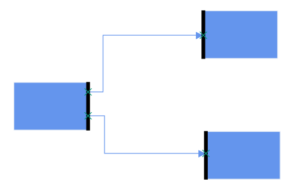
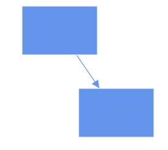
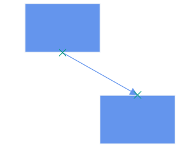
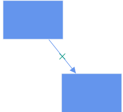
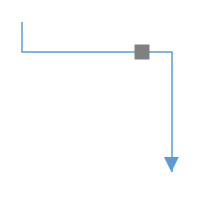
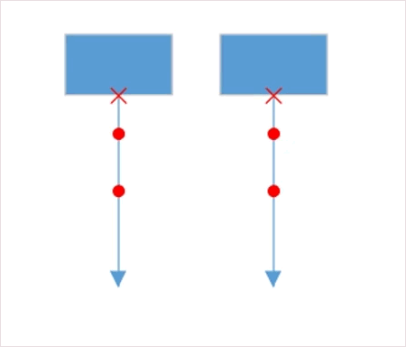
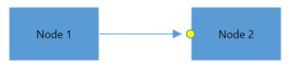

# Port

Essential Diagram for WPF provides support to define ports for making connections.

When a Connector is connected between two Nodes, its end points are automatically docked to Node’s nearest boundary as shown in the following image.

Port act as the connection points of node and allows to create connections with only specific points as shown in the following image.

 

## Node Port

To specify and make connection with Node at precise Point. 

### Define Node Port

`Ports` property of a Node should be initialized with Collection. Port itself having properties as `NodeOffsetX` and `NodeOffsetY` to update position, appearance, visibility and interaction with this. 

Please find the common style for Node and NodePort.



<!--Style for Node-->

  </Setter.Value>
 </Setter>
</Style>
<!--style for NodePort-->

  </Setter.Value>
 </Setter>
 <Setter Property="Shape">
  <Setter.Value>
   <RectangleGeometry Rect="0,0,10,10"/>
  </Setter.Value>
 </Setter>
</Style>

<syncfusion:SfDiagram x:Name="diagram" PortVisibility="Visible">
  <!--Initializes the NodeCollection-->
  <syncfusion:SfDiagram.Nodes>
    <syncfusion:NodeCollection>
    <!--Initializes the Node-->
      <syncfusion:NodeViewModel  UnitHeight="100" UnitWidth="100" OffsetX="100" OffsetY="100" Shape="{StaticResource Rectangle}">
      <!--Initialization of PortCollection-->
         <syncfusion:NodeViewModel.Ports>
           <syncfusion:PortCollection>
            <!--Initialization of NodePort-->
             <syncfusion:NodePortViewModel x:Name="port" NodeOffsetX="0.5" NodeOffsetY="0.5">
             </syncfusion:NodePortViewModel>
          </syncfusion:PortCollection>
        </syncfusion:NodeViewModel.Ports>
      </syncfusion:NodeViewModel>
    </syncfusion:NodeCollection>
  </syncfusion:SfDiagram.Nodes>
</syncfusion:SfDiagram>




//Define Nodes Property
diagram.Nodes = new NodeCollection();

NodeViewModel node = new NodeViewModel()
{
 UnitHeight = 100,
 UnitWidth = 100,
 OffsetX = 100,
 OffsetY = 100,
 Shape = new RectangleGeometry() { Rect = new Rect(0, 0, 10, 10) },
 //Define PortCollection
 Ports = new PortCollection()
 {
 //Define the NodePortViewModel
   new NodePortViewModel()
  {
   //Initializing the position of NodePort
   NodeOffsetX=0.5,
   NodeOffsetY=0.5,
  }
 }
};
//Adding Node to Collection
(diagram.Nodes as NodeCollection).Add(node);

			


>N The default value of `PortVisibility` is `PortVisibility.MouseOverOnConnect`. For more information , refer to the PortVisibility 

## Connector Port

 To specify and make connection with Connector at precise Length.
  
### Define Connector Port  

`Ports` property of a Connector should be initialized with Collection. Port itself having properties `Length` to update position, appearance, visibility and interaction with this.

Please find the common style for Connector and ConnectorPort.



<!--Style for the Connector-->

  </Setter.Value>
 </Setter>
 <Setter Property="TargetDecoratorStyle">
  <Setter.Value>
   
  </Setter.Value>
 </Setter>
</Style>
<!--Style For ConnectorPort-->

  </Setter.Value>
 </Setter>
 <Setter Property="Shape">
  <Setter.Value>
   <RectangleGeometry Rect="0,0,10,10"/>
  </Setter.Value>
 </Setter>
</Style>

<!--Initialize the sfdiagram-->
<syncfusion:SfDiagram x:Name="diagram" PortVisibility="Visible">
 <!--Initialize the ConnectorCollection-->
 <syncfusion:SfDiagram.Connectors>
  <syncfusion:ConnectorCollection>
   <!--Initialize the Connector-->
   <syncfusion:ConnectorViewModel SourcePoint="100,100" TargetPoint="200,200">
    <syncfusion:ConnectorViewModel.Ports>
     <!--Iitializes the PortCollection-->
     <syncfusion:PortCollection>
      <!--Initializes the ConnectorPort-->
      <syncfusion:ConnectorPortViewModel x:Name="Port"  Length="0.5">
      </syncfusion:ConnectorPortViewModel>
     </syncfusion:PortCollection>
    </syncfusion:ConnectorViewModel.Ports>
   </syncfusion:ConnectorViewModel>
  </syncfusion:ConnectorCollection>
 </syncfusion:SfDiagram.Connectors>
</syncfusion:SfDiagram>




//Define Connector Property
diagram.Connectors = new ConnectorCollection();
ConnectorViewModel connector = new ConnectorViewModel()
{
 SourcePoint = new Point(100, 100),
 TargetPoint = new Point(200, 200),
 //Define the PortCollection
 Ports = new PortCollection()
 {
  //Define the ConnectorPortViewModel
  new ConnectorPortViewModel()
  {
   Length=0.5,
  }
 }
};
//Adding Connector to Collection
(diagram.Connectors as ConnectorCollection).Add(connector);


			

## Dock Port

DockPort is different from standard ports like NodePort and ConnectorPort, as it allows you to create connection at any point within specific intervals as shown in the following image.

To add a collection port, you need to define the port object and add it to `Ports` property of Node. The `SourcePoint` and `TargetPoint` properties of DockPort allow you to define its end points. 




 <!--Style for Node-->
 
   </Setter.Value>
  </Setter>
 </Style>
 <!--Style for DockPort-->
 
   </Setter.Value>
  </Setter>
 </Style>
 <!--Style for Connector-->
 
   </Setter.Value>
  </Setter>
  <Setter Property="TargetDecoratorStyle">
   <Setter.Value>
    
   </Setter.Value>
  </Setter>
 </Style>

<!--Initializes the SfDiagram-->
  <syncfusion:SfDiagram x:Name="diagram" PortVisibility="Visible">
    <!--Initializes the NodeCollection-->
     <syncfusion:SfDiagram.Nodes>
       <syncfusion:NodeCollection>
         <!--Initializes the Node-->
           <syncfusion:NodeViewModel x:Name="node" OffsetX="100" OffsetY="100" UnitHeight="100" UnitWidth="100" Shape="{StaticResource Rectangle}">
             <!--Initializes the PortCollection-->
             <syncfusion:NodeViewModel.Ports>
               <syncfusion:PortCollection>
               <!--Initializes the DockPort-->
               <syncfusion:DockPortViewModel x:Name="port" SourcePoint="0,1" TargetPoint="1,1">
              </syncfusion:DockPortViewModel>
            </syncfusion:PortCollection>
          </syncfusion:NodeViewModel.Ports>
        </syncfusion:NodeViewModel>
      </syncfusion:NodeCollection>
    </syncfusion:SfDiagram.Nodes>
  </syncfusion:SfDiagram>



## Port to Port Connection

Connector’s `SourcePort` or `SourcePortID` and `TargetPort` or `TargetPortID` properties allows to create connections between some specific points of source/target Nodes/Connectors.

### Connection for NodePort



<!--Initialization of sfdiagram-->
<syncfusion:SfDiagram x:Name="diagram" PortVisibility="Visible">
 <!--Initialization of Nodes-->
 <syncfusion:SfDiagram.Nodes>
  <!--Initialization of NodeCollection-->
  <syncfusion:NodeCollection>
   <syncfusion:NodeViewModel UnitHeight="65" UnitWidth="65" OffsetX="100" OffsetY="200" Shape="{StaticResource Diamond}">
     <!--Initialization of Ports-->
     <syncfusion:NodeViewModel.Ports>
      <!--Initialization of PortCollection-->
      <syncfusion:PortCollection>
       <syncfusion:NodePortViewModel ID="port1" x:Name="port1" NodeOffsetX="0.5" NodeOffsetY="0">
       </syncfusion:NodePortViewModel>
      </syncfusion:PortCollection>
     </syncfusion:NodeViewModel.Ports>
    </syncfusion:NodeViewModel>
   <syncfusion:NodeViewModel UnitHeight="55" UnitWidth="55" OffsetX="200" OffsetY="150" Shape="{StaticResource Rectangle}">
    <syncfusion:NodeViewModel.Ports>
     <syncfusion:PortCollection>
      <syncfusion:NodePortViewModel ID="port2" x:Name="port2" NodeOffsetX="0" NodeOffsetY="0.2">
      </syncfusion:NodePortViewModel>
     </syncfusion:PortCollection>
    </syncfusion:NodeViewModel.Ports>
  </syncfusion:NodeViewModel>
 </syncfusion:NodeCollection>
</syncfusion:SfDiagram.Nodes>
 <!--Initialization of Connectors-->
 <syncfusion:SfDiagram.Connectors>
  <!--Initialization of ConnectorCollection-->
  <syncfusion:ConnectorCollection>
   <syncfusion:ConnectorViewModel SourcePortID="port1" TargetPortID="port2">
   </syncfusion:ConnectorViewModel>
  </syncfusion:ConnectorCollection>
 </syncfusion:SfDiagram.Connectors>
</syncfusion:SfDiagram>




public MainWindow()
{
 InitializeComponent();
 diagram.PageSettings.PageWidth = 1000;
 diagram.PageSettings.PageHeight = 1000;
 //Define NodeCollection
 diagram.Nodes = new NodeCollection();
 //Define NodeProperty
 NodeViewModel node1 = AddNode(100, 200, "Decision",65,65, "nodeport1", 0.5, 0);
 //Adding Node to Collection
 (diagram.Nodes as NodeCollection).Add(node1);
 NodeViewModel node2 = AddNode(200, 150, "Rectangle",55,55, "nodeport2", 0, 0.2);
 (diagram.Nodes as NodeCollection).Add(node2);
 //Define ConnectorCollection
 diagram.Connectors = new ConnectorCollection();
 ConnectorViewModel conn1 = new ConnectorViewModel()
 {
  SourcePortID = "nodeport1",
  TargetPortID = "nodeport2",
 };
 //Adding Connector to Collection
 (diagram.Connectors as ConnectorCollection).Add(conn1);
}
//Method for Creating Node
public NodeViewModel AddNode(double offsetX, double offsetY,string shape,double height,double width, string id, double portX, double portY)
{ 
 NodeViewModel node = new NodeViewModel();
 node.OffsetX = offsetX;
 node.OffsetY = offsetY;
 node.UnitHeight = height;
 node.UnitWidth = width;
 node.Shape = App.Current.Resources[shape];
 node.Ports = new PortCollection()
 {
  new NodePortViewModel()
  {
   ID=id,
   NodeOffsetX=portX,
   NodeOffsetY=portY,
  }
 };
return node;
}




### Connection for ConnectorPort




<Window.Resources>
  <!--Style for NodePort-->
  
    </Setter.Value>
   </Setter>
  </Style>
  <!--Style For ConnectorPort-->
  
    </Setter.Value>
   </Setter>
   <Setter Property="Shape">
    <Setter.Value>
     <EllipseGeometry RadiusX="5" RadiusY="5"/>
    </Setter.Value>
   </Setter>
  </Style>
</Window.Resources>

<!--Initialize the SfDiagram-->
<syncfusion:SfDiagram x:Name="diagram" PortVisibility="Visible" DefaultConnectorType="Line">
 <!--Initialize the Node-->
 <syncfusion:SfDiagram.Nodes>
  <syncfusion:NodeCollection>
   <syncfusion:NodeViewModel UnitHeight="65" UnitWidth="100" OffsetX="100" OffsetY="50" Shape="{StaticResource Rectangle}" ID="node1">
    <syncfusion:NodeViewModel.Ports>
     <syncfusion:PortCollection>
      <syncfusion:NodePortViewModel NodeOffsetX="0.5" NodeOffsetY="1">
      </syncfusion:NodePortViewModel>
     </syncfusion:PortCollection>
    </syncfusion:NodeViewModel.Ports>
   </syncfusion:NodeViewModel>
   <syncfusion:NodeViewModel UnitHeight="65" UnitWidth="100" OffsetX="300" OffsetY="50" Shape="{StaticResource Rectangle}" ID="node2">
    <syncfusion:NodeViewModel.Ports>
     <syncfusion:PortCollection>
      <syncfusion:NodePortViewModel NodeOffsetX="0.5" NodeOffsetY="1">
      </syncfusion:NodePortViewModel>
     </syncfusion:PortCollection>
    </syncfusion:NodeViewModel.Ports>
   </syncfusion:NodeViewModel>
  </syncfusion:NodeCollection>
 </syncfusion:SfDiagram.Nodes>
 <!--Initialize the Connector-->
 <syncfusion:SfDiagram.Connectors>
  <syncfusion:ConnectorCollection>
   <syncfusion:ConnectorViewModel ID="connector1" SourceNodeID="node1" TargetPoint="100,160">
    <!--Initialize the Port-->
     <syncfusion:ConnectorViewModel.Ports>
      <syncfusion:PortCollection>
       <syncfusion:ConnectorPortViewModel ID="connectorport1" Length="0.3">
       </syncfusion:ConnectorPortViewModel>
       <syncfusion:ConnectorPortViewModel ID="connectorport2" Length="0.7">
       </syncfusion:ConnectorPortViewModel>
      </syncfusion:PortCollection>
     </syncfusion:ConnectorViewModel.Ports>
    </syncfusion:ConnectorViewModel>
   <syncfusion:ConnectorViewModel ID="connector2" SourceNodeID="node2" TargetPoint="300,160" >
   <!--Initialize the Port-->
    <syncfusion:ConnectorViewModel.Ports>
     <syncfusion:PortCollection>
      <syncfusion:ConnectorPortViewModel ID="connectorport3" Length="0.3">
      </syncfusion:ConnectorPortViewModel>
      <syncfusion:ConnectorPortViewModel ID="connectorport4" Length="0.7">
      </syncfusion:ConnectorPortViewModel>
     </syncfusion:PortCollection>
    </syncfusion:ConnectorViewModel.Ports>
   </syncfusion:ConnectorViewModel>
  </syncfusion:ConnectorCollection>
 </syncfusion:SfDiagram.Connectors>
</syncfusion:SfDiagram>





 InitializeComponent();
 //Define NodeCollection
 diagram.Nodes = new NodeCollection();
 NodeViewModel node1 = AddNode(100, 50, 65, 100,0.5,1);
 //Adding Node to Collection
 (diagram.Nodes as NodeCollection).Add(node1);
 NodeViewModel node2 = AddNode(300, 50, 65, 100, 0.5, 1);
 (diagram.Nodes as NodeCollection).Add(node2);
 //Define connectorCollection
 diagram.Connectors = new ConnectorCollection();
 ConnectorViewModel con1 = AddConnector(node1, new Point(100, 160), 0.3, 0.7);
 //Adding connector to collection
 (diagram.Connectors as ConnectorCollection).Add(con1);
 ConnectorViewModel con2 = AddConnector(node2, new Point(300, 160), 0.3, 0.7);
 (diagram.Connectors as ConnectorCollection).Add(con2);
    }
 //Method for Creating Node
 public NodeViewModel AddNode(double offsetX, double offsetY, double height, double width, double nodeOffX, double nodOffY)
   {
     NodeViewModel node = new NodeViewModel();
     node.OffsetX = offsetX;
     node.OffsetY = offsetY;
     node.UnitHeight = height;
     node.UnitWidth = width;
     node.Shape = new RectangleGeometry { Rect = new Rect(0, 0, 10, 10) };
     node.Ports = new PortCollection()
      {
          new NodePortViewModel()
            {
              NodeOffsetX=nodeOffX,
              NodeOffsetY=nodOffY
            }
      };
     return node;
   }
   //Method for creating Connector
   public ConnectorViewModel AddConnector(object sourceNode,Point targetPoint,double length,double length1)
     {
       ConnectorViewModel con = new ConnectorViewModel();
       con.SourceNode = sourceNode;
       con.TargetPoint = targetPoint;
       con.Ports = new PortCollection()
         {
            new ConnectorPortViewModel()
              {
                 Length=length,
              },
            new ConnectorPortViewModel()
              {
                 Length=length1,
              }
         };
       return con;
     }




### Connection for DockPort

DockPort does not allow direct connection to it as like NodePort and ConnectorPort. But you can able to create connection interactively. 




diagram.PortVisibility = PortVisibility.Visible;
//Define the ConnectorPort
ConnectorPortViewModel cp1 = new ConnectorPortViewModel()
  {
    Length = 0.5,
  };
ConnectorPortViewModel cp2 = new ConnectorPortViewModel()
  {
    Length = 0.5,
  };
//Define the DockPort
DockPortViewModel dock1 = new DockPortViewModel()
 {
   SourcePoint = new Point(1, 1),
   TargetPoint = new Point(1, 0),
   //Adding ConnectorPort to DockPort
   Ports = new PortCollection()
   {
     cp1
   }
 };
DockPortViewModel dock2 = new DockPortViewModel()
 {
   SourcePoint = new Point(0, 0),
   TargetPoint = new Point(0, 1),
   Ports = new PortCollection()
   {
     cp2
   }
 };
// Define the NodeCollection
diagram.Nodes = new NodeCollection();
NodeViewModel node1 = AddNode(100, 100, "Rectangle", 65, 100);
//Define the PortCollection
node1.Ports = new PortCollection()
 {
   dock1
 };
//Adding Node to Collection
(diagram.Nodes as NodeCollection).Add(node1);
NodeViewModel node2 = AddNode(300, 100, "Rectangle", 65, 100);
node2.Ports = new PortCollection()
 {
   dock2
 };
(diagram.Nodes as NodeCollection).Add(node2);
//Define the ConnectorCollection
diagram.Connectors = new ConnectorCollection();
ConnectorViewModel connector1 = new ConnectorViewModel()
{
  //Adding DockPort's Connector Port as Source and Target Port
  SourcePort=cp1,
  TargetPort=cp2
};
//Adding Connector to Collection
(diagram.Connectors as ConnectorCollection).Add(connector1);
}
//Method for Creating Node
public NodeViewModel AddNode(double offsetX, double offsetY, string shape, double height, double width)
 {
    NodeViewModel node = new NodeViewModel();
    node.OffsetX = offsetX;
    node.OffsetY = offsetY;
    node.UnitHeight = height;
    node.UnitWidth = width;
    node.Shape = App.Current.Resources[shape];
    return node;
 }



For more information, refer to [Draw Connectors](/wpf/sfdiagram/tools#drawing-tools:connectors "Draw Connectors").

## Padding

Padding is used to leave space between the Connector’s end point and the object to where it is connected. The `ConnectorPadding` property of Node defines the space to be left between the Node bounds and its edges.




NodePortViewModel nodePort = new NodePortViewModel()
{
    //Declaring the ConnectorPadding value
    ConnectorPadding = 10,
    NodeOffsetX = 0,
    NodeOffsetY = 0.5,
};



### HitPadding

 Connection can be made from/to Nodes, Connectors, Port or on empty area in a diagram. Making connection with Ports are usually difficult as thickness are usually small. To make it easy to connect, it should be possible to connect when mouse comes near its vicinity area. `HitPadding` property allow to customize the vicinity area while connecting.
 
 
 
  NodePortViewModel np1 = new NodePortViewModel()
  {
    Constraints=PortConstraints.Default|PortConstraints.Draggable&~PortConstraints.InheritHitPadding,
    //Declaring the value for HitPadding
    HitPadding = 250,
    NodeOffsetX = 1,
    NodeOffsetY = 0.5
  };
 
 
 

### PortVisibility

The visibility of ports depends on the properties of `MouseOver`, `Default`, `Collapse`, `MouseOverOnConnect`, `ValidConnection` and `Visible`.

| Property | Definition |
|---|---|
| MouseOver |  Port is Visible on the mousehover over the DiagramElement. |
| Default | Port is Visible on the Connecting the connector, over the other DiagramElement where port presents within the DiagramElement. |
| Collapse | Port Visibility is hidden. |
| MouseOverOnConnect | Port is Visible on the Connecting the connector, over the other DiagramElement where port presents within the DiagramElement. |
| ValidConnection | Port is Visible on the mousehover over the DiagramElement. |
| Visible | Port is visible. |

To Know more about PortVisibility, please refer to [PortVisibility](https://help.syncfusion.com/cr/cref_files/wpf/Syncfusion.SfDiagram.WPF~Syncfusion.UI.Xaml.Diagram.PortVisibility.html).

## Appearance

You can change the shape of port by using its `shape` property. The appearance of ports can be customized with a set of style specific properties.




<!--Style for Node-->

  </Setter.Value>
 </Setter>
</Style>
<!--style for NodePort-->

  </Setter.Value>
 </Setter>
 <Setter Property="Shape">
  <Setter.Value>
   <EllipseGeometry RadiusX="5" RadiusY="5"/>
  </Setter.Value>
 </Setter>
</Style>

<!--Initializes the SfDiagram-->
<syncfusion:SfDiagram x:Name="diagram" PortVisibility="Visible">
 <!--Initializes the NodeCollection-->
 <syncfusion:SfDiagram.Nodes>
  <syncfusion:NodeCollection>
   <!--Initializes the Node-->
   <syncfusion:NodeViewModel x:Name="node" OffsetX="100" OffsetY="100" UnitHeight="65" UnitWidth="65" Shape="{StaticResource Rectangle}">
    <!--Initializes the NodePortCollection-->
    <syncfusion:NodeViewModel.Ports>
     <syncfusion:PortCollection>
      <!--Initializes the NodePort-->
      <syncfusion:NodePortViewModel x:Name="port" UnitWidth="7" UnitHeight="7" NodeOffsetX="1" NodeOffsetY="0.5">
      </syncfusion:NodePortViewModel>
     </syncfusion:PortCollection>
    </syncfusion:NodeViewModel.Ports>
   </syncfusion:NodeViewModel>
  </syncfusion:NodeCollection>
 </syncfusion:SfDiagram.Nodes>
</syncfusion:SfDiagram>




The appearance of DockPort can be customized using `ConnectorGeometryStyle` property.




<!--Style for DockPort-->

  </Setter.Value>
 </Setter>
</Style>




## Interaction

 Diagram provides the support to drag the port interactively using NodePort, ConnectorPort and DockPort.
 
#### Port Dragging
 
 

* NodePort - Port Dragging occurs within the limit of node. `PortChangedEvent` will notify the `OffsetX`and `OffsetY` changes with their `OldValue` and `NewValue`. 
 
* ConnectorPort - Port Dragging occurs within the limit of Connector. `PortChangedEvent` will notify the `Length` changes with their `OldValue` and `NewValue`.
 
* DockPort - Port Dragging occurs within the limit of node. `PortChangedEvent` will notify the `SourcePoint`and `TargetPoint` changes with their `OldValue` and `NewValue`.

 To explore about arguments, please refer to [PortChangedEvent](https://help.syncfusion.com/cr/cref_files/wpf/Syncfusion.SfDiagram.WPF~Syncfusion.UI.Xaml.Diagram.PortChangedEventArgs.html)

## Constraints

The `Constraints` property allows to enable/disable certain behaviors of ports. For more information about port constraints, refer to [Port Constraints](/wpf/sfdiagram/constraints#port-constraints "Port Constraints").