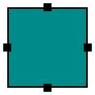
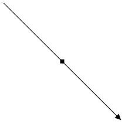
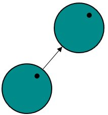

# Port

Essential Diagram for WPF provides support to define ports for making connections.

When a Connector is connected between two Nodes, its end points are automatically docked to Node’s nearest boundary as shown in the following image.

Port act as the connection points of node and allows to create connections with only specific points as shown in the following image.

### Data Binding

In order to achieve Properties of ViewModel are bind to View, we have provided the Default Style for View in “BindingStyle.xaml”. For more information, refer to [Data Binding](/wpf/sfdiagram/Data-Binding).

## Node Port

### Add ports to Nodes

To add a collection port, you need to define the port object and add it to `Ports` property of Node. The `NodeOffsetX` and `NodeOffsetY` property of Port accepts an object of fractions and used to determine the position of Ports. The following code illustrates how to add ports to the Node.

The following code illustrates how to add ports to Node.

[XAML]



<!--Style for Node-->

		</Setter.Value>
	</Setter>
    <Setter Property="Shape">
    	<Setter.Value>
        	<RectangleGeometry Rect="0,0,10,10"/>
       	</Setter.Value>
	</Setter>
</Style>

<!--Style for NodePort-->

		</Setter.Value>
	</Setter>
    <Setter Property="Shape">
    	<Setter.Value>
        	<RectangleGeometry Rect="0,0,10,10"/>
        </Setter.Value>
	</Setter>
</Style>



[C#]



//Create port collection
public class PortCollection : ObservableCollection<IPort>
{

}



[XAML]



<!--Initializes the SfDiagram-->
<syncfusion:SfDiagram x:Name="diagram" PortVisibility="Visible">
	<!--Initializes the NodeCollection-->
	<syncfusion:SfDiagram.Nodes>
		<syncfusion:NodeCollection>
		    <!--Initializes the Node-->
        	<syncfusion:NodeViewModel x:Name="node" OffsetX="100" 
				                      OffsetY="100" UnitHeight="100"
									  UnitWidth="100">	
				<!--Initializes the PortCollection-->					  						                                   
				<syncfusion:NodeViewModel.Ports>
					<local:PortCollection>
					    <!--Initializes the NodePort-->
						<syncfusion:NodePortViewModel x:Name="port" UnitWidth="10"
                                                      UnitHeight="10" NodeOffsetX="0.5"
                                                      NodeOffsetY="0.5">
						</syncfusion:NodePortViewModel>
					</local:PortCollection>
                </syncfusion:NodeViewModel.Ports>
        	</syncfusion:NodeViewModel>
       	</syncfusion:NodeCollection>
	</syncfusion:SfDiagram.Nodes>
</syncfusion:SfDiagram>



## ConnectorPort

### Add Port to Connector
To add a collection port, you need to define the port object and add it to `Ports` property of Connector. The `Length` property of Port accepts an object of fractions and used to determine the position of Ports. The following code illustrates how to add ports to the Connector.

The following code illustrates how to add ports to Connector.

[XAML]



<!--Style for Connector-->

		</Setter.Value>
	</Setter>
</Style>

<!--Style for ConnectorPort-->

      	</Setter.Value>
   	</Setter>
    <Setter Property="Shape">
    	<Setter.Value>
        	<RectangleGeometry Rect="0,0,10,10"/>
      	</Setter.Value>
   	</Setter>
</Style>



[C#]



//Create port collection
public class PortCollection : ObservableCollection<IPort>
{

}



[XAML]



<!--Initializes the SfDiagram-->
<syncfusion:SfDiagram x:Name="diagram" PortVisibility="Visible" DefaultConnectorType="Line">
	<!--Initializes the ConnectorCollection-->
	<syncfusion:SfDiagram.Connectors>
    	<syncfusion:ConnectorCollection>
		    <!--Initializes the Connector-->
        	<syncfusion:ConnectorViewModel x:Name="connector" SourcePoint="100,100" TargetPoint="300,300">
				<!--Initializes the PortCollection-->
				<syncfusion:ConnectorViewModel.Ports>
                	<local:PortCollection>
					    <!--Initializes the ConnectorPort-->
                    	<syncfusion:ConnectorPortViewModel x:Name="port" UnitWidth="7"
                                                           UnitHeight="7" 
                                                           Length="0.5">
						</syncfusion:ConnectorPortViewModel>
					</local:PortCollection>
                </syncfusion:ConnectorViewModel.Ports>
			</syncfusion:ConnectorViewModel>
       	</syncfusion:ConnectorCollection>
	</syncfusion:SfDiagram.Connectors>
</syncfusion:SfDiagram>



## Dock Port

DockPort is different from standard ports like NodePort and ConnectorPort, as it allows you to create connection at any point within specfic intervals as shown in the following image.

To add a collection port, you need to define the port object and add it to `Ports` property of Node. The `SourcePoint` and `TargetPoint` properties of DockPort allow you to define its end points. The following code illustrates how to add DockPort to the Node.

The following code illustrates how to add ports to Node.

[XAML]



<!--Style for Node-->

        </Setter.Value>
    </Setter>
    <Setter Property="Shape">
        <Setter.Value>
            <RectangleGeometry Rect="0,0,10,10"/>
        </Setter.Value>
    </Setter>
</Style>

<!--Style for DockPort-->

        </Setter.Value>
    </Setter>
</Style>



[C#]



//Create port collection
public class PortCollection : ObservableCollection<IPort>
{

}



[XAML]



<!--Initializes the SfDiagram-->
<syncfusion:SfDiagram x:Name="diagram" PortVisibility="Visible">
	<!--Initializes the NodeCollection-->
	<syncfusion:SfDiagram.Nodes>
		<syncfusion:NodeCollection>
		    <!--Initializes the Node-->
        	<syncfusion:NodeViewModel x:Name="node" OffsetX="100" 
				                      OffsetY="100" UnitHeight="100"
									  UnitWidth="100">	
				<!--Initializes the PortCollection-->					  						                                   
                <syncfusion:NodeViewModel.Ports>
                    <local:PortCollection>
                        <!--Initializes the NodePort-->
                        <syncfusion:DockPortViewModel x:Name="port" SourcePoint="0,1" TargetPoint="1,1">
						    <!--Initializes the PortCollection-->					  						                                   
                            <syncfusion:DockPortViewModel.Ports>
                                <local:PortCollection>
								</local:PortCollection>
					        </syncfusion:DockPortViewModel.Ports>
                        </syncfusion:DockPortViewModel>
                    </local:PortCollection>
                </syncfusion:NodeViewModel.Ports>
        	</syncfusion:NodeViewModel>
       	</syncfusion:NodeCollection>
	</syncfusion:SfDiagram.Nodes>
</syncfusion:SfDiagram>



## Connect with ports

Connector’s `SourcePort` and `TargetPort` properties allow to create connections between some specific points of source/target Nodes. For More information about creating connections with port, refer to [Connections with Ports](/wpf/sfdiagram/Connector#Connections-with-Ports "Connections with Ports").

DockPort doesn't allow direct connection to it as like NodePort and ConnectorPort. But you can able to create connection interactively. For more information, refer to [Draw Connectors](/wpf/sfdiagram/Tools#drawing-tools:connectors "Draw Connectors").

## Appearance

You can change the shape of port by using its shape property. The appearance of ports can be customized with a set of style specific properties.

The following code illustrates how to change the appearance of port.

[XAML]



<!--Style for NodePort-->

        </Setter.Value>
	</Setter>
    <Setter Property="Shape">
    	<Setter.Value>
			<EllipseGeometry RadiusX="10" RadiusY="10"/>
        </Setter.Value>
	</Setter>
</Style>



[XAML]



<!--Initializes the SfDiagram-->
<syncfusion:SfDiagram x:Name="diagram" PortVisibility="Visible">
	<!--Initializes the NodeCollection-->
	<syncfusion:SfDiagram.Nodes>
		<syncfusion:NodeCollection>
				<!--Initializes the Node-->
              	<syncfusion:NodeViewModel x:Name="node" OffsetX="100" OffsetY="100" 	
				  		                  UnitHeight="100" UnitWidth="100">  
				    <!--Initializes the NodePortCollection-->                                  
					<syncfusion:NodeViewModel.Ports>
						<local:PortCollection>
						    <!--Initializes the NodePort-->
							<syncfusion:NodePortViewModel x:Name="port" UnitWidth="7"
                                                      	  UnitHeight="7"
                                                          NodeOffsetX="1"
                                                          NodeOffsetY="0.5">
							</syncfusion:NodePortViewModel>
						</local:PortCollection>
                	</syncfusion:NodeViewModel.Ports>
              	</syncfusion:NodeViewModel>
       	</syncfusion:NodeCollection>
	</syncfusion:SfDiagram.Nodes>
</syncfusion:SfDiagram>



The appearance of DockPort can be customized using `ConnectorGeometryStyle` property.

[XAML]



<!--Style for DockPort-->

        </Setter.Value>
    </Setter>
</Style>



## Constraints

The `Constraints` property allows to enable/disable certain behaviors of ports. For more information about port constraints, refer to [Port Constraints](/wpf/sfdiagram/Constraints#PortConstraints "Port Constraints").