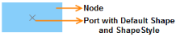
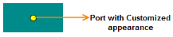
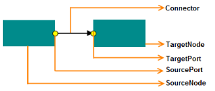

# Ports

Essential Diagram for WinRT provides support to define custom ports for making connections. The ConnectionPort class is used for defining custom ports on nodes. Any number of ports can be defined on a node. Ports in the SfDiagram support absolute and relative positioning.

### Adding Ports to a Node

To add a port to the node, you must specify the position of the port by using the Left and Top properties, and then specify the Node to host the port by using the Node property. Once this is done, the port is added to the Ports collection of the Node.

The following code shows how to add a connection port to the node:



// Creating NodeViewModel

ObservableCollection<NodeViewModel> nodes = new ObservableCollection<NodeViewModel>();

NodeViewModel n = new NodeViewModel()

{

Width = 100,

Height = 60,

OffsetX=200,

OffsetY=200,

Shape = new RectangleGeometry() { Rect = new Rect(0, 0, 10, 10) },

ShapeStyle = GetStyle()

};

// Creating NodePort for NodeViewModel

n.Ports = new ObservableCollection<INodePort>()

{

// NodePort with Relative Positioning and Default Shape

new NodePort()

{

Width=10,

Height=10,

NodeOffsetX=0.5,

NodeOffsetY=0.5,

UnitMode=UnitMode.Fraction,

Node=n

},

// NodePort with Absolute Positioning,Customizied Shape and Style

new NodePort()

{

Width=10,

Height=10,

NodeOffsetX=25,

NodeOffsetY=50,

UnitMode=UnitMode.Absolute,

Node=n,

Shape=new EllipseGeometry(){RadiusX=10,RadiusY=10},

ShapeStyle= this.Resources["portstyle"] as Style

}

};

// Adding Nodes to the SfDiagram

nodes.Add(n);

diagramcontrol.Nodes = nodes;



## Setting the Port Shape

Shape is a collection of predefined geometry. The default value for Node Port Shape is _Cross_. The following code shows how to set the Shape for a Node Port:



NodePort  n1=new NodePort()

{

Width=10,

Height=10,

NodeOffsetX=25,

NodeOffsetY=50,

UnitMode=UnitMode.Absolute,

Shape=new EllipseGeometry(){RadiusX=10,RadiusY=10},

ShapeStyle=GetPortStyle()

};



## Setting the Port Shape Style

Shape can be customized by applying styles through the ShapeStyle property. The following code shows how to set the ShapeStyle property:







NodePort  n1=new NodePort()

{

Width=10,

Height=10,

NodeOffsetX=25,

NodeOffsetY=50,

UnitMode=UnitMode.Absolute,

Shape=new EllipseGeometry(){RadiusX=10,RadiusY=10},

ShapeStyle=this.Resources["portstyle"] as Style

};



## Port Constraints

PortConstraints property is used to enable or disable certain behaviors of Nodes. This property isapplicab le only to the Port of the SfDiagram control.

_Constraints Table_

<table>
<tr>
<th>
Constraints</th><th>
Description</th></tr>
<tr>
<td>
Connectable</td><td>
Enables connection with the connector.</td></tr>
<tr>
<td>
InConnect</td><td>
Enables connection with the incoming connector.</td></tr>
<tr>
<td>
OutConnect</td><td>
Enables connection with the outgoing connector.</td></tr>
<tr>
<td>
InheritConnectable  </td><td>
Enables to inherit the connecting behavior from node (incoming or outgoing).</td></tr>
<tr>
<td>
InheritPortVisibility </td><td>
Enables to inherit the value for PortVisibility from the node. </td></tr>
<tr>
<td>
Inherit </td><td>
Enables to inherit both connecting behavior and the value for PortVisibility from the node. </td></tr>
<tr>
<td>
None</td><td>
Disables all behaviors of the control.</td></tr>
</table>

The default value for PortConstraints property is Inherit.

The following code example illustrates how to set the PortConstraints property for a Node Port in the SfDiagram:



nodeport.Constraints = nodeport.Constraints | PortConstraints.Connectable;



N> PortConstraints property is manipulated using bitwise operations. For more information about bitwise operations, see Bitwise Operations.
### Setting Up a Port Connection

The SourcePort and TargetPort properties are used to specify the Source and Target Ports for establishing a connection between two nodes. Also, the SourceNode and TargetNode properties should be specified. 

The following code shows how to establish a port connection:



// Creating NodeViewModel-SourceNode

ObservableCollection<NodeViewModel> nodes = new ObservableCollection<NodeViewModel>();

NodeViewModel source = new NodeViewModel()

{

Width = 75,

Height = 50,

OffsetX=200,

OffsetY=200,

Shape = new RectangleGeometry() { Rect = new Rect(0, 0, 10, 10) },

ShapeStyle = GetStyle()

};

// Creating NodePort for NodeViewModel

source.Ports = new ObservableCollection<INodePort>()

{

// NodePort with Absolute Positioning, Customizied Shape and Style

new NodePort()

{

Width=10,

Height=10,

NodeOffsetX=0.5,

NodeOffsetY=0.95,

UnitMode=UnitMode.Fraction,

Node=source,

Shape=new EllipseGeometry(){RadiusX=10,RadiusY=10},

ShapeStyle=GetPortStyle()}

};

}

// Adding Nodes to the Sfdiagram

nodes.Add(source);

// Creating NodeViewModel-TargetNode

NodeViewModel target = new NodeViewModel()

{

Width = 75,

Height = 50,

OffsetX = 200,

OffsetY = 330,

Shape = new RectangleGeometry() { Rect = new Rect(0, 0, 10, 10) },

ShapeStyle = GetStyle()

};

// Creating NodePort for NodeViewModel

target.Ports = new ObservableCollection<INodePort>()

{

// NodePort with Absolute Positioning, Customized Shape and Style

new NodePort()

{

Width=10,

Height=10,

NodeOffsetX=0.5,

NodeOffsetY=0.09,

UnitMode=UnitMode.Fraction,

Node=target,

Shape=new EllipseGeometry(){RadiusX=10,RadiusY=10},

ShapeStyle=GetPortStyle()

}

};

// Adding Nodes to the SfDiagram

nodes.Add(target);

ObservableCollection<ConnectorViewModel> lines = new ObservableCollection<ConnectorViewModel>();

ConnectorViewModel con = new ConnectorViewModel()

{

SourceNode = source,

TargetNode = target,

SourcePort = source.Ports.ToList()[0] as NodePort,

TargetPort = target.Ports.ToList()[0] as NodePort,

};

// Adding Connection to the SfDiagram
lines.Add(con);

diagramcontrol.Connectors = lines;



## PortVisibility

The PortVisibility property is used to control the visibility of ports on a node. PortVisibility has the following four options.

1. MouseOver 
2. MouseOverOnConnect 
3. Visible 
4. Collapse 

### Properties

Property Table

<table>
<tr>
<th>
Property</th><th>
Description</th><th>
Value</th></tr>
<tr>
<td>
PortVisibility </td><td>
Gets and sets whether the port can be visible or not.</td><td>
PortVisibility </td></tr>
</table>

### Enum Fields

_List of Ennum fields_

<table>
<tr>
<th>
Enum</th><th>
Description  </th></tr>
<tr>
<td>
MouseOver</td><td>
Port is visible when pointer is over the Node.</td></tr>
<tr>
<td>
MouseOverOnConnect</td><td>
Port is visible only when you try to connect the Node, that is, when connector’s endpoints are in the dragging state and also the pointer is near or over the node.</td></tr>
<tr>
<td>
Visible</td><td>
Port is always visible.</td></tr>
<tr>
<td>
Collapse</td><td>
Port is always collapsed.</td></tr>
</table>

N> Maintain some distance (25 pixels) around the Node. Port is visible when the pointer enters its surrounding area. This is applicable only for MouseOver and MouseOverOnConnect.

The PortVisibility property is used to control the visibility of Ports.



//Node.

Node node = new Node()

{

     UnitWidth = 100,

     UnitHeight = 100,

     OffsetX = 200,

     OffsetY = 200,

     Shape = new RectangleGeometry(){Rect = new Rect(10,10,10,10)},

     ShapeStyle = GetStyle(),

//PortVisibility of Node.

     PortVisibility = PortVisibility.Visible

};

//Adds Port to Node.

node.Ports = new ObservableCollection<INodePort>()

 {

     AddPort(0.5, 0.1,node),

     AddPort(0.9, 0.5,node),

     AddPort(0.5, 0.9,node),

     AddPort(0.1, 0.5,node)

 };

//Adds Node.

(Diagram.Nodes as ICollection<Node>).Add(node);

//Creates Port.

private NodePort AddPort(double x, double y, Node node)

{

    return new NodePort()

    {

//Sets PortVisibility of Port.

        PortVisibility = PortVisibility.Visible,

        Node = node,

        Width = 10,

        Height = 10,

        NodeOffsetX = x,

        NodeOffsetY = y,

        UnitMode = UnitMode.Fraction,

        ShapeStyle = GetStyle1()

    };

}

 

### Inherit PortVisibility 

PortVisibility property can be set in the Diagram, Node, and Port. This helps control the visibility in a single place (Diagram instance) instead of all ports. Port’s visibility can be controlled by using two properties; 

### PortVisibility and Constraints. 

When Port’s Constraint is set to InheritPortVisibility, visibility is updated based on Node’s PortVisibility property. Similarly, when Node’s Constraint property is set to InheritPortVisibility, visibility is updated based on Diagram’s PortVisibility. 

By default, Port inherits node’s port visibility, and node in turn inherits diagram’s port visibility. This property value inheritance can be stopped for a particular item by changing the constraint as explained.

To stop node’s inheritance with Diagram

Port visibility of a particular node can be stopped by removing InheritPortVisibility from the Node.Constraints as shown in the following code.



//Sets PortVisibility to the SfDiagram.

sfDiagram.PortVisibility = PortVisibility.MouseOverOnConnect;

Node node = new Node()

{

//Overrides port visibility.

PortVisibility = PortVisibility.MouseOver,

};

//Removes InheritPortVisibility from NodeConstraints. 

node.Constraints = NodeConstraints.Default & ~NodeConstraints.InheritPortVisibility;

 //Adds Port to Node.

 node.Ports = new ObservableCollection<INodePort>()

 {

     AddPort(0.5, 0.1,node),

 }
 
 

To stop Port’s inheritance with Node



// Sets PortVisibility to the SfDiagram.

sfDiagram.PortVisibility = PortVisibility.MouseOverOnConnect;

Node node = new Node()

{

//Sets PortVisibility to Node.

    PortVisibility = PortVisibility.None,

};

//Creates port.

INodePort port = AddPort(0.5, 0.1,node);

//Overrides port visibility.

port.PortVisibility = PortVisibility.MouseOver,

// Removes InheritPortVisibility from PortConstraints. 

port.Constraints = PortConstraints.Default & ~PortConstraints.InheritPortVisibility;

 //Adds Port to Node.

 node.Ports = new ObservableCollection<INodePort>()

 {

     port

 }
 
 