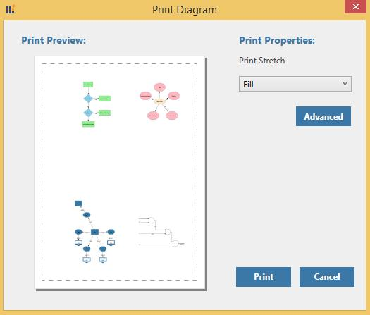

# Printing

This feature enables you to print a copy of the Diagram with Print Preview

Print Preview

Print preview is used to preview the SfDiagram control before printing. Print preview scales the entire Diagram into a single page.

__Print__ __Preview__

Customization of Print Preview

The SfDiagram control provides support to customize the appearance print preview by using the PrintStretch properties of PrintingService.

Customize the Orientation and Size

The following code illustrates how to customize the orientation and size of the print preview.

<table>
<tr>
<td>
diagram.PrintingService.PrintPreviewStretch = Stretch.Fill;    </td></tr>
</table>
Customize the Appearance

The SfDiagram control provides the PrintPreview Control to customize the page to be printed by overring the ControlTemplate of the PrintPreview Control. The customization is also shown in PrintPreview. This is helpful when a header or footer has been added to the page.

For more details about the customization of PrintPreviewControl, refer to the Print and Export sample from our dashboard samples.

