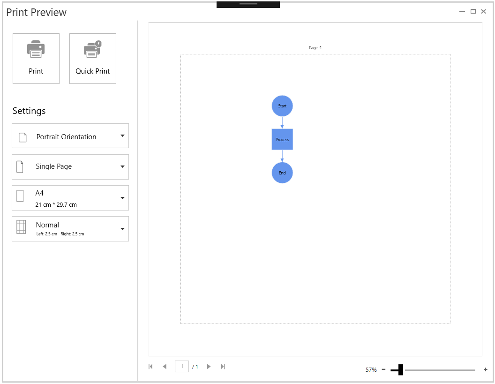

### Printing

This feature enables you to print a copy of the diagram with Print Preview (located in the CharmBar).

Print Preview

Print preview is used to preview the SfDiagram control before printing. Print preview will scale the entire diagram into a single page. 

{:.image }

Figure 74: _Print Preview_

Customization of Print Preview

The SfDiagram control provides support to customize the appearance print preview using the PrintStretch properties of PrintingService.

Customize the Orientation and Size

The following code illustrates how to customize the orientation and size of the print preview:

[C#]

//Customize the appearance of the print preview.

sfdiagram.PrintingService.PrintPreviewStretch= PrintPreviewStretch.Fill;

Here, sfdiagram is an instance of SfDiagram.

Customize the Appearance

The SfDiagram control provides the PrintPreview Control to customize the page to be printed by overring the ControlTemplate of the PrintPreview Control, the customization will also be shown in PrintPreview. This will be helplful when a header or footer has been added to the page.

For more details about the customization of PrintPreviewControl, Please refer to the Print and Export sample from our dashboard samples.

