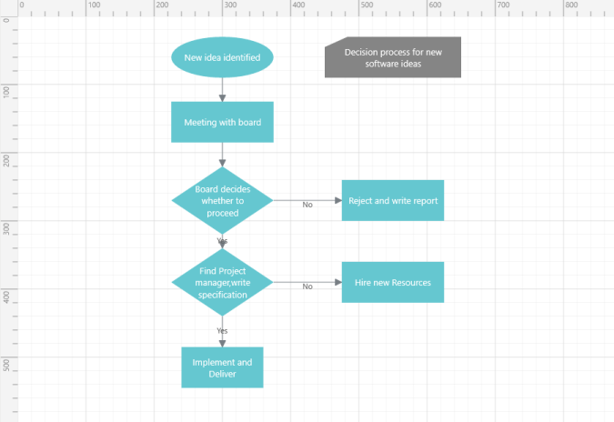
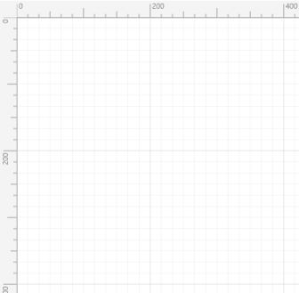

### Rulers

The ruler provides a horizontal and vertical guide for measuring in the Diagram control. The ruler can be used to measure diagram objects, indicate positions, and align diagram elements. This is especially useful in creating scale models. Users can set the unit of measure, such as centimeters or inches. The default unit of measure is pixels.

Adding Rulers to a Diagram

Use the following code sample to add the ruler to the diagram.

[C#]

diagramControl.HorizontalRuler = new Ruler();

diagramControl.VerticalRuler = new Ruler() { Orientation = Orientation.Vertical };

{:.image }

_Figure_ _88__: Default ruler_

Customizing the Ruler

By default, ruler segments will be arranged based on measurement units.

Segment width, the textual description of the ruler segment, and the appearance of the ruler ticks can be customized. Use the following code sample to customize the ruler:

[C#]

    // Customizing the Ruler

    public class CustomRuler : Ruler

    {

        protected override RulerSegment GetNewSegment()

        {

            //Creating a custom segment with 12 intervals.

            return new CustomSegment() {Intervals=12 };

        }

    }

    // Customizing RulerSegment 

    public class CustomSegment : RulerSegment

    {

        protected override Tick GetNewTick()

        {

            return new CustomTick() ;

        }

        public override double GetSegmentWidth()

        {

            // Customizing the ruler segment width.

            return 200;

        }

        // Customizing the label of the RulerSegment

        protected override void UpdateLabel(TextBlock label)

        {

            base.UpdateLabel(label);

        }

    }

    // Customizing the Ruler ticks.

    public class CustomTick : Tick

    {

        // &lt;summary&gt;

        /// To update the ticks values start value, length, alignment

        /// &lt;/summary&gt;

        /// <param name="start">Start value</param>

        /// <param name="length">Length of the tick</param>

        /// <param name="align">Alignment of the tick</param>

        protected override void ArrangeTick(out double start, out double length, out            

                                                                   TickAlignment align)

        {

            start = 0;

            if (Value % 200 == 0 )

             {

                length = 20;

            }

            else if (Value % 100 == 0 || Value%100<2)

            {

                length = 14;

            }

            else if (Value % 50 == 0)

            {

                length = 9;

            }

            else

            {

                length = 5;

            }

            align = TickAlignment.RightOrBottom;

        }

    }

In this example, the ruler segment width is set to 200 and the number of intervals is customized as 12.

{:.image }

_Figure_ _89__: Customized ruler segments_

