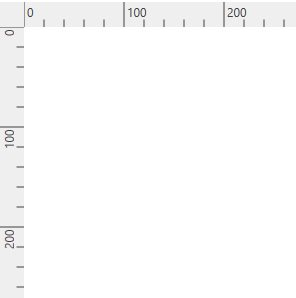
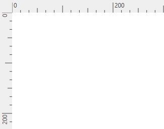

# Rulers

The Ruler provides a horizontal and vertical guide for measuring in the Diagram control. The Ruler can be used to measure the Diagram objects, indicate positions, and align Diagram elements. This is especially useful in creating scale models. You can set the unit of measure, such as centimeters or inches. The default unit of measure is pixels.

Adding Rulers to the Diagram

Use the following code example to add the ruler to the Diagram.

<table>
<tr>
<td>
diagramcontrol.HorizontalRuler = new Ruler();  diagramcontrol.VerticalRuler = new Ruler() { Orientation = Orientation.Vertical };    </td></tr>
</table>

__Default__ __ruler______

Customizing the Ruler

By default, ruler segments are arranged based on measurement units.

Segment width, the textual description of the ruler segment, and the appearance of the ruler ticks can be customized. Use the following code example to customize the ruler.

<table>
<tr>
<td>
{{'__//__ '| markdownify }}{{'__Customizing__ '| markdownify }}{{'__the__ '| markdownify }}{{'__Ruler__'| markdownify }}{{'____'| markdownify }}  public class CustomRuler : Ruler  {  protected override RulerSegment GetNewSegment()  {  //Creating a custom segment with 12 intervals.  return new CustomSegment() { Intervals = 12 };  }  }  {{'____'| markdownify }}{{'__//__ '| markdownify }}{{'__Customizing__ '| markdownify }}{{'__RulerSegment__'| markdownify }}{{'____'| markdownify }}  public class CustomSegment : RulerSegment  {  protected override Tick GetNewTick()  {  return new CustomTick();  }  public override double GetSegmentWidth()  {  // Customizing the ruler segment width.  return 200;  }  // Customizing the label of the RulerSegment  protected override void UpdateLabel(TextBlock label)  {  base.UpdateLabel(label);  }  }  // Customizing the Ruler ticks.  public class CustomTick : Tick  {  // 
  /// To update the ticks values start value, length, alignment  /// 
  /// <param name="start">Start value</param>  /// <param name="length">Length of the tick</param>  /// <param name="align">Alignment of the tick</param>    protected override void ArrangeTick(out double start, out double length, out    TickAlignment align)  {  start = 0;  if (Value % 200 == 0)  {  length = 20;  }  else if (Value % 100 == 0 || Value % 100 < 2)  {  length = 14;  }  else if (Value % 50 == 0)  {  length = 9;  }  else  {  length = 5;  }  align = TickAlignment.RightOrBottom;  }  }    </td></tr>
</table>

__Customized__ __ruler__ __segments______

