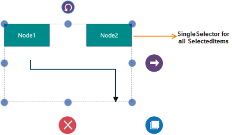
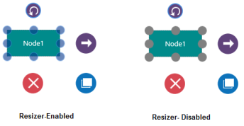
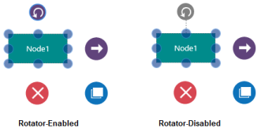

# Selector

This is a single entity that binds the selected items in the SfDiagram. The Diagramming Objects are selected by Tapping on them, and the changes are reflected in the IsSelected property.

## SelectedItems

This is the collection of Selected Objects (Nodes, Connectors and Groups) in the SfDiagram, and is populated based on the IsSelected property of Diagramming Objects (Nodes, Connectors and Groups).

The following code example illustrates how to get the selected items:



// Selected Items of the SfDiagram

SelectorViewModel selecteditems = (sfdiagram.SelectedItems as SelectorViewModel);

// Selected Items-Collection for Nodes

foreach (INode node in selecteditems.Nodes)

{

// Selected Nodes that have IsSelected as true

}

// SelectedItems-Collection for Connectors

foreach (IConnector connector in selecteditems.Connectors)

{

// Selected Connectors that have IsSelected as true

}

//SelectedItems-Collection for Groups

foreach (IGroup group in selecteditems.Groups)

{

// Selected Groups that have IsSelected as true

}

 

## Multiple Selections

During multiple selections, the selector binds all the selected items. 

## Customizing the Selector

This has 12 Diagram Thumbs for Node, Connector, Pivot and Rotator. The Selector Style can be customized by overriding the existing template.

## Tooltip and Quick commands

This feature enables visual guide for arranging the Nodes. Tooltip shows information like Size, Position and Angle when you manipulate the Node.

## SelectorConstraints

SelectorConstraints property is used to enable or disable certain behaviors of Selector (Quick Commands, Rotator and Resizer) 

_List of constraints Table_

<table>
<tr>
<th>
Constraints</th><th>
Description</th></tr>
<tr>
<td>
Resizer</td><td>
Enables or Disables the Resizer</td></tr>
<tr>
<td>
Rotator</td><td>
Enables or Disables the Rotator</td></tr>
<tr>
<td>
TooltipPosition</td><td>
Enables or Disables the Tooltip information based on the position of the selected node.</td></tr>
<tr>
<td>
TooltipSize</td><td>
Enables or Disables the Tooltip information based on the size of the selected Node.</td></tr>
<tr>
<td>
TooltipAngle</td><td>
Enables or Disables the Tooltip information based on the angle of the selected node.</td></tr>
<tr>
<td>
Tooltip </td><td>
Enables or Disables all the Tooltip information based on the selected node.</td></tr>
<tr>
<td>
QuickCommands</td><td>
Enables or Disables the QuickCommands</td></tr>
<tr>
<td>
Default    </td><td>
By default, position, size, and angle information are shown in the Tooltip and Quick Commands.</td></tr>
</table>

### SelectorConstraints.Resizer

#### Enables or disables the Resizer

The following code example illustrates how to enable the SelectorConstraints for Resizer. 



(Diagram.SelectedItems as SelectorViewModel).SelectorConstraints = (Diagram.SelectedItems as SelectorViewModel).SelectorConstraints & ~SelectorConstraints.Resizer;



### SelectorConstraints.Rotator

#### Enables or disables the Rotator

The following code example illustrates how to enable the SelectorConstraints for Rotator. 



(Diagram.SelectedItems as SelectorViewModel).SelectorConstraints = (Diagram.SelectedItems as SelectorViewModel).SelectorConstraints & ~SelectorConstraints.Rotator;



