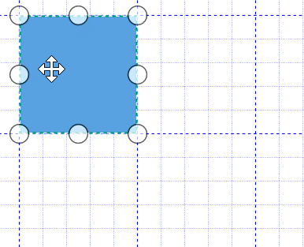
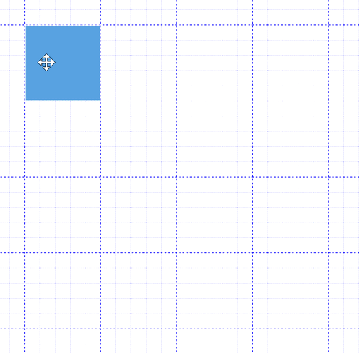
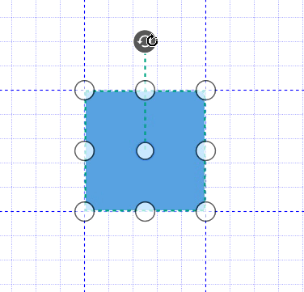

# Custom Snapping

Snapping process can be customized by changing its snapping interval and snapping angle.

## Changing the snapping interval

Snapping helps you to drag or resize the elements completely and sharp from one position to another position by some amount of distance. This snapping distance can be customized using the `SnapInterval` property of `SnapSettings` class. Default snapping interval is 20.



<!--Initialize SfDiagram-->
<syncfusion:SfDiagram x:Name="diagram">
  <!--Enables the SnapConstraints value as SnapToLines -->
  <syncfusion:SfDiagram.SnapSettings>
    <syncfusion:SnapSettings SnapConstraints="SnapToLines,ShowLines">
      <!--Initialize HorizontalGridlines-->
      <syncfusion:SnapSettings.HorizontalGridlines>
        <syncfusion:Gridlines>
          <!--Initialize SnapInterval value as 100-->
          <syncfusion:Gridlines.SnapInterval>
            <local:DoubleExt>
              <sys:Double>100</sys:Double>
            </local:DoubleExt>
          </syncfusion:Gridlines.SnapInterval>
        </syncfusion:Gridlines>
      </syncfusion:SnapSettings.HorizontalGridlines>
      <!--Initialize VerticalGridlines-->
      <syncfusion:SnapSettings.VerticalGridlines>
        <syncfusion:Gridlines>
          <!--Initialize SnapInterval value as 100-->
          <syncfusion:Gridlines.SnapInterval>
            <local:DoubleExt>
              <sys:Double>100</sys:Double>
            </local:DoubleExt>
          </syncfusion:Gridlines.SnapInterval>
        </syncfusion:Gridlines>
      </syncfusion:SnapSettings.VerticalGridlines>
    </syncfusion:SnapSettings>
  </syncfusion:SfDiagram.SnapSettings>
</syncfusion:SfDiagram>



//Initialize SfDiagram
SfDiagram diagram = new SfDiagram();
//Initialize the Snap Settings
diagram.SnapSettings = new SnapSettings()
{
  SnapConstraints = SnapConstraints.SnapToLines | SnapConstraints.ShowLines,
  HorizontalGridlines = new Gridlines()
  {
    //Customize the vertical grid lines snap interval
    SnapInterval = new List<double>() { 100 },
  },
  VerticalGridlines = new Gridlines()
  {
    //Customize the vertical grid lines snap interval
    SnapInterval = new List<double>() { 100 },
  },
};

//Creating a class for list of double values
public class DoubleExt : List<double>
{
}



| SnapInterval Value  | Output |
|---|---|
| 20 | |
| 100 | |

## Changing the snapping angle

Snapping angle is used to specify the rotation angle for snapping when the node is rotated. It helps to perfom snapping when node is resized or dragged with roatated position. Default snapping angle is 5d.



<!--Initialize SfDiagram-->
<syncfusion:SfDiagram x:Name="diagram">
  <syncfusion:SfDiagram.SnapSettings>
    <!--Initialize the snap angle-->
    <syncfusion:SnapSettings SnapAngle="90"/>
  </syncfusion:SfDiagram.SnapSettings>
</syncfusion:SfDiagram>





//Initialize SfDiagram
SfDiagram diagram = new SfDiagram();
diagram.SnapSettings = new SnapSettings()
{
  //Initialize the snap angle
  SnapAngle = 90,
};




 



[How to add gridlines for diagram](/wpf/sfdiagram/gridlines)

[How to add ruler for diagram](/wpf/sfdiagram/rulers)

