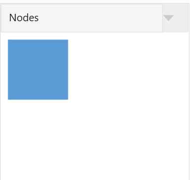
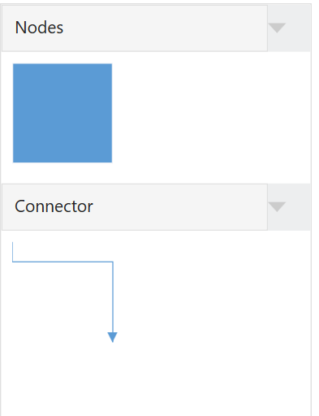
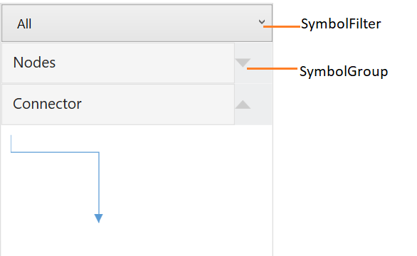

# Stencil

Stencil has a collection of Symbols and it is used to clone the desired symbol by dragging it from the Stencil and dropping it into the SfDiagram.

Namespace for Stencil



xmlns:stencil="using:Syncfusion.UI.Xaml.Diagram.Stencil"



## Symbol

Symbol is used to visualize the elements in Stencil using following ways:
 
 * ISymbol
 * Using DiagramElements

### Using ISymbol

ISymbol have `Symbol` and `SymbolTemplate` to visualize the Symbol.



public class SymbolItem : ISymbol
{
 //Symbol-Any Object
 public object Symbol { get; set; }

 //Custom property for Mapping.
 public object GroupName { get; set; }

 //Data template to visualize the object.
 public DataTemplate SymbolTemplate { get; set; }

 //For cloning the symbol from the given object and data template.
 public ISymbol Clone()
 {
  return new SymbolItem()
  {
   Symbol = this.Symbol,
   SymbolTemplate = this.SymbolTemplate
  };
 }
 public object Key { get; set; }
}







<DataTemplate x:Key="Diamond">
  <Path Stretch="Fill" Data="M 397.784,287.875L 369.5,316.159L 341.216,287.875L 369.5,259.591L 397.784,287.875 Z" Fill="White"
Stroke="Black" StrokeThickness="1" />
</DataTemplate>

 <local:SymbolItem GroupName="Flow Chart" Symbol="Diamond" SymbolTemplate="{StaticResource Diamond}"/>
 
 
 
 
 
//Initialize the SymbolItem
SymbolItem symbol = new SymbolItem()
{
    Key = "Flow Chart",
    Symbol = "Diamond",
    SymbolTemplate = this.Resources["Diamond"] as DataTemplate
};

 
 
 
#### Define SymbolSource

`SymbolSource` is the property of Stencil which is Collection of objects (i.e,Symbol,Node,Connector etc..). Based on the SymbolSource, the Stencil will populate the Symbols.



//Adding ISymbol to SymbolCollection
public class SymbolCollection : ObservableCollection<ISymbol>
{
}






<Window.Resources>
    <DataTemplate x:Key="Diamond">
        <Path Stretch="Fill" Data="M 397.784,287.875L 369.5,316.159L 341.216,287.875L 369.5,259.591L 397.784,287.875 Z" Fill="White"
Stroke="Black" StrokeThickness="1" />
    </DataTemplate>
</Window.Resources>
<Grid >
    <!--Define the Stencil Element-->
    <stencil:Stencil x:Name="stencil" BorderBrush="#dfdfdf" BorderThickness="1" >
        <!--Initialize the SymbolSource-->
        <stencil:Stencil.SymbolSource>
            <!--Define the SymbolCollection-->
            <local:SymbolCollection>
                <!--Symbol with SymbolTemplate-->
                <local:SymbolItem GroupName="Flow Chart" Symbol="Diamond"  SymbolTemplate="{StaticResource Diamond}"/>
            </local:SymbolCollection>
        </stencil:Stencil.SymbolSource>
        <!--Define the SymbolGroups-->
        <stencil:Stencil.SymbolGroups>
            <stencil:SymbolGroups>
                <stencil:SymbolGroupProvider MappingName="GroupName">
                </stencil:SymbolGroupProvider>
            </stencil:SymbolGroups>
        </stencil:Stencil.SymbolGroups>
    </stencil:Stencil>
</Grid>





//Define the SymbolCollection
stencil.SymbolSource = new SymbolCollection();
//Initialize the SymbolItem
SymbolItem symbol = new SymbolItem()
{
    Key = "Flow Chart",
    Symbol = "Diamond",
    SymbolTemplate = this.Resources["Diamond"] as DataTemplate
};
//Adding Symbol to Collection
(stencil.SymbolSource as SymbolCollection).Add(symbol);




### Using DiagramElements

DiagramElements such as Node, Connector and Group can be used to visualize the Symbol.
 
  

<Grid>
    <!--Define the Stencil-->
    <stencil:Stencil Grid.Column="0" BorderThickness="1" BorderBrush="#dfdfdf" x:Name="stencil">
        <!--Initialize the SymbolSource-->
        <stencil:Stencil.SymbolSource>
            <!--Initialize the SymbolCollection-->
     <local:SymbolCollection>
                <!--Define the DiagramElement-Node-->
                <syncfusion:NodeViewModel x:Name="node" UnitHeight="100" UnitWidth="100" OffsetX="100" OffsetY="100" Shape="{StaticResource Rectangle}" Key="Nodes">
                </syncfusion:NodeViewModel>
            </local:SymbolCollection>
        </stencil:Stencil.SymbolSource>
        <!--Initialize the SymbolGroup-->
        <stencil:Stencil.SymbolGroups>
            <stencil:SymbolGroups>
                <!--Map Symbols Using MappingName-->
                <stencil:SymbolGroupProvider MappingName="Key">
                </stencil:SymbolGroupProvider>
            </stencil:SymbolGroups>
        </stencil:Stencil.SymbolGroups>
    </stencil:Stencil>
</Grid>




## Symbol Groups

The `SymbolGroupProvider` groups the symbols into SymbolGroup based on the MappingName property.




<stencil:Stencil x:Name="stencil" ExpandMode="All" 
		         SymbolSource="{StaticResource Collection}">
    <!--Initialize the SymbolGroup-->
    <stencil:Stencil.SymbolGroups>
        <stencil:SymbolGroups>
            <!--Map Symbols Using MappingName-->
            <stencil:SymbolGroupProvider MappingName="Key"></stencil:SymbolGroupProvider>
        </stencil:SymbolGroups>
    </stencil:Stencil.SymbolGroups>
</stencil:Stencil>




## Symbol Filters

`SymbolFilterProvider` is used to filter or hide the symbols by using delegates. SymbolFilters are the collection of SymbolFilterProvider.



// Define filtering of Symbols
private bool Filter(SymbolFilterProvider sender, object symbol)
     {
          if (symbol is NodeViewModel)
              {
                  if (sender.Content.ToString() == (symbol as NodeViewModel).Key.ToString())
                  return true;
              }
     }




for Sample, refer to [SymbolFilter](http://www.syncfusion.com/downloads/support/directtrac/198906/ze/SymbolFilter-1471608955 "SymbolFilter").

### SelectedFilter

There can be multiple SymbolFilters, but only one filter can be selected at a time. These SymbolFilters are visually represented in a combo box. When the selected item is changed in the combo box, SelectedFilter is updated accordingly.

## Preview for Drag and Drop

When you drag an item from Stencil to Diagram, a preview of the dragged item will be displayed.



//Enables the drag and drop preview.
stencil.Constraints = stencil.Constraints | StencilConstraints.ShowPreview;

//Disables the drag and drop preview.
stencil.Constraints = stencil.Constraints & ~StencilConstraints.ShowPreview;



Here, Stencil is an instance of Stencil.

#### Preview of the dragging Symbol

#### Customization of Preview for Drag and Drop

You can customize the preview content by overriding the PrepareDragDropPreview method of the Stencil feature. The following code example illustrates how to customize preview content.



public class CustomStencil : Stencil
    {
        //Virtual method to customize the preview of dragging the symbol from Stencil.
        protected override void PrepareDragDropPreview()
        {
            this.SymbolPreview = new ContentPresenter()
            {
                Content = new Rectangle()
                {
                    Width = 50,
                    Height = 50,
                    Fill = new SolidColorBrush(Colors.SteelBlue)
                }
            };
        }
    }




## Events

`Expanded Event` and `Collapsed Event` are notified to provide interactions in SymbolGroup. To explore about arguments refer to [SymbolGroupExpandCollapseEventArgs](https://help.syncfusion.com/cr/cref_files/wpf/Syncfusion.SfDiagram.WPF~Syncfusion.UI.Xaml.Diagram.Stencil.SymbolGroupExpandCollapseEventArgs.html "SymbolGroupExpandCollapseEventArgs")

`DragEnter Event`, `DragLeave Event`, `DragOver Event` and  `ItemDropEvent Event` are notified to provide interactions in diagram. To explore about arguments refer to [ItemDropEventArgs](https://help.syncfusion.com/cr/cref_files/wpf/Syncfusion.SfDiagram.WPF~Syncfusion.UI.Xaml.Diagram.ItemDropEventArgs.html "ItemDropEventArgs")

#### ExpandMode
 please refer to, [ExpandMode](https://help.syncfusion.com/cr/cref_files/wpf/Syncfusion.SfDiagram.WPF~Syncfusion.UI.Xaml.Diagram.Stencil.Stencil_members.html "ExpandMode").