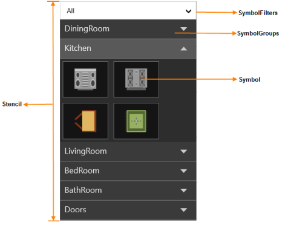
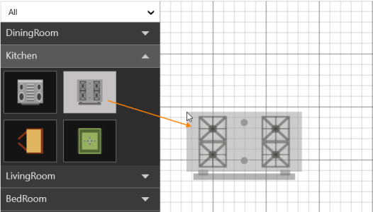
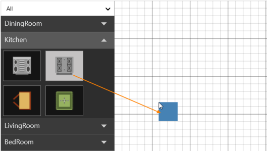
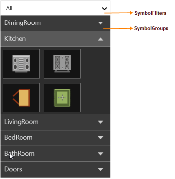

# Stencil

Stencil has a collection of Symbols. Stencil is used to clone the desired symbol by dragging it from the Stencil and dropping it into the SfDiagram. Each symbol can be grouped together by using the SymbolGroupProvider and filtered by using the SymbolFilterProvider through delegates.



xmlns:stencil="clr-namespace:Syncfusion.UI.Xaml.Diagram.Stencil;assembly=Syncfusion.SfDiagram.Wpf"



_Key Terms Table_

<table>
<tr>
<th>
Key Terms</th><th>
Description</th></tr>
<tr>
<td>
Symbol</td><td>
To visualize the items in Stencil.</td></tr>
</table>

_Properties Table_

<table>
<tr>
<th>
Properties</th><th>
Description</th></tr>
<tr>
<td>
SymbolGroups</td><td>
Collection of SymbolGroupProvider  To Group the Symbols based on the MappingName Property.</td></tr>
<tr>
<td>
SymbolFilters</td><td>
Collection of SymbolFilterProvider    To filter/Hide the Symbols based on MappingName Property.</td></tr>
<tr>
<td>
SymbolSource</td><td>
ItemSource for Stencil to populate the SymbolGroups with Symbol</td></tr>
</table>

## Symbol

Symbol is used to implement the ISymbol interface. The ISymbol interface consists of two properties to visualize symbols in Stencil: Symbol and SymbolTemplate.



public class SymbolItem : ISymbol

{

// Symbol-Any Object

public object Symbol { get; set; }

// Data Template to Visualize the Object

public DataTemplate SymbolTemplate { get; set; }

//For Cloning the Symbol from the given Object and Data Template

public ISymbol Clone()

{

return new SymbolItem()

{

Symbol = this.Symbol,

SymbolTemplate = this.SymbolTemplate

};

}

// Custom Property for Mapping

public string GroupName { get; set; }

}



### Adding the Symbol

The following example illustrates how to add the Symbol into a Collection:

1. Create the ISymbol with Symbol and SymbolTemplate properties.

   ~~~ xaml

		<local:SymbolItem GroupName="Flow Chart" Symbol="FlowChart_Star" SymbolTemplate="{StaticResource FlowChart_Star}">
		
		</local:SymbolItem>

   ~~~
   
2. Define the SymbolTemplate.

   ~~~ xaml

		<DataTemplate x:Key="FlowChart_Star">

		<Path Style="{StaticResource SymbolStyle}" Data="M 9,2 11,7 17,7 12,10 14,15 9,12   4,15 6,10 1,7 7,7 Z" Stretch="Fill">

		</Path>

		</DataTemplate>

   ~~~

3. Add the ISymbol into the Collection.

   ~~~ csharp

		// SymbolSource to Stencil

		public class SymbolCollection : ObservableCollection<ISymbol>

		{

		// ISymbols

		}

   ~~~

   ~~~ xaml

		<local:SymbolCollection x:Key="symbolcollection">

		<!--Adding Symbol into a Collection-->

		<local:CustomSymbolItem GroupName="Flow Chart" Symbol="FlowChart_Star"   

		SymbolTemplate="{StaticResource FlowChart_Star}">

		</local:CustomSymbolItem>

		</local:SymbolCollection>

   ~~~

This Collection is the SymbolSource to the Stencil. Based on the SymbolSource, the Stencil populates the Symbols.

## SymbolGroup

SymbolGroup is used to group the Symbols in Stencil. The SymbolGroupProvider groups the symbols based on the MappingName property.

The following code example illustrates how to create a Stencil:



<stencil:Stencil SymbolSource="{StaticResource symbolcollection}"

x:Name="stencil">

<stencil:Stencil.SymbolGroups>

<stencil:SymbolGroups>

<stencil:SymbolGroupProvider MappingName="GroupName"/>

</stencil:SymbolGroups>

</stencil:Stencil.SymbolGroups>

</stencil:Stencil>



N> In the preceding code example, “GroupName” is the custom property of Symbol used to group the symbols by using MappingName property of the SymbolGroupProvider.

## SymbolFilter

This is used to filter the SymbolGroups in Stencil. SymbolFilterProvider is used for filtering the SymbolGroup by using Delegate. The desired Group can be displayed by using the SelectedFilter property.

The following code example shows how to define the SymbolFilter:



<stencil:Stencil.SymbolFilters>

<stencil:SymbolFilters>

<stencil:SymbolFilterProvider>

</stencil:SymbolFilterProvider>

</stencil:SymbolFilters>

</stencil:Stencil.SymbolFilters>



The following code example shows how to define the SelectedFilter:



stencil.SelectedFilter = new SymbolFilterProvider { Filter = Filter, Content = "Test" };



The following code example shows how to use Delegate for SymbolFilter:



public bool Filter(ISymbol symbol)

{

if ((symbol as SymbolItem).GroupName == "Flow Chart")

{

return true;

}

else

{

return false;

}

}



N> In the preceding code example, only symbols with GroupName as “Flow Chart” is displayed.

## Symbol

Symbol is used to implement the ISymbol interface. The ISymbol interface consists of two properties to visualize symbols in Stencil.

<table>
<tr>
<th>
Property</th><th>
Description</th></tr>
<tr>
<td>
Symbol</td><td>
Symbol accepts any object.</td></tr>
<tr>
<td>
SymbolTemplate</td><td>
DataTemplate to visualize the symbol in Stencil</td></tr>
</table>

### Create and add a Symbol

The following is a simple example that shows how to create and add custom symbols. 

1. Create a custom class (SymbolItem in this example) that derives ISymbol and implements necessary things.

   ~~~ csharp

		public class SymbolItem : ISymbol
		 {

		  // Symbol-Any Object
		  public object Symbol { get; set; }

		  // Data template to visualize the object.
		  public DataTemplate SymbolTemplate { get; set; } 

		  //For cloning the symbol from the given object and data template.
		  public ISymbol Clone()
		  {
			  return new SymbolItem()
			  {
				Symbol = this.Symbol,
				SymbolTemplate = this.SymbolTemplate
			  };
		  }

		  // Custom property for grouping.
		  public string GroupName { get; set; }
		}

   ~~~
   
   N> Custom Property GroupName in SymbolItem is used for grouping the Symbols by Mapping.

2. Create a collection for Symbols

   ~~~ csharp

		// A custom class to hold a collection of symbols.
		public class SymbolCollection : ObservableCollection<ISymbol>
		{ 
		}
		
   ~~~

3. Define the SymbolTemplate.

   ~~~ xaml

		<DataTemplate x:Key="Star">
		 
		 <Path Style="{StaticResource SymbolStyle}" Data="M 9,2 11,7 17,7 12,10 14,15 9,12   4,15 6,10 1,7 7,7 Z" Stretch="Fill">
		  
		 </Path>
		 
		</DataTemplate>

   ~~~
   
4. Create an instance of SymbolItem with the Symbol and SymbolTemplate properties.

   ~~~ xaml

		<local:SymbolItem GroupName="FlowChart" Symbol="Star" SymbolTemplate="{StaticResource Star}">
		
		</local:SymbolItem>

   ~~~
   
5. Add the symbols into the collection (SymbolSource for Stencil).

   ~~~ xaml

		<local:SymbolCollection x:Key="symbolcollection">
		
		<!--Adding a Symbol into a Collection-->
		
		<local:CustomSymbolItem GroupName="FlowChart" Symbol="Star" SymbolTemplate="{StaticResource Star}"/>

		</local:SymbolCollection>

   ~~~

This collection is the SymbolSource for the stencil. Based on the SymbolSource, the stencil populates the symbols.

## Preview for Drag and Drop

SfDiagram provides preview support for Stencil. When you drag an item from Stencil to Diagram, a preview of the dragged item is displayed. You can enable or disable the preview support. You can also customize the preview.  

### Use Case Scenario

This feature displays a preview of the item you drag from Stencil, enabling you to identify the item you are dragging from the Stencil to the SfDiagram control. It also gives a preview of the size and appearance of the item before it is dropped.

### Enabling Preview

To enable preview for the dragged item from Stencil, set the Constraints property of Stencil to ShowPreview. To disable preview, remove ShowPreview from Constraints property. By default, preview for drag and drop is enabled.

The following code example illustrates how to enable preview support:  



//Enables the drag and drop preview.

stencil.Constraints = stencil.Constraints | StencilConstraints.ShowPreview;

//Disables the drag and drop preview.

stencil.Constraints = stencil.Constraints &~ StencilConstraints.ShowPreview;



Here, stencil is an instance of Stencil.

### Customization of Preview for Drag and Drop

You can customize the preview content by overriding the PrepareDragDropPreview method of the Stencil feature. The following code example illustrates how to customize preview content:



public class CustomStencil : Stencil

    {     

        /// 

        /// Virtual method to customize the preview of dragging the symbol from Stencil.

        /// 

        protected override void PrepareDragDropPreview()

        {

            this.SymbolPreview = new ContentPresenter() 

            { 

                Content = new Rectangle() 

                { 

                    Width = 50, 

                    Height = 50, 

                    Fill = new SolidColorBrush(Colors.SteelBlue) 

                } 

            };

        }

    }



## SymbolGroups

The SymbolGroupProvider groups the symbols into SymbolGroup based on the MappingName property. 

<table>
<tr>
<th>
Name</th><th>
Description</th></tr>
<tr>
<td>
MappingName</td><td>
Used to group the symbols by mapping this property to the custom property of Symbols.</td></tr>
</table>

The following code example illustrates how to create a SymbolGroup: 



<stencil:Stencil SymbolSource="{StaticResource symbolcollection}" x:Name="stencil">  
       <stencil:Stencil.SymbolGroups>   
                <stencil:SymbolGroups>
             <stencil:SymbolGroupProvider MappingName="GroupName"/>
         </stencil:SymbolGroups>
    </stencil:Stencil.SymbolGroups>
</stencil:Stencil>



N> In the preceding code example, “GroupName” is the custom Symbol property that is used to group the symbols by using the MappingName property of the SymbolGroupProvider.

### Expand or Collapse SymbolGroup

Expand and Collapse can be performed on SymbolGroup (updating the Visibility of the Symbols) based on the ExpandMode property. It includes the following options; the default option is One:

<table>
<tr>
<th>
S.No</th><th>
Expand Mode</th><th>
Description</th></tr>
<tr>
<td>
1.</td><td>
One</td><td>
Always one SymbolGroup is in expanded state.</td></tr>
<tr>
<td>
2.</td><td>
OneOrMore</td><td>
At least one SymbolGroup is in Expanded state. </td></tr>
<tr>
<td>
3.</td><td>
ZeroOrOne</td><td>
Not more than a single SymbolGroup is in expanded state. All ‘SymbolGroup’ can be in collapsed state.</td></tr>
<tr>
<td>
4.</td><td>
ZeroOrMore</td><td>
Any number of SymbolGroup can be in the expanded state. All ‘SymbolGroup’ can be in collapsed state.</td></tr>
</table>

## SymbolFilters

SymbolFilterProvider is used to filter or hide the symbols by using delegates. SymbolFilters are the collection of SymbolFilterProvider. 

The following code example shows how to create and add the SymbolFilter. Based on the return Boolean value of the SymbolFilter delegate, the corresponding item is removed from Stencil. When a SymbolGroup does not have any Symbols, the corresponding SymbolGroup is also removed.



 private void CreateFilters()

 {

    stencil.SymbolFilters = new SymbolFilters();

    SymbolFilterProvider allFilter = new SymbolFilterProvider

                             { 

                                Content = "All", 

                                Filter = SymbolFilter

                             };

    SymbolFilterProvider kitchenFilter = new SymbolFilterProvider

                             { 

                                Content = "Kitchen", 

                                Filter = SymbolFilter

                             };

    stencil.SymbolFilters.Add(addFilter);

    stencil.SymbolFilters.Add(kitchenFilter);

 }

// sender: used to get the selected SymbolFilters

private bool SymbolFilter(SymbolFilterProvider sender, ISymbol symbol)

{

    if (sender.Content.ToString() == "All")

    {

        return true;

    }           

    if ((symbol as SymbolItem).GroupName == sender.Content.ToString())

    {

         return true;

    }

    return false;
}



## SelectedFilter

There can be multiple SymbolFilters, but only one filter can be selected at a time. These SymbolFilters are visually represented in a combo box. When the selected item is changed in the combo box, SelectedFilter is updated accordingly.

SymbolFilters
{:.caption}

