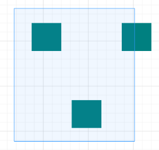
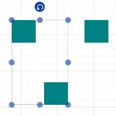
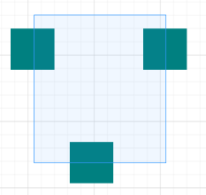
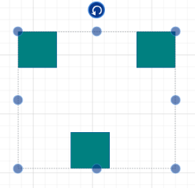

### Tool

Some gestures have multiple functionalities; for example, “Touch and Drag” gesture is used for panning, drawing and rubber band selection.

Tool property provides support to operate any one of the multiple functionalities at any particular time. It supports the following functionalities:

<table>
<tr>
<td>
S.No</td><td>
Tools</td><td>
Description</td></tr>
<tr>
<td>
1.</td><td>
None</td><td>
Disables all behaviors of the control</td></tr>
<tr>
<td>
2.</td><td>
SingleSelect     </td><td>
Enables to select the diagramming objects.</td></tr>
<tr>
<td>
3.</td><td>
MultipleSelect</td><td>
Enables multiple selection (rubber band selection) behavior.</td></tr>
<tr>
<td>
4.</td><td>
ZoomPan</td><td>
Enables Zooming/panning behavior of the control.</td></tr>
<tr>
<td>
5.</td><td>
DrawOnce</td><td>
Enables to draw different types of Line Connector only once</td></tr>
<tr>
<td>
6.</td><td>
ContinuousDraw</td><td>
Enables to draw different types of Line Connector continuously</td></tr>
</table>

The default value for Tool property is _MultipleSelect_.

The following code example illustrates how to enable the Panning and Zooming functionality by using Tools property of the SfDiagram:

[C#]

sfdiagram.Tool = Tool.ZoomPan;

{:.image }
_Note: Tool property is manipulated by using bitwise operations. For more information about bitwise operations, see_ Bitwise Operations.

Multiple Selection

Description

There are many ways to select multiple elements. Multiple selection can be customized by changing the values of SfDiagram.MultipleSelectionMode.

The following table lists the enumerable elements of the MultipleSelectionMode.

<table>
<tr>
<td>
Enumerable Elements</td><td>
Description</td></tr>
<tr>
<td>
RubberbandCompleteIntersect</td><td>
Elements that are completely positioned in the selection rectangle are selected.</td></tr>
<tr>
<td>
RubberbandPartialIntersect</td><td>
Elements that intersect with the selection rectangle are selected.</td></tr>
<tr>
<td>
JustTap</td><td>
Elements can be selected by tapping.</td></tr>
<tr>
<td>
HoldKeyAndTap</td><td>
Elements can be selected by holding a key and tapping.</td></tr>
</table>

Change the MultipleSelectionMode

[C#]

diagramControl.MultipleSelectionMode = MultipleSelectionMode.RubberBandPartialIntersect; 

Examples

RubberbandCompleteIntersect

Elements that are completely positioned in the selection rectangle are selected.

{:.image }

_Figure_ _75__: While Selecting_

{:.image }

_Figure_ _76__: After Selection_

RubberbandPartialIntersect

Elements that intersect with the selection rectangle are selected.

{:.image }

_Figure_ _77__: While Selecting_

{:.image }

_Figure_ _78__: After Selection_

JustTap

By default, when tapping an element, the existing selection list is cleared, and the tapped element is added to the selection list. JustTap is used to avoid clearing the selection list and add the tapped element to the list.

HoldKeyAndTap

By default, when tapping an element, the existing selection list is cleared, and the tapped element is added to the selection list. Holding Ctrl and tapping an element avoid clearing the selection list and add the tapped element to the list.

_Figure_ _95__: DataSource_

