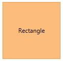
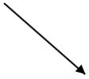

# Tools

Drawing Tools

Drawing tool allow you to draw any kind of node/connector during runtime by clicking and dragging on the Diagram page.

Shapes

To draw a shape, You have to activate the drawing tool by using the Tool property and you need to set the event for GetDrawType. The following code illustrates how to draw a rectangle at run time.

[XAML]

<table>
<tr>
<td>
      </td></tr>
</table>
[C#]

<table>
<tr>
<td>
(diagram.Info as IGraphInfo).GetDrawType += MainWindow_GetDrawType;  diagram.DrawingTool = DrawingTool.Node;  diagram.Tool = Tool.ContinuesDraw;  private void MainWindow_GetDrawType(object sender, DrawTypeEventArgs args)  {  args.DrawItem = new TextBlock()  {  Text = "Rectangle",  HorizontalAlignment = HorizontalAlignment.Center,  VerticalAlignment = VerticalAlignment.Center  };  }    </td></tr>
</table>

The following code example illustrates how to draw a path.

[XAML]

<table>
<tr>
<td>
      </td></tr>
</table>
[C#]

<table>
<tr>
<td>
(diagram.Info as IGraphInfo).GetDrawType += MainWindow_GetDrawType;  diagram.DrawingTool = DrawingTool.Node;  diagram.Tool = Tool.ContinuesDraw;  private void MainWindow_GetDrawType(object sender, DrawTypeEventArgs args)  {  args.DrawItem = new TextBlock()  {  Text="Path",  HorizontalAlignment = HorizontalAlignment.Center,  VerticalAlignment = VerticalAlignment.Center  };  }    </td></tr>
</table>

Connectors

To draw Connectors, you have to set the Connector to DrawingTool property. The drawing tool can be activated by using the Tool property as shown. The following code example illustrates how to draw a straight line Connector.

[XAML]

<table>
<tr>
<td>
        </td></tr>
</table>
<table>
<tr>
<td>
diagram.DrawingTool = DrawingTool.Connector;  diagram.Tool = Tool.DrawOnce;    </td></tr>
</table>

Text

Diagram allows you to create a text Node as soon as you click on the Diagram page. The following code illustrates how to draw a text.

<table>
<tr>
<td>
(diagram.Info as IGraphInfo).GetDrawType += MainWindow_GetDrawType;  diagram.DrawingTool = DrawingTool.Node;  diagram.Tool = Tool.ContinuesDraw;  private void MainWindow_GetDrawType(object sender, DrawTypeEventArgs args)  {  args.DrawItem = new TextBlock()  {  Text="text",  HorizontalAlignment = HorizontalAlignment.Center,  VerticalAlignment = VerticalAlignment.Center  };  }    </td></tr>
</table>
Tool Selection

There are some functionalities that can be achieved by clicking and dragging on the Diagram surface. They are as follows.

* Draw selection rectangle – MultipleSelect tool
* Pan the Diagram – Zoom pan
* Draw Nodes/Connectors – ContinuousDraw / DrawOnce

As all the three behaviors are completely different, You can achieve only one behavior at a time based on the tool that you choose. When more than one of those are applied, a tool is activated based on the precedence given in the following table.

<table>
<tr>
<td>
Precedence  </td><td>
Tools  </td><td>
Description  </td></tr>
<tr>
<td>
1.  </td><td>
ContinuesDraw  </td><td>
Allows you to draw the Nodes or Connectors continuously. Once it is activated, you cannot perform any other interaction in the Diagram.  </td></tr>
<tr>
<td>
2.  </td><td>
DrawOnce  </td><td>
Allows you to draw single Node or Connector. Once you complete the DrawOnce action, SingleSelect and MultipleSelect tools are automatically enabled.  </td></tr>
<tr>
<td>
3.  </td><td>
ZoomPan  </td><td>
Allows you to pan the Diagram. When you enable both the SingleSelect and ZoomPan tools, you can perform the basic interaction as the cursor hovers Node/Connector. Panning is enebled when cursor hovers the Diagram.  </td></tr>
<tr>
<td>
4.  </td><td>
MultipleSelect  </td><td>
Allows you to select multiple Nodes and Connectors. When you enable both the MultipleSelect and ZoomPan tools, cursor hovers the Diagram. When panning is enabled, you cannot select multiple Nodes.  </td></tr>
<tr>
<td>
5.  </td><td>
SingleSelect  </td><td>
Allows you to select individual or Connectors.  </td></tr>
<tr>
<td>
6.  </td><td>
None  </td><td>
Disables all tools.  </td></tr>
</table>
You can set the desired tool to the Tool property of the Diagram. The following code illustrates how to enable single/multiple tools.

<table>
<tr>
<td>
{{'__//__'| markdownify }}{{'__To__ '| markdownify }}{{'__Enable__ '| markdownify }}{{'__Single__ '| markdownify }}{{'__Tool__'| markdownify }}{{'____'| markdownify }}  diagram.Tool = Tool.SingleSelect;  {{'__//__'| markdownify }}{{'__To__ '| markdownify }}{{'__Enable__ '| markdownify }}{{'__multiple__ '| markdownify }}{{'__tools__'| markdownify }}{{'____'| markdownify }}  diagram.Tool = Tool.SingleSelect | Tool.ZoomPan;     </td></tr>
</table>
