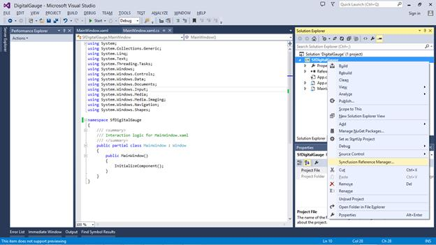
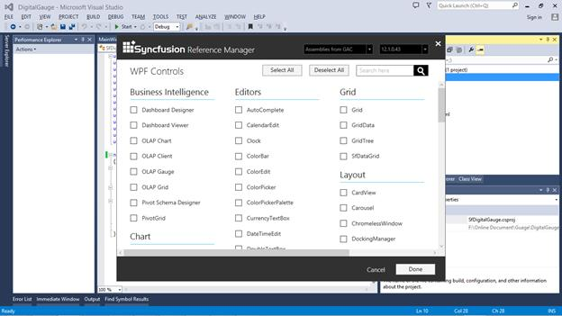
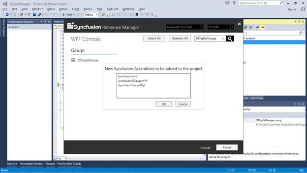
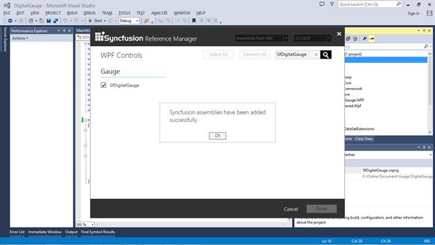
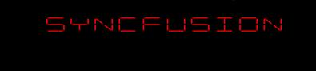

# Getting Started 

This section explains you the steps required to configure the **SfDigitalGauge** and also explains the steps to add basic elements of **SfDigitalGauge** through various API’s available within it.

## Configuring SfDigitalGauge using Syncfusion Reference Manager

Syncfusion Reference Manager is used to add  Syncfusion Tools.

Follow the below steps to add **SfDigitalGauge** using Syncfusion Reference manager.

Create a simple WPF application using Visual Studio.

Right Click on the Project and select Syncfusion Reference Manager.

The Syncfusion Reference Manager Wizard will be opened as shown in the figure below.

Search for **SfDigitalGaugeGauge** using Search Box and select SfDigitalGaugeGauge Control. Click on done to add selected SfDigitalGaugeGauge Control.

The SfDigitalGauge assemblies will be automatically added to the Project after Clicking *OK*.

Create a namespace reference to the SfDigitalGauge control using Syncfusion’s global namespace reference **schemas.syncfusion.com** or the SfDigitalGauge control’s namespace reference using **Syncfusion.UI.Xaml.Gauges** available in the Syncfusion. **Syncfusion.SfGauge.WPF** assembly.



    xmlns:syncfusion =[http://schemas.syncfusion.com/wpf](http://schemas.syncfusion.com/wpf# "")

    or

    xmlns:syncfusion ="clr-namespace:Syncfusion.UI.Xaml.Gauges;assembly=Syncfusion.SfGauge.Wpf"



Add the following code to create a simple SfDigitalGauge control.




    <Window x:Class="SfDigitalGauge.MainWindow"
    xmlns="http://schemas.microsoft.com/winfx/2006/xaml/presentation"
    xmlns:x="http://schemas.microsoft.com/winfx/2006/xaml"
    xmlns:syncfusion="http://schemas.syncfusion.com/wpf"
    Title="MainWindow" Height="350" Width="525">
    <Grid Name="Grid">
    <syncfusion:SfDigitalGauge></syncfusion:SfDigitalGauge>  
    </Grid>
    </Window> 





    SfDigitalGauge digitalgauge = new SfDigitalGauge();
    this.Grid.Children.Add(digitalgauge);




>**Note:-The Syncfusion Reference Manager is available in versions 11.3.0.30 and later. It supports referencing assemblies from version 10.4.0.71 version to the current version and Syncfusion Reference Manager can be used only in Visual Studio 2010, 2012, and 2013,2015.**

## Configuring SfDigitalGauge

SfDigitalGauge is existing in the following assembly and namespace.

**Assembly**: Syncfusion.SfGauge.Wpf

**Namespace**: Syncfusion.UI.Xaml.Gauges

Create a namespace reference to the SfDigitalGauge control using Syncfusion’s global namespace reference **schemas.syncfusion.com** or the SfDigitalGauge control’s namespace reference using **Syncfusion.UI.Xaml.Gauges** available in the Syncfusion. **Syncfusion.SfGauge.WPF** assembly.



    xmlns:syncfusion =[http://schemas.syncfusion.com/wpf](http://schemas.syncfusion.com/wpf# "")

    or

    xmlns:syncfusion ="clr-namespace:Syncfusion.UI.Xaml.Gauges;assembly=Syncfusion.SfGauge.Wpf"






    <syncfusion:SfDigitalGauge />





    SfDigitalGauge digitalgauge = new SfDigitalGauge();
    this.Grid.Children.Add(digitalgauge);
     



Run the above code and now the default **SfDigitalGauge** can be displayed as follows. UI component of the digital gauge can be customized by adding segments and passing Values which will be explained in the next section.

## Displaying Values 

You can add alphanumeric characters to SfDigitalGauge using **Value** property in SfDigitalGauge.




    <syncfusion:SfDigitalGauge Value="GAUGE" />    





    SfDigitalGauge digitalgauge = new SfDigitalGauge();
    digitalgauge.Value = "GAUGE";
    this.Grid.Children.Add(digitalgauge);




SfDigitalGauge Values are displayed as follows.

## Changing segments

You can view the digital characters in SfDigitalGauge using different types of Segments available in **CharacterType** property.




    <syncfusion:SfDigitalGauge Value="12345"  CharacterType="SegmentSeven" />





    SfDigitalGauge digitalgauge = new SfDigitalGauge();
    digitalgauge.Value = "12345";
    digitalgauge.CharacterType = CharacterType.SegmentSeven;
    this.Grid.Children.Add(digitalgauge);




SfDigitalGauge Segments are displayed as follows.

