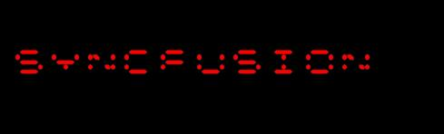

# Settings

There are some other elements/behavior in SfDigitalGauge also can be customized. 

They are:

* Character Spacing
* Segment Thickness
* RTL (Right to Left) support
* Character Stroke
* Dimmed Brush stroke
* Dimmed Brush opacity

## Character Spacing

The distance between the characters can be set by using the **CharacterSpacing** property.




    <syncfusion:SfDigitalGauge  Value="SYNCFUSION" CharacterSpacing="50"/>





    SfDigitalGauge digitalgauge = new SfDigitalGauge();
    digitalgauge.Value = " SYNCFUSION";
    digitalgauge.CharacterSpacing = 50;
    this.Grid.Children.Add(digitalgauge);      




## Character Stroke

The Stroke of the character can be changed by **CharacterStroke** property.




    <syncfusion:SfDigitalGauge  Value="SYNCFUSION"   CharacterType="SegmentFourteen" CharacterStroke="Yellow" />





    SfDigitalGauge digitalgauge = new SfDigitalGauge();
    digitalgauge.Value = " SYNCFUSION";
    digitalgauge.CharacterStroke = new SolidColorBrush(Colors.Yellow);
    digitalgauge.CharacterType = CharacterType.SegmentFourteen;
    this.Grid.Children.Add(digitalgauge);
    



## Segment Thickness

Using **SegmentThickness** property, you can adjust the thickness of the segment.




    <syncfusion:SfDigitalGauge  Value="SYNCFUSION"  CharacterType="SegmentFourteen”  SegmentThickness="5"/>
    




    SfDigitalGauge digitalgauge = new SfDigitalGauge();
    digitalgauge.Value = " SYNCFUSION";
    digitalgauge.SegmentThickness = 5;
    digitalgauge.CharacterType = CharacterType.SegmentFourteen;
    this.Grid.Children.Add(digitalgauge);




## RTL (Right to Left) support

The Characters are aligned using **EnableRTLFormat** property. The default value of **EnableRTLFormat** **is** false.




    <syncfusion:SfDigitalGauge  Value="SYNCFUSION"  CharacterType="SegmentFourteen"   EnableRTLFormat="True" />





    SfDigitalGauge digitalgauge = new SfDigitalGauge();
    digitalgauge.Value = " SYNCFUSION";
    digitalgauge.EnableRTLFormat= true;
    digitalgauge.CharacterType = CharacterType.SegmentFourteen;
    this.Grid.Children.Add(digitalgauge);




## Dimmed Brush stroke

**DimmedBrush** property is used to apply brushes to the dimmed segment. This property is used to suit the background of the Digital gauge




    <syncfusion:SfDigitalGauge  Value="SYNCFUSION" CharacterType="SegmentFourteen"  DimmedBrush="White" />





    SfDigitalGauge digitalgauge = new SfDigitalGauge();
    digitalgauge.Value = " SYNCFUSION";
    digitalgauge.DimmedBrush = new SolidColorBrush(Colors.White);
    digitalgauge.CharacterType = CharacterType.SegmentFourteen;
    this.Grid.Children.Add(digitalgauge);




## Dimmed Brush opacity

**DimmedBrushOpacity** property is used to set the opacity of the brushes to the dimmed segment.




    <syncfusion:SfDigitalGauge  Value="SYNCFUSION" DimmedBrush="White"  DimmedBrushOpacity="20" CharacterType="SegmentFourteen" />





    SfDigitalGauge digitalgauge = new SfDigitalGauge();
    digitalgauge.Value = " SYNCFUSION";
    digitalgauge.DimmedBrush = new SolidColorBrush(Colors.White);
    digitalgauge.CharacterType = CharacterType.SegmentFourteen;
    digitalgauge.DimmedBrushOpacity = 20;
    this.Grid.Children.Add(digitalgauge);




