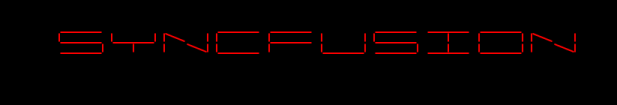
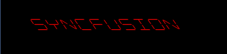

# Transformation of Digital Characters

The digital characters in the Digital Gauge can be transformed by setting certain properties. Two kinds of transformations are done by using this property. They are:

* Scaling
* Skewing

## Scaling

The value of the digital characters is scaled by changing its height and width. It is achieved by setting the CharacterHeight and CharacterWidth property of Digital Gauge.

### CharacterHeight



[XAML]

<syncfusion:SfDigitalGauge Value="SYNCFUSION"  CharacterHeight="70"

                                   CharacterType="SegmentFourteen" />




[C#]

            SfDigitalGauge digitalgauge = new SfDigitalGauge();

            digitalgauge.Value = "SYNCFUSION";

            digitalgauge.CharacterHeight = 70;

            digitalgauge.CharacterType = CharacterType.SegmentFourteen;

            this.Grid.Children.Add(digitalgauge);


#### Screenshot:

### CharacterWidth



[XAML]

<syncfusion:SfDigitalGauge  Value="SYNCFUSION"  CharacterWidth="60"

                                   CharacterType="SegmentFourteen" />




[C#]

            SfDigitalGauge digitalgauge = new SfDigitalGauge();

            digitalgauge.Value = "SYNCFUSION";

            digitalgauge.CharacterWidth = 60;

            digitalgauge.CharacterType = CharacterType.SegmentFourteen;

            this.Grid.Children.Add(digitalgauge);


#### Screenshot:

{{ '' | markdownify }}

## Skewing

The Digital Gauge also performs skew transformation for the digital characters. It can be done on both x-axis and y-axis by using SkewAngleX and SkewAngleY properties respectively.

### SkewAngleX



[XAML]

      <syncfusion:SfDigitalGauge  Value="SYNCFUSION"  SkewAngleX="35"

                                   CharacterType="SegmentFourteen" />




[C#]

            SfDigitalGauge digitalgauge = new SfDigitalGauge();

            digitalgauge.Value = "SYNCFUSION";

            digitalgauge.SkewAngleX = 35;

            digitalgauge.CharacterType = CharacterType.SegmentFourteen;

            this.Grid.Children.Add(digitalgauge);
			


#### Screenshot:

### SkewAngleY



[XAML]

   <syncfusion:SfDigitalGauge  Value="SYNCFUSION"  SkewAngleY="30"

                                   CharacterType="SegmentFourteen" />   





[C#]

            SfDigitalGauge digitalgauge = new SfDigitalGauge();

            digitalgauge.Value = "SYNCFUSION";

            digitalgauge.SkewAngleY = 30;

            digitalgauge.CharacterType = CharacterType.SegmentFourteen;

            this.Grid.Children.Add(digitalgauge);


#### Screenshot:

