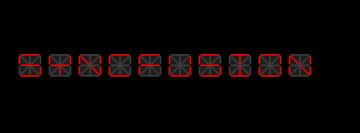

# UI Settings

There are some other UI modifications that can be achieved in the Digital Gauge. They are:

* Character Spacing
* Segment Thickness
* RTL (Right to Left) support
* Character Stroke
* Dimmed Brush stroke
* Dimmed Brush opacity

## Character Spacing

The distance between the characters can be set by using the CharacterSpacing property.



[XAML]

           <syncfusion:SfDigitalGauge  Value="SYNCFUSION" CharacterSpacing="50"/>




[C#]

            SfDigitalGauge digitalgauge = new SfDigitalGauge();

            digitalgauge.Value = " SYNCFUSION";

            digitalgauge.CharacterSpacing = 50;

            this.Grid.Children.Add(digitalgauge);      


### Screenshot:

## Character Stroke

The Stroke of the character can be changed by using CharacterStroke property.



[XAML]

       <syncfusion:SfDigitalGauge  Value="SYNCFUSION"   CharacterType="SegmentFourteen" CharacterStroke="Yellow" />




[C#]

            SfDigitalGauge digitalgauge = new SfDigitalGauge();

            digitalgauge.Value = " SYNCFUSION";

            digitalgauge.CharacterStroke = new SolidColorBrush(Colors.Yellow);

            digitalgauge.CharacterType = CharacterType.SegmentFourteen;

            this.Grid.Children.Add(digitalgauge);



### Screenshot:

## Segment Thickness

By using SegmentThickness property, you can adjust the thickness of the segment.



[XAML]

      <syncfusion:SfDigitalGauge  Value="SYNCFUSION"  CharacterType="SegmentFourteen  SegmentThickness="5"/>




[C#]

            SfDigitalGauge digitalgauge = new SfDigitalGauge();

            digitalgauge.Value = " SYNCFUSION";

            digitalgauge.SegmentThickness = 5;

            digitalgauge.CharacterType = CharacterType.SegmentFourteen;

            this.Grid.Children.Add(digitalgauge);



### Screenshot:

## RTL (Right to Left) support

The Characters are aligned by using EnableRTLFormat property. The default value of EnableRTLFormat is False.



[XAML]

      <syncfusion:SfDigitalGauge  Value="SYNCFUSION"  CharacterType="SegmentFourteen"   EnableRTLFormat="True" />




[C#]

            SfDigitalGauge digitalgauge = new SfDigitalGauge();

            digitalgauge.Value = " SYNCFUSION";

            digitalgauge.EnableRTLFormat= true;

            digitalgauge.CharacterType = CharacterType.SegmentFourteen;

            this.Grid.Children.Add(digitalgauge);


### Screenshot:

## Dimmed Brush stroke

DimmedBrush property is used to apply brushes to the dimmed segment. This property is used to suit the background of the Digital gauge.


[XAML]

      <syncfusion:SfDigitalGauge  Value="SYNCFUSION" CharacterType="SegmentFourteen"  DimmedBrush="White" />





[C#]

            SfDigitalGauge digitalgauge = new SfDigitalGauge();

            digitalgauge.Value = " SYNCFUSION";

            digitalgauge.DimmedBrush = new SolidColorBrush(Colors.White);

            digitalgauge.CharacterType = CharacterType.SegmentFourteen;

            this.Grid.Children.Add(digitalgauge);



### Screenshot:

## Dimmed Brush opacity

DimmedBrushOpacity property is used to set the opacity of the brushes to the dimmed segment.



[XAML]

      <syncfusion:SfDigitalGauge  Value="SYNCFUSION" DimmedBrush="White"  DimmedBrushOpacity="20" CharacterType="SegmentFourteen" />



[C#]

            SfDigitalGauge digitalgauge = new SfDigitalGauge();

            digitalgauge.Value = " SYNCFUSION";

            digitalgauge.DimmedBrush = new SolidColorBrush(Colors.White);

            digitalgauge.CharacterType = CharacterType.SegmentFourteen;

            digitalgauge.DimmedBrushOpacity = 20;

            this.Grid.Children.Add(digitalgauge);



### Screenshot:

