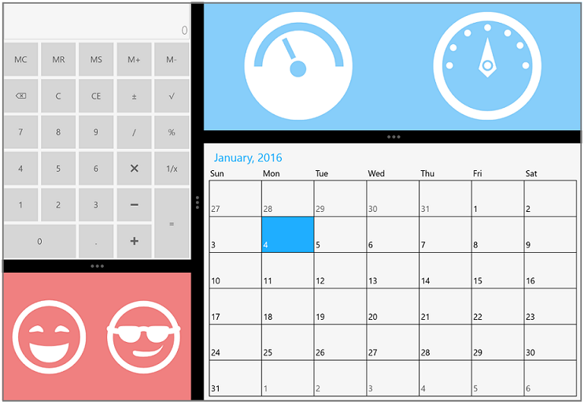

# Overview

`SfGridSplitter` is a container control helps to split the available space horizontally or vertically with a movable splitter and arrange the visual elements inside it. 

Following are the key features of SfGridSplitter control

* Dynamic resizing: Supports available to split the space with movable splitter that helps resize controls on demand.
* Expand / Collapse: Supports to expand and collapse splitter controls interactively in UI.
* Orientation: Supports both horizontal and vertical orientation to Split controls based on user layout.

