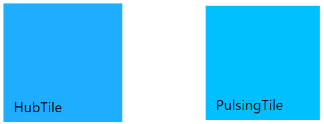

# Getting Started

## Assembly deployment

Refer [SfHubTile](https://help.syncfusion.com/wpf/control-dependencies#sfhubtile) and [SfPulsingTile](https://help.syncfusion.com/wpf/control-dependencies#sfpulsingtile) control dependencies section to get the list of assemblies or NuGet package needs to be added as reference to use the SfHubTile and SfPulsingTile control in any application.

## Creating simple application with HubTile and PulsingTile

In this walk through, you will create WPF application that contains SfHubTile and SfPulsingTile control. 

1. [Creating project](#creating-the-project)
2. [Adding control via Designer](#adding-control-via-designer)
3. [Adding control manually in XAML](#adding-control-manually-in-xaml)
4. [Adding control manually in C#](#adding-control-manually-in-c)

### Creating the project

Create new WPF Project in Visual Studio to display SfHubTile and SfPulsingTile with data objects.

### Adding control via Designer

SfHubTile and SfPulsingTile controls can be added to the application by dragging it from Toolbox and dropping it in Designer view. The required assembly references will be added automatically.

### Adding control manually in XAML

In order to add control manually in XAML, do the below steps,

1. Add the below required assembly references to the project,
	* Syncfusion.SfHubTile.WPF
	* Syncfusion.SfShared.WPF
2. Import Syncfusion WPF schema **http://schemas.syncfusion.com/wpf** or SfHubTile control namespace **Syncfusion.Windows.Controls.Notification** in XAML page.
3. Declare SfHubTile and SfPulsingTile controls in XAML page.



<Window xmlns="http://schemas.microsoft.com/winfx/2006/xaml/presentation"
        xmlns:x="http://schemas.microsoft.com/winfx/2006/xaml"
        xmlns:syncfusion="http://schemas.syncfusion.com/wpf" 
        x:Class="WpfApplication1.MainWindow"
        Title="MainWindow" Height="350" Width="525">
    <Grid>
    	<!--HubTile-->
		<syncfusion:SfHubTile Content="SfHubTile" Grid.Column="0" />
		<!--Pulse Tile-->
		<syncfusion:SfPulsingTile Content="SfPulsingTile" Grid.Column="1"/>
    </Grid>
</Window>



### Adding control manually in C\#

In order to add control manually in C#, do the below steps,

1. Add the below required assembly references to the project,
	* Syncfusion.SfHubTile.WPF
	* Syncfusion.SfShared.WPF
2. Import SfHubTile namespace **using Syncfusion.Windows.Controls.Notification;**.
3. Create SfHubTile and SfPulsingTile controls instance and add it to the window.



using Syncfusion.Windows.Controls.Notification;
namespace SfHubTileSample
{
	public partial class MainWindow : Window
	{
		public MainWindow()
		{
			InitializeComponent();
			// HubTile
			SfHubTile hubTile = new SfHubTile();
			grid.Children.Add(hubTile);			
			//Pulse Tile
			SfPulsingTile pulseTile = new SfPulsingTile();
			grid.Children.Add(pulseTile);
		}
	}
}



## Setting Header for Tile

You can set the header for tile by setting [Header](https://help.syncfusion.com/cr/wpf/Syncfusion.SfShared.Wpf~Syncfusion.Windows.Primitives.HeaderedContentControl~Header.html) property.



<!-- HubTile -->
<syncfusion:SfHubTile x:Name="hubTile" Header="HubTile"/>
<!-- Pulsing Tile -->
<syncfusion:SfPulsingTile x:Name="pulsingTile" Header="Pulsing Tile"/>


//Setting header for HubTile
hubTile.Header = "HubTile";
//Setting header for Pulsing Tile
pulseTile.Header = "Pulsing Tile";



## Setting Title for Tile

You can set the title for tile by setting [Title](ttps://help.syncfusion.com/cr/wpf/Syncfusion.SfHubTile.Wpf~Syncfusion.Windows.Controls.Notification.HubTileBase~Title.html) property.



<!-- HubTile -->
<syncfusion:SfHubTile x:Name="hubTile" Title="This is title area."/>
<!--Pulsing Tile-->
<syncfusion:SfPulsingTile x:Name="pulsingTile" Title="This is title area."/>


//Setting title for HubTile
hubTile.Title = "This is title area.";
//Setting title for Pulsing Tile
pulseTile.Title = "This is title area.";



## Setting Image for Tile

You can set the image for tile by setting the image path in [ImageSource](https://help.syncfusion.com/cr/wpf/Syncfusion.SfHubTile.Wpf~Syncfusion.Windows.Controls.Notification.HubTileBase~ImageSource.html) property.



<!--HubTile--> 
<syncfusion:SfHubTile x:Name="hubTile" ImageSource="Assets\New Mail.png"/>
<!--Pulsing Tile-->
<syncfusion:SfPulsingTile x:Name="pulsingTile">
	<Image Source="Assets/PulsingTile.jpg" Stretch="UniformToFill"  VerticalAlignment="Center" HorizontalAlignment="Center"  Height="200" />
</syncfusion:SfPulsingTile>



