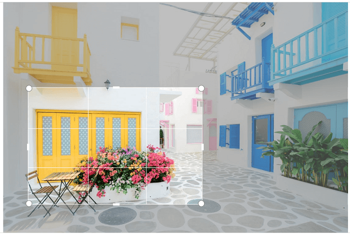
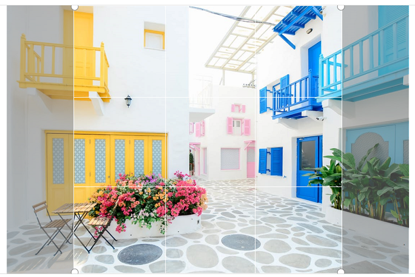
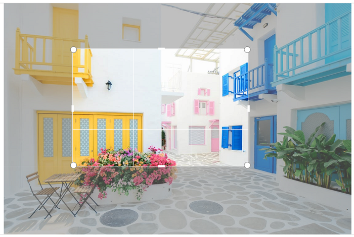
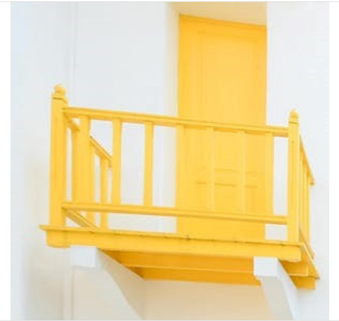

# Crop

Image can be cropped both via toolbar and programmatically.

## Toolbar cropping

To crop the image click on the Crop icon in the toolbar. Cropping handles will be added on the image, you can resize the handles to crop the required portion.

Upon clicking the crop icon, sub toolbar will be displayed below the main toolbar. After selecting the cropping portion click OK in the sub toolbar to crop that selected portion.

Sub toolbar contains the following the icons.

* Width - You can specify the width of the cropping area.
* Height - You can specify the height of the cropping area.
* OK - Clicking on this icon selected portion will be cropped.
* Cancel - On clicking this icon cropping handles will be removed.

N> On specifying width and height cropping area is located from the left top corner.

You can also perform continuous cropping on the image.

Below image describes the area selected for cropping.

 

Below is the image taken after performing cropping on the selected area.

 

## Programmatic cropping

Cropping can be done programmatically using  the following two methods in image editor.

* ToggleCropping - Used to select the cropping area.
* Crop - Crops the selected area in the image.

### Toggle cropping

Toggle cropping method takes 3 parameters.

### Crop area selection

Below method will select the full image area for cropping and you can resize as per your wish

 

 

editor.ToggleCropping();



 

Below method with get the ratio as the parameter to select the cropping area.

 

 

editor.ToggleCropping(25,25);



 

 

Below method with get the rect in terms of percentage to select the cropping area.

 

 

Rect rect = new Rect(20, 20, 50, 50);
editor.ToggleCropping(rect);



 

 

### Crop

After selecting the crop area use Crop method in the image editor to crop the selected portion as in the below method.

 

 

editor.Crop(new Rect(0, 0, 0, 0)



 

### Manual cropping

To manually select and crop the location use the same Crop method but specify the portion to br cropped in terms of rect as in the below code.

 

 

editor.Crop(new Rect(0, 0, 0, 0)



 

 
