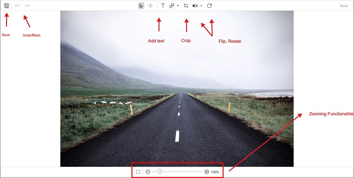
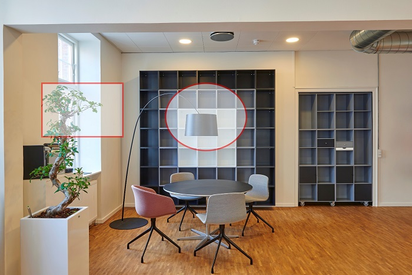

# Shapes

You can annotate the image by adding shapes such as Circle, Rectangle, Arrow. Shapes can be added in the following 2 ways.

*	Using Toolbar
*	Programmatically using code.

## Toolbar

To add shape, click on the AddShape icon in the toolbar. This will list out the default shapes and you can select the desired shape from it. By default, selected shape will be added at the center. You can select and drag the shape to position at the desired location. Upon selecting the shape, handles will be enabled which helps in resizing of the shape. Click outside to disable the selection.

## Customization

The following properties of the added shape can be customized.

*	Fill
*	Stroke
*	StrokeWidth

On selecting the shape icon in the toolbar, a sub toolbar will be generated below the main toolbar to provide the customizing options for the shapes.

N> Shape needs to be selected to apply customization from the sub toolbar.

### Fill

Color picker will be opened on selecting this icon, you can select the desired color from it to fill the selected shape. By default, fill is in transparent.

### Stroke

On selecting the required color from this color picker, stroke of the selected shape will be updated. By default, stroke will be in Red.

### Stroke width

You can select the desired from the listed-out sizes to update the stroke width of the selected shape.

 

### Delete

To delete the added shape, select the shape and click delete icon from the keyboard.

## Programmatical approach

Shapes can be added into the image using the AddShape method. This method takes the following 2 parameters.

*	ShapeType - You can choose the required shapes types. Available shape types are Rectangle, Circle, Arrow.
*	PenSettings – Used for customizing the added shapes.

% tabs %} 

 

editor.AddShape(ShapeType.Rectangle, new PenSettings());



 

### Delete

To delete the selected shape use Delete method as follows.

% tabs %} 

 

editor.Delete();



 

## Pen settings

Using the following properties in the pen settings, added shapes can be customized.

*	Fill - Fills the selected shape with this color.
*	Stroke – Applies this stroke to the selected shape.
*	Opacity – Applies opacity to both stroke and fill of the shape.
*	StrokeWidth – Applied the specified width to the stroke of the shape.
*	Bounds – Rect used to position the shape.

N> Values of the bounds rect will be in percentage. For example (25,25,25,25) will take the position of 25 percent from the left and top.

% tabs %} 

 

            PenSettings penSettings = new PenSettings();
            penSettings.Fill = new SolidColorBrush(Colors.AliceBlue);
            penSettings.Opacity = 0.5f;
            penSettings.Stroke = new SolidColorBrush(Colors.Red);
            penSettings.StrokeWidth = 3;
            penSettings.Bounds = new Rect(10, 30, 20, 20);
            editor.AddShape(ShapeType.Rectangle, penSettings);

            penSettings = new PenSettings();
            penSettings.Fill = new SolidColorBrush(Colors.AliceBlue);
            penSettings.Opacity = 0.5f;
            penSettings.Stroke = new SolidColorBrush(Colors.Red);
            penSettings.StrokeWidth = 3;            
            penSettings.Bounds = new Rect(40, 30, 20, 25);
            editor.AddShape(ShapeType.Circle, penSettings);



 

 

## Shape resizing

By default, both shapes and text are resizable. You can also control the resizable using the ResizableElements property in image editor.
Below code will enable Resizing functionality to both shapes and text.

% tabs %} 

 

 editor.ResizableElements = ImageEditorResizableElements.Shapes | ImageEditorResizableElements.Text;



 
