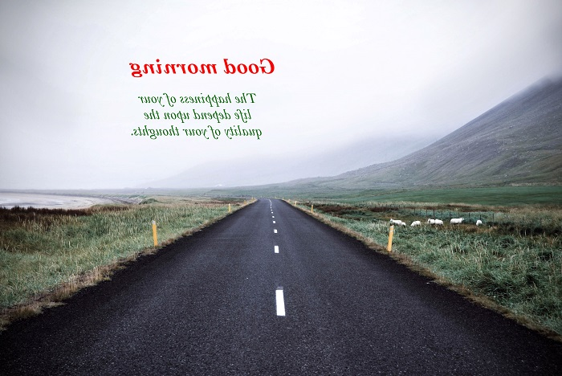

# Transformation

Image editor control provides the below 2 transformations.

1.	Flip.
2.	Rotate.

## Flip

Images can be flipped either in horizontal or vertical direction. By default, images will be flipped in horizontal direction.

### Via Toolbar

To flip the image click the Flip icon in the toolbar. Popup will be displayed prompting for whether horizontal flip or vertical flip. Select the required flip direction to flip the image.

### Using code

Programmatically you can flip the image using the Flip method. This method takes the flip direction as the parameter to specify whether it is a horizontal flip or vertical flip.

 

 

editor.Flip(FlipDirection.Horizontal);



 

Below image depicts the horizontal flip.

   

Vertical flip of the image.

   

## Rotate

### Via Toolbar

To rotate the image, click on the rotate icon in the toolbar, this will rotate the image to 90 degree from the current state. By continuous clicking angle will be increased since it will rotate from the current state.

### Programmatic approach

Use Rotate method to rotate the image to 90 degree from the current state. 

 
