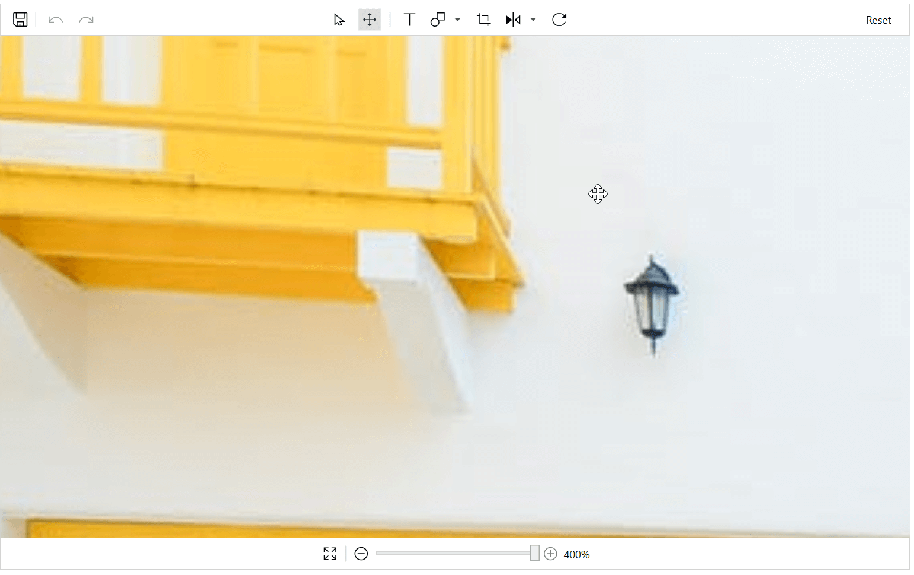

# Zooming and panning

## Zooming

## Toolbar

Images can be zoomed in or zoomed out for better viewing. In the foolter toolbar you will find the slider which helps in increasing the zoom level of the image.

Zoom level ranges from 50 to 400 percent. You can move the slider to increase the zoom level. Also there will be an Increase and Decrease icon on both sides of the slider this will help in gradual increasing of the level.

At a time this Increase/Decrease icon can increase/decrease the level upto 10 percent. To reset the zoom level you can click the ResetZoom icon which is placed to the left of the DecreaseZoom icon.

## Mouse wheel

You can also zoom the image using mouse wheel. Based on the mouse wheel delta images will be zoomed.

 

## Panning

Zoomed image can be panned to view the hidden portion. To enable Pan clcik on the pan icon in the top toolbar. This will enable the panning operation on the image. When panning is enabled, shapes or text added in the image cannot be resized or repositioned. To resize the shape enable the Select icon in the toolbar this will disable the pan operation.

Select and Pan operation will works like a toggle functions.

 