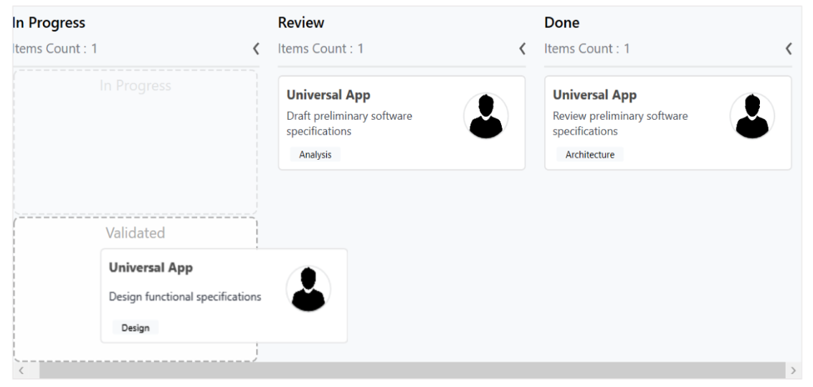

# Column

## Customizing column size

By default, the columns are sized smartly to arrange the default elements of the cards with better readability. You can also define the minimum and maximum widths for the columns in [`SfKanban`](https://help.syncfusion.com/cr/cref_files/wpf/Syncfusion.SfKanban.WPF~Syncfusion.UI.Xaml.Kanban.SfKanban.html) using the [`SfKanban.MinColumnWidth`](https://help.syncfusion.com/cr/cref_files/wpf/Syncfusion.SfKanban.WPF~Syncfusion.UI.Xaml.Kanban.SfKanban~MinColumnWidth.html) and [`SfKanban.MaxColumnWidth`](https://help.syncfusion.com/cr/cref_files/wpf/Syncfusion.SfKanban.WPF~Syncfusion.UI.Xaml.Kanban.SfKanban~MaxColumnWidth.html) properties, respectively.





<kanban:SfKanban MinColumnWidth ="300" MaxColumnWidth ="340">
</kanban:SfKanban>



 

kanban. MinColumnWidth = 300;
kanban. MaxColumnWidth = 340;





You can also define the exact column width using the [`SfKanban.ColumnWidth`](https://help.syncfusion.com/cr/cref_files/wpf/Syncfusion.SfKanban.WPF~Syncfusion.UI.Xaml.Kanban.SfKanban~ColumnWidth.html) property.





<kanban:SfKanban ColumnWidth ="250">
</kanban:SfKanban>



 

kanban.ColumnWidth = 250;





## Categorizing columns

If [`ItemsSource`](https://help.syncfusion.com/cr/cref_files/wpf/Syncfusion.SfKanban.WPF~Syncfusion.UI.Xaml.Kanban.SfKanban~ItemsSource.html) contains custom objects, the path of the property used to categorize the card should be explicitly defined using the [`ColumnMappingPath`](https://help.syncfusion.com/cr/cref_files/wpf/Syncfusion.SfKanban.WPF~Syncfusion.UI.Xaml.Kanban.SfKanban~ColumnMappingPath.html) property. By default, [`SfKanban`](https://help.syncfusion.com/cr/cref_files/wpf/Syncfusion.SfKanban.WPF~Syncfusion.UI.Xaml.Kanban.SfKanban.html) automatically categorizes the items using the [`KanbanModel.Category`](https://help.syncfusion.com/cr/cref_files/wpf/Syncfusion.SfKanban.WPF~Syncfusion.UI.Xaml.Kanban.KanbanModel~Category.html) property.





<kanban:SfKanban ColumnMappingPath="Group">
</kanban:SfKanban>



 

kanban.ColumnMappingPath = "Group";





### Multiple category for a column

More than one category can be mapped to a column by assigning multiple values to the Categories collection of [`KanbanColumn`](https://help.syncfusion.com/cr/cref_files/wpf/Syncfusion.SfKanban.WPF~Syncfusion.UI.Xaml.Kanban.KanbanColumn.html). For example, you can map the “In progress" and "Validate" types under the “In progress” column.

 

progressColumn.Categories = new List<object>() { "In Progress", "Validated" };



