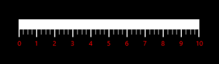
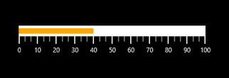
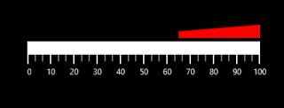
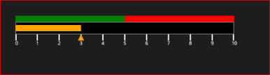

# Concepts and Feature

# Label Settings

Labels of the linear scale provide a numeric value to the major ticks that are specified according to the range of the scale.

## Customizing Labels

The foreground of the label is customized by setting the LabelStroke of the linear scale. By making use of the LabelSize property, the font size of the labels is personalized. The labels can be positioned away from the ticks by using the LabelOffset property.


[XAML]

        <Gauges:SfLinearGauge Name="linearGauge" Orientation="Horizontal">

            <Gauges:SfLinearGauge.MainScale>

                <Gauges:LinearScale LabelStroke="Red" Minimum="0" Maximum="10" Interval="1"  MinorTicksPerInterval="3"

                                    LabelSize="13" 

                                    LabelOffset="5">

                </Gauges:LinearScale>

            </Gauges:SfLinearGauge.MainScale>

        </Gauges:SfLinearGauge>



[C#]

            SfLinearGauge lineargauge = new SfLinearGauge();

            LinearScale _mainScale = new LinearScale();

            _mainScale.Minimum = 0;

            _mainScale.Maximum = 10;

            _mainScale.MinorTicksPerInterval = 3;

            _mainScale.LabelStroke = new SolidColorBrush(Colors.Red);

            _mainScale.LabelSize = 13;

            _mainScale.LabelOffset = 5;

            lineargauge.MainScale = _mainScale;

            this.Grid.Children.Add(lineargauge);



The following screenshot illustrates customizing Labels of the Linear Gauge:

## Label Position

The labels in the scale can be placed above or below the linear scale by choosing the following options that are available in the LabelPosition property. 

1. Above.
2. Below (Default).


[XAML]

        <Gauges:SfLinearGauge>

            <Gauges:SfLinearGauge.MainScale>

                <Gauges:LinearScale TickPosition="Cross"

                                    ScaleBarLength="300" 

                                    LabelPosition="Above"

                                    Minimum="0" Maximum="100"

                                    LabelStroke="Black"

                                    LabelSize="14"	

                                    Interval="10">

                </Gauges:LinearScale>

            </Gauges:SfLinearGauge.MainScale>

        </Gauges:SfLinearGauge>



[C#]

            SfLinearGauge lineargauge = new SfLinearGauge();

            LinearScale _mainScale = new LinearScale();

            _mainScale.ScaleBarLength = 300;

            _mainScale.TickPosition = LinearTicksPosition.Cross;

            _mainScale.LabelPosition = LinearLabelsPosition.Above;

            _mainScale.Minimum = 0;

            _mainScale.Maximum = 100;

            _mainScale.LabelStroke = new SolidColorBrush(Colors.White);

            _mainScale.LabelSize = 14;

            _mainScale.Interval = 10;

            _mainScale.MajorTickStroke = new SolidColorBrush(Colors.Black);

            lineargauge.MainScale = _mainScale;

            this.Grid.Children.Add(lineargauge); 



The following screenshot illustrates the labels positioned above the Scale:

# Pointer Settings

Multiple pointers are added to the Linear Gauge to point multiple values on the same linear scale. This is useful for showing a low and a high value at the same time. Value of the pointer is set by the Value property. There are two types of pointers to choose from by using the PointerType property. Movement of the pointer can be animated by enabling the EnableAnimation property.

## Bar Pointer

Bar pointer is an accenting line or colored bar that is placed on the Linear Gauge to mark the values. Bar pointer’s UI is customized by using the BarPointerStroke and BarPointerStrokeThickness properties.


[XAML]

        <Gauges:SfLinearGauge>

            <Gauges:SfLinearGauge.MainScale>

                <Gauges:LinearScale BindRangeStrokeToLabels="True"

                                    BindRangeStrokeToTicks="True"

                                    ScaleBarLength="300">

                    <Gauges:LinearScale.Pointers>

                        <Gauges:LinearPointer PointerType="BarPointer" Value="40" />

                    </Gauges:LinearScale.Pointers>

                </Gauges:LinearScale>

            </Gauges:SfLinearGauge.MainScale>

        </Gauges:SfLinearGauge>




[C#]

            SfLinearGauge lineargauge = new SfLinearGauge();

            lineargauge.Orientation = Orientation.Horizontal;

            LinearScale _mainScale = new LinearScale();

            _mainScale.BindRangeStrokeToLabels = true;

            _mainScale.BindRangeStrokeToTicks = true;

            _mainScale.ScaleBarLength = 300;

            _mainScale.Pointers.Add(new LinearPointer() { PointerType = LinearPointerType.BarPointer,Value=40 });

            lineargauge.MainScale = _mainScale;

            this.Grid.Children.Add(lineargauge);



The following screenshot illustrates the Linear Gauge with Bar Pointer:

## Symbol Pointer

In the symbol pointer type, the value is pointed by a symbol on the scale. You can modify the symbol pointer’s size by changing the SymbolPointerHeight and SymbolPointerWidth properties. The stroke of the symbol pointer is changed by using the SymbolPointerStroke property. The SymbolPointerStyle property is used to select the symbol pointer style.


[XAML]

       <Gauges:SfLinearGauge>

            <Gauges:SfLinearGauge.MainScale>

                <Gauges:LinearScale BindRangeStrokeToLabels="True"

                                    BindRangeStrokeToTicks="True"

                                    ScaleBarLength="300">

                    <Gauges:LinearScale.Pointers>

                        <Gauges:LinearPointer PointerType="SymbolPointer" Value="40"  SymbolPointerStyle = "Triangle"/>

                    </Gauges:LinearScale.Pointers>

                </Gauges:LinearScale>

            </Gauges:SfLinearGauge.MainScale>

        </Gauges:SfLinearGauge>




[C#]

            SfLinearGauge lineargauge = new SfLinearGauge();

            lineargauge.Orientation = Orientation.Horizontal;

            LinearScale _mainScale = new LinearScale();

            _mainScale.BindRangeStrokeToLabels = true;

            _mainScale.BindRangeStrokeToTicks = true;

            _mainScale.ScaleBarLength = 300;

            _mainScale.Pointers.Add(new LinearPointer() { PointerType = LinearPointerType.SymbolPointer,Value=40, SymbolPointerStyle = LinearSymbolPointerStyle.Triangle });

            lineargauge.MainScale = _mainScale;

            this.Grid.Children.Add(lineargauge);


The following screenshot illustrates the Linear Gauge with Symbol Pointer:

## Pointer Position

The SymbolPointer in the scale can be placed above, below, or in between the scale by choosing the following options that are available in the SymbolPointerPosition property. 

1. Above.
2. Below (Default).
3. Cross.


[XAML]

   <Gauges:SfLinearGauge Name="linearGauge" Orientation="Horizontal">

            <Gauges:SfLinearGauge.MainScale>

                <Gauges:LinearScale ScaleDirection="Forward"

                                    ScaleBarStroke="Black" 

                                    ScaleBarSize="20" 

                                    ScaleBarLength="350"

                                    ScaleBarBorderThickness="1"

                                         Interval="10" MinorTicksPerInterval="3"

                                    Minimum="0" Maximum="100">

                    <Gauges:LinearScale.Pointers>

                        <Gauges:LinearPointer Value="40" PointerType="BarPointer" />

                        <Gauges:LinearPointer Value="40" PointerType="SymbolPointer" SymbolPointerPosition="Above"/>

                    </Gauges:LinearScale.Pointers>

                </Gauges:LinearScale>

            </Gauges:SfLinearGauge.MainScale>

        </Gauges:SfLinearGauge>



[C#]

            SfLinearGauge lineargauge = new SfLinearGauge();

            lineargauge.Orientation = Orientation.Horizontal;

            LinearScale _mainScale = new LinearScale();

            _mainScale.ScaleDirection = LinearScaleDirection.Forward;

            _mainScale.ScaleBarStroke = new SolidColorBrush(Colors.Black);

            _mainScale.ScaleBarSize = 20;

            _mainScale.ScaleBarLength = 350;

            _mainScale.ScaleBarBorderThickness = new Thickness(1);

            _mainScale.Interval = 10;

            _mainScale.Minimum = 0;

            _mainScale.Maximum = 100;

            _mainScale.Pointers.Add(new LinearPointer() { Value = 40, PointerType = LinearPointerType.BarPointer });

            _mainScale.Pointers.Add(new LinearPointer() { Value = 40, PointerType = LinearPointerType.SymbolPointer , SymbolPointerPosition=LinearSymbolPointersPosition.Above});

            lineargauge.MainScale = _mainScale;

            this.Grid.Children.Add(lineargauge);



The following screenshot illustrates the SymbolPointer:

# Range Settings

Ranges of the linear scale are a collection of the linear range. A linear range is a visual element that starts at a specified StartValue and ends at a specified EndValue within the linear scale. These start and end values are mentioned with the help of the LinearRange class. 

## Customizing Range

The stroke of the range is personalized by changing the RangeStroke of the linear range. The appearance of linear range is customized by setting the StartWidth and EndWidth properties. With the help of the RangeOffset property, the linear range can be positioned with respect to the linear scale. By setting the RangeOpacity of the LinearRange, the opacity of the range can be modified.


 [XAML]

        <Gauges:SfLinearGauge Orientation="Horizontal">

            <Gauges:SfLinearGauge.MainScale>

                <Gauges:LinearScale>

                    <Gauges:LinearScale.Ranges>

                        <Gauges:LinearRange StartValue="0" EndValue="35" 

                                            StartWidth="25" EndWidth="10" 

                                            RangeOffset="5" RangeOpacity="1"

                                            RangeStroke="Green"/>

                        <Gauges:LinearRange StartValue="65" EndValue="100" 

                                            StartWidth="10" EndWidth="25" 

                                            RangeOffset="5" RangeOpacity="1"

                                            RangeStroke="Red"/>

                    </Gauges:LinearScale.Ranges>

                </Gauges:LinearScale>

            </Gauges:SfLinearGauge.MainScale>

        </Gauges:SfLinearGauge>



[C#]

            SfLinearGauge lineargauge = new SfLinearGauge();

            lineargauge.Orientation = Orientation.Horizontal;

            LinearScale _mainScale = new LinearScale();

            _mainScale.Ranges.Add(new LinearRange() { StartValue = 0, EndValue = 35, StartWidth = 25, EndWidth = 10,RangeOffset=5,RangeOpacity=1, RangeStroke = new SolidColorBrush(Colors.Green) });

            _mainScale.Ranges.Add(new LinearRange() { StartValue = 65, EndValue = 100, StartWidth = 10, EndWidth = 25, RangeOffset = 5, RangeOpacity = 1, RangeStroke = new SolidColorBrush(Colors.Red) });

            lineargauge.MainScale = _mainScale;

            this.Grid.Children.Add(lineargauge);



## Binding RangeStroke to Ticks and Labels

By setting the BindWithRangeStrokeToLabels, the stroke of the labels can be set related to the stroke of the specified ranges. Similarly, by setting the BindWithRangeStrokeToTicks, the stroke of the ticks can be set related to the stroke of the specified ranges.


[XAML]

       <Gauges:SfLinearGauge Orientation="Horizontal">

            <Gauges:SfLinearGauge.MainScale>

                <Gauges:LinearScale BindRangeStrokeToLabels="True"

                                    BindRangeStrokeToTicks="True">

                    <Gauges:LinearScale.Ranges>

                        <Gauges:LinearRange StartValue="0" EndValue="35" 

                                            StartWidth="15" EndWidth="15" 

                                            RangeOffset="5" RangeStroke="Green"/>

                        <Gauges:LinearRange StartValue="35" EndValue="65" 

                                            StartWidth="15" EndWidth="15" 

                                            RangeOffset="5" RangeStroke="Yellow"/>

                        <Gauges:LinearRange StartValue="65" EndValue="100" 

                                            StartWidth="15" EndWidth="15" 

                                            RangeOffset="5" RangeStroke="Red"/>

                    </Gauges:LinearScale.Ranges>

                </Gauges:LinearScale>

            </Gauges:SfLinearGauge.MainScale>

        </Gauges:SfLinearGauge>



[C#]

            SfLinearGauge lineargauge = new SfLinearGauge();

            lineargauge.Orientation = Orientation.Horizontal;

            LinearScale _mainScale = new LinearScale();

            _mainScale.BindRangeStrokeToLabels = true;

            _mainScale.BindRangeStrokeToTicks = true;

            _mainScale.Ranges.Add(new LinearRange() { StartValue = 0, EndValue = 35, StartWidth = 15, EndWidth = 15, RangeOffset = 5,RangeStroke = new SolidColorBrush(Colors.Green) });

            _mainScale.Ranges.Add(new LinearRange() { StartValue = 35, EndValue = 65, StartWidth = 15, EndWidth = 15, RangeOffset = 5, RangeStroke = new SolidColorBrush(Colors.Yellow) });

            _mainScale.Ranges.Add(new LinearRange() { StartValue = 65, EndValue = 100, StartWidth = 25, EndWidth = 10, RangeOffset = 5, RangeStroke = new SolidColorBrush(Colors.Red) });

            lineargauge.MainScale = _mainScale;

            this.Grid.Children.Add(lineargauge);



## Range Position

The range can be placed above or below the scale by choosing the options available in the RangePosition property. They are:

1. Above (Default).
2. Below.


[XAML]

       <Gauges:SfLinearGauge>

            <Gauges:SfLinearGauge.MainScale>

                <Gauges:LinearScale BindRangeStrokeToLabels="True" 

                                    BindRangeStrokeToTicks="True"  

                                    RangePosition="Above"

                                    ScaleBarLength="300">

                    <Gauges:LinearScale.Ranges>

                        <Gauges:LinearRange StartValue="65" EndValue="100" 

                                            StartWidth="10" EndWidth="25" 

                                            RangeOffset="5" RangeOpacity="1"

                                            RangeStroke="Red"/>

                    </Gauges:LinearScale.Ranges>

                </Gauges:LinearScale>

            </Gauges:SfLinearGauge.MainScale>

        </Gauges:SfLinearGauge>




[C#]

            SfLinearGauge lineargauge = new SfLinearGauge();

            LinearScale _mainScale = new LinearScale();

            _mainScale.BindRangeStrokeToLabels = true;

            _mainScale.BindRangeStrokeToTicks = true;

            _mainScale.ScaleBarLength = 300;

            _mainScale.RangePosition = LinearRangesPosition.Above;

            _mainScale.Ranges.Add(new LinearRange() { StartValue = 65, EndValue = 100, StartWidth = 10, EndWidth = 25, RangeOffset = 5, RangeOpacity = 1, RangeStroke = new SolidColorBrush(Colors.Red) });

            lineargauge.MainScale = _mainScale;

            this.Grid.Children.Add(lineargauge);



The following screenshot displays the Linear Gauge with the Range positioned above:

# Scale Settings

The MainScale is a linear scale that integrates ticks, labels, and scale bar to specify the basic look and feel of the Linear Gauge. It defines the overall minimum and maximum values as well as the frequency of labels and ticks through the interval of the scale. It can contain multiple ranges within a scale. It also contains one or more pointers to the measures of the linear scale. 

## Customizing the MainScale

The range of the main scale can be mentioned by Minimum and Maximum of the linear scale. The width and height of the linear scale is customized by using the ScaleBarLength and ScaleBarSize properties respectively. The border thickness of the linear scale is changed by using the ScaleBarBorderThickness property. The direction of the linear scale is personalized by setting the ScaleDirection property of the linear scale.


[XAML]

        <Gauges:SfLinearGauge Name="linearGauge" Orientation="Horizontal">

            <Gauges:SfLinearGauge.MainScale>

                <Gauges:LinearScale ScaleDirection="Forward"

                                    ScaleBarStroke="Black" 

                                    ScaleBarSize="20" 

                                    ScaleBarLength="350"

                                    ScaleBarBorderThickness="1"

                                         Interval="1"

                                    Minimum="0" Maximum="10">

                    <Gauges:LinearScale.Ranges>

                        <Gauges:LinearRange StartValue="0" EndValue="5" 

                                            StartWidth="10" EndWidth="10" 

                                            RangeStroke="Green"/>

                        <Gauges:LinearRange StartValue="5" EndValue="10" 

                                            StartWidth="10" EndWidth="10" 

                                            RangeStroke="Red"/>

                    </Gauges:LinearScale.Ranges>

                    <Gauges:LinearScale.Pointers>

                        <Gauges:LinearPointer Value="3" PointerType="BarPointer" />

                        <Gauges:LinearPointer Value="3" PointerType="SymbolPointer"/>

                    </Gauges:LinearScale.Pointers>

                </Gauges:LinearScale>

            </Gauges:SfLinearGauge.MainScale>

        </Gauges:SfLinearGauge>



[C#]

            SfLinearGauge lineargauge = new SfLinearGauge();

            lineargauge.Orientation = Orientation.Horizontal;

            LinearScale _mainScale = new LinearScale();

            _mainScale.ScaleDirection = LinearScaleDirection.Forward;

            _mainScale.ScaleBarStroke = new SolidColorBrush(Colors.Black);

            _mainScale.ScaleBarSize = 20;

            _mainScale.ScaleBarLength = 350;

            _mainScale.ScaleBarBorderThickness = new Thickness(1);

            _mainScale.Interval = 1;

            _mainScale.Minimum = 0;

            _mainScale.Maximum = 10;

            _mainScale.Ranges.Add(new LinearRange(){ StartValue = 0, EndValue = 5, StartWidth = 10, EndWidth = 10, RangeStroke = new SolidColorBrush(Colors.Green) });

            _mainScale.Ranges.Add(new LinearRange() { StartValue = 5, EndValue = 10, StartWidth = 10, EndWidth = 10, RangeStroke = new SolidColorBrush(Colors.Red) });

            _mainScale.Pointers.Add(new LinearPointer(){Value=3,PointerType=LinearPointerType.BarPointer});

            _mainScale.Pointers.Add(new LinearPointer(){Value=3,PointerType=LinearPointerType.SymbolPointer});

            lineargauge.MainScale = _mainScale;

            this.Grid.Children.Add(lineargauge);


The following screenshot displaysthe Linear Gauge:

# Tick settings

Ticks are of two types: major and minor. These ticks are arranged with respect to the specified frequency that is, interval of the linear scale. The minor ticks are displayed by using the MinorTicksPerInterval property.

## Customizing Ticks

By setting the MajorTickStroke and MinorTickStroke, the stroke of the major ticks and minor ticks are personalized. With the help of the MajorTickStrokeThickness and MinorTickStrokeThickness, the stroke thickness of the major and minor ticks is customized. The size of the major ticks and minor ticks can be modified by using the MajorTickSize and MinorTickSize properties.


[XAML]

        <Gauges:SfLinearGauge Name="linearGauge" Orientation="Horizontal">

            <Gauges:SfLinearGauge.MainScale>

                <Gauges:LinearScale Minimum="0" Maximum="10"

                                    Interval="100" MinorTicksPerInterval="3"

                                    MajorTickSize="15" MinorTickSize="10"

                                    MajorTickStroke="Red" MinorTickStroke="Yellow"

                                    MajorTickStrokeThickness="2" 

                                    MinorTickStrokeThickness="1">

                </Gauges:LinearScale>

            </Gauges:SfLinearGauge.MainScale>

        </Gauges:SfLinearGauge> 



[C#]

            SfLinearGauge lineargauge = new SfLinearGauge();

            lineargauge.Orientation = Orientation.Horizontal;

            LinearScale _mainScale = new LinearScale();

            _mainScale.Minimum = 0;

            _mainScale.Maximum = 10;

            _mainScale.Interval = 100;

            _mainScale.MinorTicksPerInterval = 3;

            _mainScale.MajorTickSize = 15;

            _mainScale.MinorTickSize = 10;

            _mainScale.MajorTickStroke = new SolidColorBrush(Colors.Red);

            _mainScale.MinorTickStroke = new SolidColorBrush(Colors.Yellow);

            _mainScale.MajorTickStrokeThickness = 2;

            _mainScale.MinorTickStrokeThickness = 1;

            lineargauge.MainScale = _mainScale;

            this.Grid.Children.Add(lineargauge);



The following screenshot illustrates customizingthe Ticks of the Linear Gauge:

## Tick Position

The ticks in the scale can be placed above, below, or in between the scale by choosing the following options that are available in the TickPosition property. 

1. Above.
2. Below (Default).
3. Cross.


[XAML]

        <Gauges:SfLinearGauge>

            <Gauges:SfLinearGauge.MainScale>

                <Gauges:LinearScale TickPosition="Cross"

                                    ScaleBarLength="300" 

                                    Minimum="0" Maximum="100"

                                    MajorTickStroke="Black" MinorTicksPerInterval="2"

                                    Interval="10">

                </Gauges:LinearScale>

            </Gauges:SfLinearGauge.MainScale>

        </Gauges:SfLinearGauge>



[C#]

            SfLinearGauge lineargauge = new SfLinearGauge();

            LinearScale _mainScale = new LinearScale();

            _mainScale.ScaleBarLength = 300;

            _mainScale.TickPosition = LinearTicksPosition.Cross;

            _mainScale.Minimum = 0;

            _mainScale.Maximum = 100;

          _mainScale.MinorTicksPerInterval = 3;

           _mainScale.Interval = 2;

           _mainScale.MajorTickStroke = new SolidColorBrush(Colors. Black));

            lineargauge.MainScale = _mainScale;

            this.Grid.Children.Add(lineargauge);



The following screenshot displays Ticks Positioned across the Scale: 

