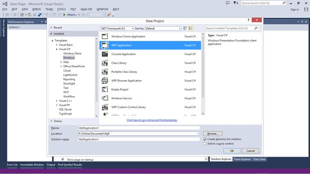
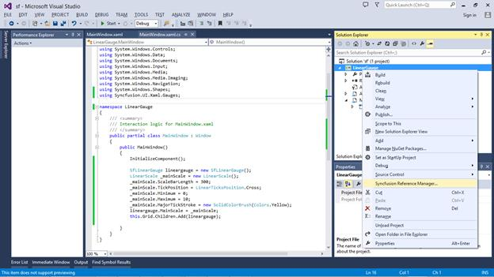
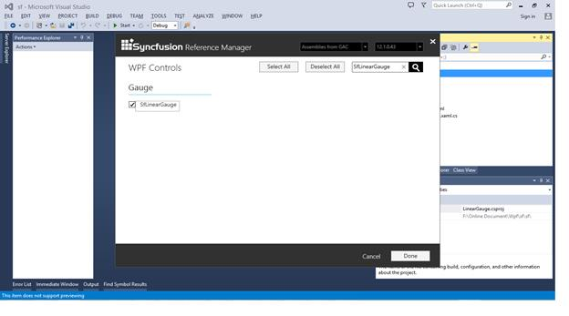
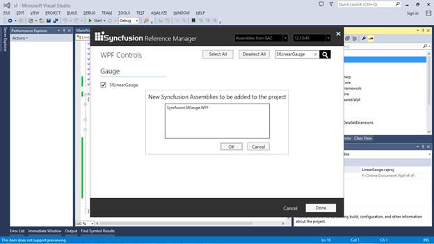
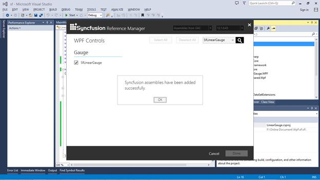
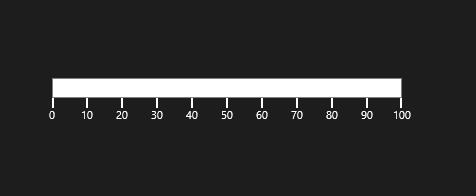
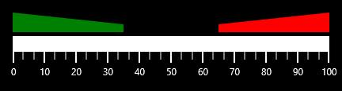
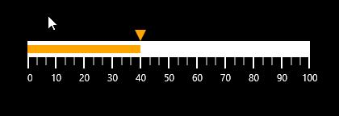

# Getting Started

This section explains you the steps required to configure the **SfLinearauge** and also explains the steps to add basic elements of **SfLinearauge** through various API’s available within it.

## Configuring SfLinearGauge using Syncfusion Reference Manager

Syncfusion Reference Manager is used to add Syncfusion Tools.

Follow the below steps to add SfLinearGauge Control using Syncfusion Reference Manager.

Create a simple WPF application using Visual Studio.

Right Click on the Project and select Syncfusion Reference Manager.

The Syncfusion Reference Manager Wizard wil be opened as shown in the figure below.

Search for **SfLinearGauge** using Search Box and select SfLinearGauge Control.  Click on done to add selected SfLinearGauge Control.

The SfLinearGauge assemblies will be automatically added to the Project after Clicking **OK**.

Create a namespace reference to the SfLinearGauge control using Syncfusion’s global namespace reference **schemas.syncfusion.com** or the SfLinearGauge control’s namespace reference using **Syncfusion.UI.Xaml.Gauges** available in the **Syncfusion.SfGauge.WPF** assembly.



    xmlns:LinearGauge="http://schemas.syncfusion.com/wpf" 
    (or)
    xmlns:LinearGauge ="clr-   
    namespace:Syncfusion.UI.Xaml.Gauges;assembly=Syncfusion.SfLinearGauge.WPF"
    


Add the following code to create a simple SfLinearGauge control.




    <Window x:Class="LinearGauge.MainWindow"
    xmlns="http://schemas.microsoft.com/winfx/2006/xaml/presentation"
    xmlns:x="http://schemas.microsoft.com/winfx/2006/xaml"
    xmlns:Gauges="http://schemas.syncfusion.com/wpf"
    Title="MainWindow" Height="350" Width="525">
    <Grid Name="Grid">
    <Gauges:SfLinearGauge/>
    </Grid
    </Window>





    SfLinearGauge lineargauge = new SfLinearGauge();
    this.Grid.Children.Add(lineargauge);
    



The SfLinearGauge  will be created as shown in the figure below.

>**Note:- The Syncfusion Reference Manager is available in versions 11.3.0.30 and later. It supports referencing assemblies from version 10.4.0.71 version to the current version and Syncfusion Reference Manager can be used only in Visual Studio 2010, 2012, 2013 and 2015.**

## Configuring SfLinearGauge

SfLinearGauge exists in the following assembly and namespace.

**Assembly**: Syncfusion.SfGauge.Wpf

**Namespace**: Syncfusion.UI.Xaml.Gauges

Create a namespace reference to the SfLinearGauge control using Syncfusion’s global namespace reference **schemas.syncfusion.com** or the SfLinearGauge control’s namespace reference using **Syncfusion.UI.Xaml.Gauges** available in the **Syncfusion.SfGauge.WPF** assembly.



    xmlns:Gauges="http://schemas.syncfusion.com/wpf" 
    (or)
    xmlns:Gauges ="clr-   
    namespace:Syncfusion.UI.Xaml.Gauges;assembly=Syncfusion.SfLinearGauge.WPF"
    




    <Gauges:SfLinearGauge/>



Run the above code and now the default SfLinearGauge can be displays as follows. In order to customize scales and other SfLinearGauge elements, you have to add the respecting element to SfLinearGauge.

As you can see now in the above image, the SfLinearGauge displays its default elements. To customize the basic look and feel of the SfLinearGauge you have to add respective elements to SfLinearGauge, which will be explained in the next section.

## Configuring LinearScale 

You can configure the LinearScale elements by making use of following API’s available in SfLinearGauge.

They are:

* ScaleDirection
* ScaleBarStroke
* ScaleBarSize
* ScaleBarLength
* ScaleBarBorderThickness
* Interval
* Minimum
* Maximum




              <Gauges:SfLinearGauge Name="linearGauge" Orientation="Horizontal">
            <Gauges:SfLinearGauge.MainScale>
                <Gauges:LinearScale ScaleDirection="Forward"
                                    ScaleBarStroke="White" 
                                    ScaleBarSize="20" 
                                    ScaleBarLength="350"
                                    ScaleBarBorderThickness="1"
                                    Interval="10"
                                    Minimum="0" Maximum="100">
                </Gauges:LinearScale>
            </Gauges:SfLinearGauge.MainScale>
        </Gauges:SfLinearGauge> 





            SfLinearGauge lineargauge = new SfLinearGauge();
            lineargauge.Orientation = Orientation.Horizontal;
            LinearScale _mainScale = new LinearScale();
            _mainScale.ScaleDirection = LinearScaleDirection.Forward;
            _mainScale.ScaleBarStroke = new SolidColorBrush(Colors.White);
            _mainScale.ScaleBarSize = 20;
            _mainScale.ScaleBarLength = 350;
            _mainScale.ScaleBarBorderThickness = new Thickness(1);
            _mainScale.Interval = 10;
            _mainScale.Minimum = 0;
            _mainScale.Maximum = 100;
            lineargauge.MainScale = _mainScale;
            this.Grid.Children.Add(lineargauge);




## Adding Ranges 

You can add ranges to SfLinearGauge by creating **LinearRange** collection using **Ranges**.




     <Gauges:SfLinearGauge>
            <Gauges:SfLinearGauge.MainScale>
                <Gauges:LinearScale>
                    <Gauges:LinearScale.Ranges>
                        <Gauges:LinearRange StartValue="0" EndValue="35" 
                                            StartWidth="25" EndWidth="10" 
                                            RangeOffset="5" RangeOpacity="1"
                                            RangeStroke="Green"/>
                        <Gauges:LinearRange StartValue="65" EndValue="100" 
                                            StartWidth="10" EndWidth="25" 
                                            RangeOffset="5" RangeOpacity="1"
                                            RangeStroke="Red"/>
                    </Gauges:LinearScale.Ranges>
                </Gauges:LinearScale>
            </Gauges:SfLinearGauge.MainScale>
        </Gauges:SfLinearGauge>





           SfLinearGauge lineargauge = new SfLinearGauge();
           LinearScale _mainScale = new LinearScale();
           _mainScale.Ranges.Add(new LinearRange()
           {
               StartValue = 0,
               EndValue = 35,
               StartWidth = 25,
               EndWidth = 10,
               RangeOffset = 5,
               RangeOpacity = 1,
               RangeStroke = new SolidColorBrush(Colors.Green)
           });
           _mainScale.Ranges.Add(new LinearRange() 
           { 
               StartValue = 65,
               EndValue = 100, 
               StartWidth = 10, 
               EndWidth = 25,
               RangeOffset = 5,
               RangeOpacity = 1,
               RangeStroke = new SolidColorBrush(Colors.Red) 
           });
           lineargauge.MainScale = _mainScale;
           this.Grid.Children.Add(lineargauge);




## Adding Pointers 

You can also add Pointers to SfLinearGauge to point a values on the scale.




      <Gauges:SfLinearGauge Name="linearGauge">
            <Gauges:SfLinearGauge.MainScale>
                <Gauges:LinearScale>
                    <Gauges:LinearScale.Pointers>
                        <Gauges:LinearPointer Value="40" PointerType="BarPointer" />
                        <Gauges:LinearPointer Value="40" PointerType="SymbolPointer"/>
                    </Gauges:LinearScale.Pointers>
                </Gauges:LinearScale>
            </Gauges:SfLinearGauge.MainScale>
        </Gauges:SfLinearGauge>





           SfLinearGauge lineargauge = new SfLinearGauge();
           LinearScale _mainScale = new LinearScale();
           _mainScale.Pointers.Add(new LinearPointer()
           {
               Value = 40,
               PointerType = LinearPointerType.BarPointer
           });
           _mainScale.Pointers.Add(new LinearPointer()
           {
               Value = 40,
               PointerType = LinearPointerType.SymbolPointer,
               SymbolPointerPosition = LinearSymbolPointersPosition.Above
           });
           lineargauge.MainScale = _mainScale;
           this.Grid.Children.Add(lineargauge);




