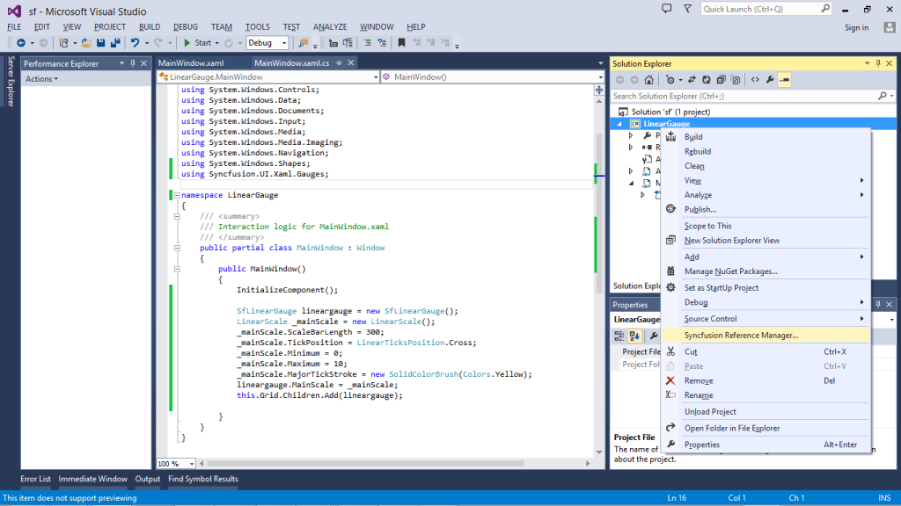
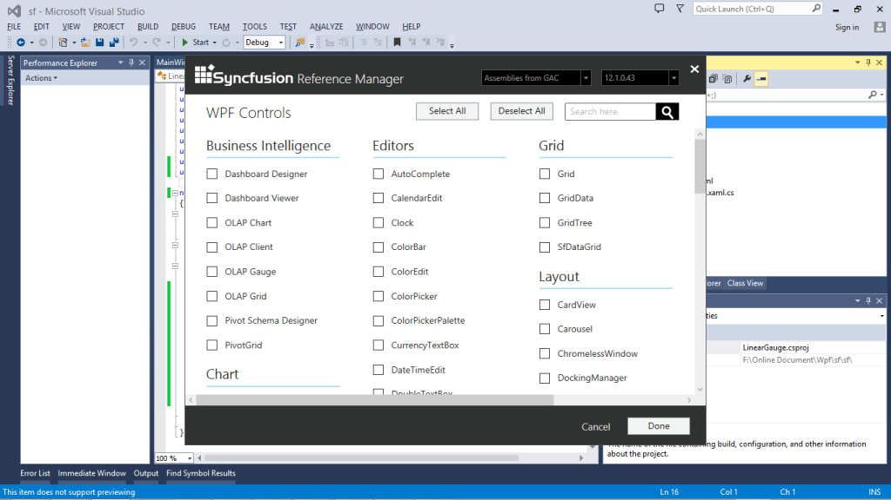
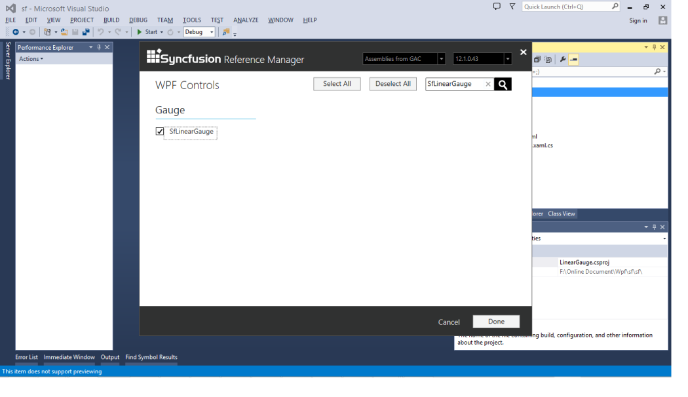
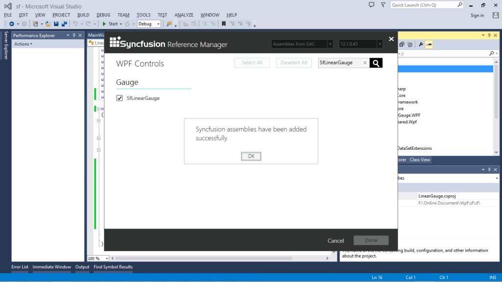

# Getting Started

## Create the Linear Gauge Programmatically

Refer to the following code example to add a Linear Gauge to your application:



<Window x:Class="LinearGauge.MainWindow"

        xmlns="http://schemas.microsoft.com/winfx/2006/xaml/presentation"

        xmlns:x="http://schemas.microsoft.com/winfx/2006/xaml"

         xmlns:Gauges="http://schemas.syncfusion.com/wpf"

        Title="MainWindow" Height="350" Width="525">

    <Grid Name="Grid">

        <Gauges:SfLinearGauge Name="linearGauge" Orientation="Horizontal">

            <Gauges:SfLinearGauge.MainScale>

                <Gauges:LinearScale ScaleDirection="Forward"

                                    ScaleBarStroke="Black" 

                                    ScaleBarSize="20" 

                                    ScaleBarLength="350"

                                    ScaleBarBorderThickness="1"

                                         Interval="10"

                                    Minimum="0" Maximum="100">

                    <Gauges:LinearScale.Pointers>

                        <Gauges:LinearPointer Value="40" PointerType="BarPointer" />

                        <Gauges:LinearPointer Value="40" PointerType="SymbolPointer"/>

                    </Gauges:LinearScale.Pointers>

                </Gauges:LinearScale>

            </Gauges:SfLinearGauge.MainScale>

        </Gauges:SfLinearGauge>

</Grid>

</Window>




           SfLinearGauge lineargauge = new SfLinearGauge();

            lineargauge.Orientation = Orientation.Horizontal;

            LinearScale _mainScale = new LinearScale();

            _mainScale.ScaleDirection = LinearScaleDirection.Forward;

            _mainScale.ScaleBarStroke = new SolidColorBrush(Colors.Black);

            _mainScale.ScaleBarSize = 20;

            _mainScale.ScaleBarLength = 350;

            _mainScale.ScaleBarBorderThickness = new Thickness(1);

            _mainScale.Interval = 10;

            _mainScale.Minimum = 0;

            _mainScale.Maximum = 100;

            _mainScale.Pointers.Add(new LinearPointer(){Value=40,PointerType=LinearPointerType.BarPointer});

            _mainScale.Pointers.Add(new LinearPointer(){Value=40,PointerType=LinearPointerType.SymbolPointer});

            lineargauge.MainScale = _mainScale;

            this.Grid.Children.Add(lineargauge);


The following screenshot displays the Linear Gauge:

## Create the SfLinearGauge with the Syncfusion Reference Manager

The SyncfusionReferenceManager is used to add the SyncfusionTools.  To Add the SfLinearGauge control by using the Syncfusion Reference Manager, follow the steps given:

1. Create a simple WPF application by using the Visual Studio.

     

2. Right click the Project and select the Syncfusion Reference Manager.

     

3. The Syncfusion Reference Manager Wizard opens as shown in the following figure.

     

4. Search for the SfLinearGauge by using the Search Box and select the SfLinearGauge control.  Click Done to add the selected SfLinearGauge control.

     

5. The SfLinearGauge assemblies are automatically added to the Project after clicking OK.

     

     

6. Create a namespace reference to the SfLinearGauge control by using the Syncfusion’s global namespace reference, schemas.syncfusion.com or the SfLinearGauge control’s namespace reference  by using the Syncfusion.UI.Xaml.Gauges available in the Syncfusion.SfLinearGauge.WPF assembly.

  
     
			 xmlns:LinearGauge="http://schemas.syncfusion.com/wpf" 

			 (or)

			 xmlns:LinearGauge ="clr-   

			 namespace:Syncfusion.UI.Xaml.Gauges;assembly=Syncfusion.SfLinearGauge.WPF"
  

7. Add the following code to create a simple SfLinearGauge control.

   ~~~ xml
     

			  <Window x:Class="LinearGauge.MainWindow"

				xmlns="http://schemas.microsoft.com/winfx/2006/xaml/presentation"

				xmlns:x="http://schemas.microsoft.com/winfx/2006/xaml"

				 xmlns:Gauges="http://schemas.syncfusion.com/wpf"

				Title="MainWindow" Height="350" Width="525">

			<Grid Name="Grid">

				<Gauges:SfLinearGauge Name="linearGauge" Orientation="Horizontal">

					<Gauges:SfLinearGauge.MainScale>

						<Gauges:LinearScale ScaleDirection="Forward"

											ScaleBarStroke="Black" 

											ScaleBarSize="20" 

											ScaleBarLength="350"

											ScaleBarBorderThickness="1"

												 Interval="10"

											Minimum="0" Maximum="100">

							<Gauges:LinearScale.Pointers>

								<Gauges:LinearPointer Value="40" PointerType="BarPointer" />

								<Gauges:LinearPointer Value="40" PointerType="SymbolPointer"/>

							</Gauges:LinearScale.Pointers>

						</Gauges:LinearScale>

					</Gauges:SfLinearGauge.MainScale>

				</Gauges:SfLinearGauge>

			</Grid>

			 </Window>
   
   ~~~
   {:.prettyprint}

 
    
			 using System.Windows;

			 using Syncfusion.UI.Xaml.Gauges;

			 namespace  LinearGauge

			{

				 public partial class MainWindow : Window

				{

					 public MainWindow()

					{

					  InitializeComponent();

					  SfLinearGauge lineargauge = new SfLinearGauge();

					  lineargauge.Orientation = Orientation.Horizontal;

					  LinearScale _mainScale = new LinearScale();

					  _mainScale.ScaleDirection = LinearScaleDirection.Forward;

					  _mainScale.ScaleBarStroke = new SolidColorBrush(Colors.Black);

					  _mainScale.ScaleBarSize = 20;

					  _mainScale.ScaleBarLength = 350;

					  _mainScale.ScaleBarBorderThickness = new Thickness(1);

					  _mainScale.Interval = 10;

					  _mainScale.Minimum = 0;

					  _mainScale.Maximum = 100;

					  _mainScale.Pointers.Add(new LinearPointer(){Value=40,PointerType=LinearPointerType.BarPointer});

					  _mainScale.Pointers.Add(new LinearPointer(){Value=40,PointerType=LinearPointerType.SymbolPointer});

					  lineargauge.MainScale = _mainScale;

					  this.Grid.Children.Add(lineargauge);

					}

				}

			}
  

8. The simple SfLinearGauge control is created as shown in the following figure.

   

   {:.prettyprint}
   
> Note: 

> The Syncfusion Reference Manager is available in versions 11.3.0.30 and later. It supports referencing assemblies from version 10.4.0.71 version to the current version.

> The Syncfusion Reference Manager can be used only in the Visual Studio 2010, 2012, and 2013.

